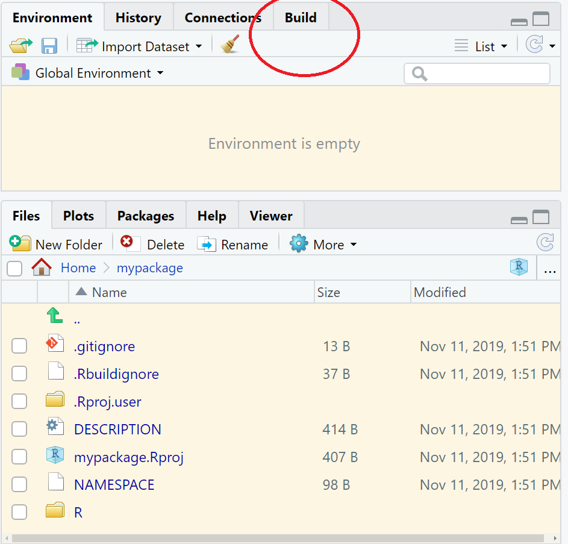
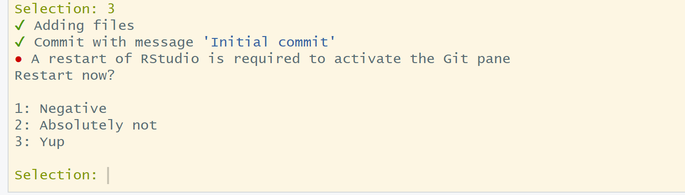

```{r setup, include=FALSE}
knitr::opts_chunk$set(echo = TRUE, 
                      message = FALSE,	
                      warning = FALSE)
options(htmltools.dir.version = FALSE)
```

```{r pkgs, include=FALSE}
library(RefManageR)
library(kableExtra)
library(tidyverse)
library(png)
library(grid)
```

```{r, load-refs, include=FALSE, cache=FALSE}
BibOptions(check.entries = FALSE,
           bib.style = "numeric",
           cite.style = "authoryear",
           style = "markdown",
           hyperlink = FALSE,
           dashed = FALSE)
myBib <- ReadBib("bibliography.bib", check = FALSE)
```

background-image: url(pics/forwards.svg)
background-position: 50% 65%
background-size: 250px

class: inverse

# Package development.

## Creating impact from code.

### Emma Rand and Susannah Cowtan. 

### York January 2020.

Updated: `r Sys.Date()`

.footnote[
[1] https://github.com/forwards/workshops/blob/master/Computing_requirements.md  
[2] Made with xaringan `r Cite(myBib, "xaringan")`

]
---
background-image: url(pics/forwards.svg)
background-position: 50% 55%
background-size: 250px

class: inverse center

# Create your first package.
---

# Create your first package.

## To create a package.

Be deliberate about where you create your package.

Do not nest inside another RStudio project, R package or git repo

```{r eval=FALSE}
usethis::create_package("path/to/mypackage")
```

This will:

* create a new R project called mypackage which is a package and an RStudio project.
* restart R in the new project.
* create a skeleton structure for your package.
* start an RStudio helper menu.

---
# Create your first package.

## What is in this skeleton?

```{r, out.width = "500px", echo=FALSE}
knitr::include_graphics("pics/createpkg1.png")
```


---
# Create your first package.

## What is in this skeleton?

### Files and directories.


* `.Rbuildignore` lists files that we need to have around but that should not be included when building the R package from source. e.g., the `.Rproj` file and the LICENSE
* `.Rproj.user`, if you have it, is a directory used internally by RStudio.
* `.gitignore` anticipates Git usage and ignores some standard, behind-the-scenes files created by R and RStudio.
* `DESCRIPTION` provides metadata about your package. We will need to edit this.
* `NAMESPACE` declares the functions your package exports for external use and the external functions your package imports from other packages.
* The `R/` directory is the “business end” of your package. It will contain .R files with function definitions.
* `mypackage.Rproj` is the file that makes this directory an RStudio Project.


---
# Create your first package.

## Build pane appears.

```{r, out.width = "500px", echo=FALSE}

```


---
# Create your first package.

## Use version control with `use_git()`.

This is optional but strongly recommended.

```{r eval=FALSE}
use_git()
```

---
# Create your first package.

## Use version control with `use_git()`.

### Commit files.

There are 5 uncommitted files:

Is it OK to commit them?

Choose the option which indicates your agreement.

```{r, out.width = "600px", echo=FALSE}
knitr::include_graphics("pics/git_agree.png")
```


---
# Create your first package.

## Use version control with `use_git()`.

### Restart R.

A restart of R is required to activate the Git pane. Restart now?

Choose the option which indicates yes. 

```{r, out.width = "600px", echo=FALSE}

```


---
# Create your first package.

## Use version control with `use_git()`.

### The RStudio Git pane.

```{r, out.width = "400px", echo=FALSE}
knitr::include_graphics("pics/git_pane.png")
```
.footnote[
[1] You *may* need to close the project and open by navigating to it without using the windows shortcuts.
]
---
# Create your first package.

## Write your first function.

First, let's create a vector of 100 numbers we can develop our function on.
I am going to imagine it is the heights (metres) of 100 trees.

```{r}
height <- rnorm(100, mean = 10, sd = 0.8) %>% 
  round(4)
```

--

The sums of squares, SS(x), is the sum of the squared deviations from the mean, i.e.,  

$$\sum (x_i- \bar{x})^2$$
    
which is:

```{r}
sum((height - mean(height))^2)
```

---
# Create your first package.

## Write your first function.

We can put that logic into a function:

```{r}
sums_squares <- function(v) {
  sum((v - mean(v))^2)
  }
```

.footnote[
[1] We do not cover writing functions here but you can learn more in the Functions chapter of R for Data Science `r Cite(myBib, "Wickham:2017:RDS:3086927")`
]

--

and check it works:

```{r}
sums_squares(height)
```


---
# Create your first package.

## Where to put that function using `use_r()`.

We save our function as a `.R` script file in the `R/` directory.

.footnote[
Putting each of the functions in a package in their own `.R` is a good place to start. As your package complexity increases,  you might group related functions.
]
--

The `use_r()` function makes this a little easier by creating/opening a script below `R/`:

```{r eval=FALSE}
use_r("sums_squares")
```

--

Paste in your function definition.

Do not add any other code.

--

Before we continue, delete the function you put in the Global Environment:

```{r}
rm(sums_squares)
```


---
# Create your first package.

## How to test drive your function with `load_all()`.

In a normal script, you might use `source("R/sums_squares.R")` but when building packages, we use a devtools approach:

```{r eval=FALSE}
load_all()
```

`load_all()` will make `sums_squares()` (and any other functions) available for use.

--

Note, you will not see it in your environment! 

`load_all()` simulates the process of building, installing, and attaching the `mypackage` package. This is more likely to give you an accurate view during package development than testing with functions in the Global Environment.

---
# Create your first package.

## Checking the package with `check()`.

`R CMD check` executed in the shell, is the gold standard for checking that an R package is in full working order. `check()` is a convenient way to run this without leaving your R session.

```{r eval=FALSE}
check()
```

You will get lots of output. It will end with:

```{r, out.width = "500px", echo=FALSE}
knitr::include_graphics("pics/check.png")
```

Which tells you that your package is unlicensed and undocumented. We will fix these issues later.
---

---
# Create your first package.

## Commit your changes with Git.


Before adding a license and documentation to our package we will take a short diversion to cover Git and GitHub.

# References

```{r refs, echo=FALSE, results="asis"}
PrintBibliography(myBib)
```


---
# License

<a rel="license" href="http://creativecommons.org/licenses/by-nc-sa/4.0/"></a><br /><span xmlns:dct="http://purl.org/dc/terms/" property="dct:title">Package Development: Creating impact from code.</span> by <span xmlns:cc="http://creativecommons.org/ns#" property="cc:attributionName">R Forwards</span> is licensed under a <a rel="license" href="http://creativecommons.org/licenses/by-nc-sa/4.0/">Creative Commons Attribution-NonCommercial-ShareAlike 4.0 International License</a>.
