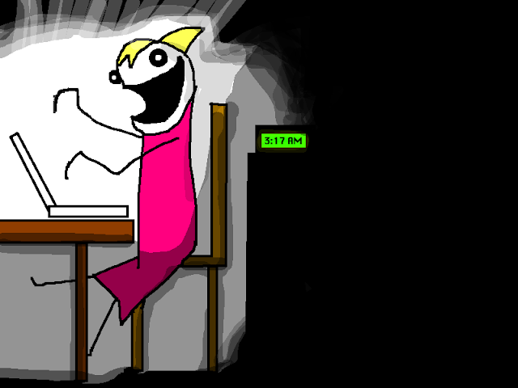

```{r setup, include=FALSE}
knitr::opts_chunk$set(echo = TRUE, 
                      message = FALSE,	
                      warning = FALSE)
options(htmltools.dir.version = FALSE)
```

```{r pkgs, include=FALSE}
library(RefManageR)
library(kableExtra)
library(dplyr)
library(png)
library(grid)
```

```{r, load-refs, include=FALSE, cache=FALSE}
BibOptions(check.entries = FALSE,
           bib.style = "numeric",
           cite.style = "authoryear",
           style = "markdown",
           hyperlink = FALSE,
           dashed = FALSE)
myBib <- ReadBib("bibliography.bib", check = FALSE)
```

background-image: url(pics/forwards.svg)
background-position: 50% 65%
background-size: 250px

class: inverse

# Package development.

## Creating impact from code.

### Emma Rand and Susannah Cowtan. 

### York January 2020.

Updated: `r Sys.Date()`

.footnote[
[1] https://github.com/forwards/workshops/blob/master/Computing_requirements.md  
[2] Made with xaringan `r Cite(myBib, "xaringan")`

]
---
# Preliminaries. 

## The material is mostly drawn from:

http://r-pkgs.had.co.nz/ `r Cite(myBib, "Wickham:2015:RP:2904414")`

```{r, out.width = "200px", echo=FALSE}
knitr::include_graphics("pics/r-pkgs-cover.png")
```


---
# Preliminaries. 

## The bad news

### .... it may be frustrating
```{r, out.width = "400px", echo=FALSE}
knitr::include_graphics("pics/allie_brosh_argh.png")
```

.footnote[
COPYRIGHT: Allie Brosh  http://hyperboleandahalf.blogspot.com/2010/09/four-levels-of-social-entrapment.html
]


---
# Preliminaries. 

## The good news!

### .... frustration is normal and temporary.
```{r, out.width = "400px", echo=FALSE}

```

.footnote[
COPYRIGHT: Allie Brosh  http://hyperboleandahalf.blogspot.com/2010/06/this-is-why-ill-never-be-adult.html
]

---
# Preliminaries. 

## Why make a package

* You want to generalise.
* You want to document.
* You want to disseminate.
* You want to collaborate.
* You want to create impact from your work.

---
# Preliminaries.

## Get to know your R installation.

```{r}
R.home()

```

The R home directory is the top-level directory of the R installation being run.

---
# Preliminaries.

## Get to know your R installation.

```{r}
list.files(R.home())
```

---
# Preliminaries.

## Get to know your R installation.

```{r}
R.version
```
---
# Preliminaries.

## Where do R packages come from?

```{r, out.width = "200px", echo=FALSE}
knitr::include_graphics("pics/stork.png")
```

--

### CRAN and GitHub, mostly

```{r, eval=FALSE}
install.packages("foo")
library(devtools)
install_github("jane/foo")
```
---
# Preliminaries.

## Where do R packages live on your computer?

```{r, out.width = "300px", echo=FALSE}
knitr::include_graphics("pics/library.png")
```

--

### R packages live in a library.

---
# Preliminaries.

## Get to know your R library.

The default library:

```{r}
.Library
```

--
All the libraries R knows about:

```{r}
.libPaths()
```


---
# Preliminaries.

## Get to know your R library.

* For many R users `.Library` and `.libPaths()` are the same.  
* Other R users maintain, or have access to, multiple libraries
* For example, you can put add-on packages in a user-level library:
`C:/Users/Emma Rand/Documents/R/win-library/3.6`

---
# Preliminaries.

## Before we start:

### Make sure you have recent versions of:

---
# References

```{r refs, echo=FALSE, results="asis"}
PrintBibliography(myBib)
```

---
# License

<a rel="license" href="http://creativecommons.org/licenses/by-nc-sa/4.0/"></a><br /><span xmlns:dct="http://purl.org/dc/terms/" property="dct:title">Package Development: Creating impact from code.</span> by <span xmlns:cc="http://creativecommons.org/ns#" property="cc:attributionName">R Forwards</span> is licensed under a <a rel="license" href="http://creativecommons.org/licenses/by-nc-sa/4.0/">Creative Commons Attribution-NonCommercial-ShareAlike 4.0 International License</a>.
