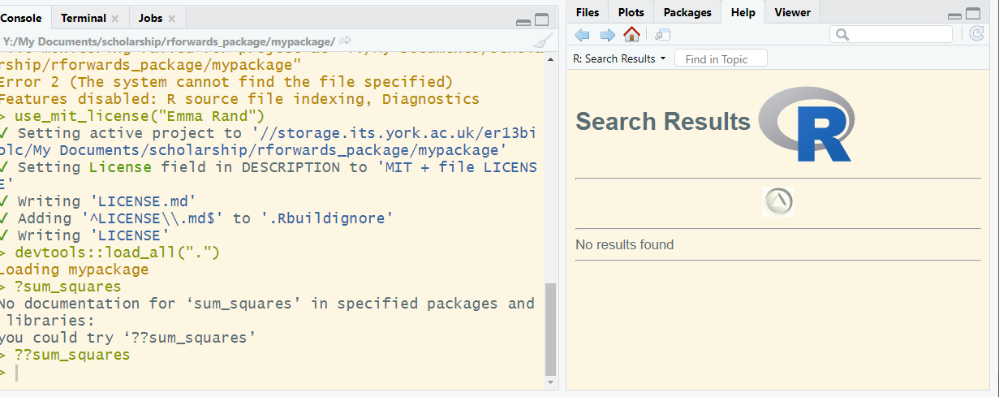
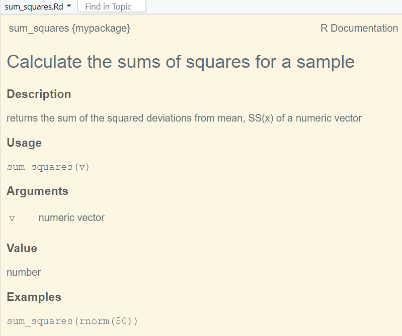

```{r setup, include=FALSE}
knitr::opts_chunk$set(echo = TRUE, 
                      message = FALSE,	
                      warning = FALSE)
options(htmltools.dir.version = FALSE)
```

```{r pkgs, include=FALSE}
library(RefManageR)
library(tidyverse)

```

```{r, load-refs, include=FALSE, cache=FALSE}
BibOptions(check.entries = FALSE,
           bib.style = "numeric",
           cite.style = "authoryear",
           style = "markdown",
           hyperlink = FALSE,
           dashed = FALSE)
myBib <- ReadBib("bibliography.bib", check = FALSE)
```

background-image: url(pics/forwards.svg)
background-position: 50% 65%
background-size: 250px

class: inverse

# Package development.

## Creating impact from code.

### Emma Rand and Susannah Cowtan. 

### York January 2020.

Updated: `r Sys.Date()`

.footnote[
Made with xaringan `r Cite(myBib, "xaringan")`

]
---
background-image: url(pics/forwards.svg)
background-position: 50% 55%
background-size: 250px

class: inverse center

# Package Documentation.


---
# Package Documentation.

## Two levels

### Function-level.

The `roxygen2` package helps you document each function.

### Package-level.

The package needs documenting

---
# Package Documentation.

## `DESCRIPTION`

This file provides metadata about your package and is the defining feature of a package in that `devtools` and RStudio consider any directory containing a `DESCRIPTION` file to be a package.

--

The `usethis::create_package()` function automatically adds a simple `DESCRIPTION` file.

--

It is in this file that you record what packages are needed for your package to work (called the dependencies), authors, maintainers and contributers, contact information and license information.

---
# Package Documentation.

## `DESCRIPTION`

We need to edit the `DESCRIPTION` file<sup>1</sup>:

* add your details as the author.
  * role: "aut means author, "cre" means creator, "ctb" means contributor.
* Add a Title and Description.

.footnote[
[1] You can use Ctrl + . and start typing a file name to open a file for editing.
]

--

Let's have a look at the description file in someone else's package.


---
# Package Documentation.

## `LICENSE`

A license provides legally binding guidelines for the use and distribution of software.

Technically, without a license people do not have permission to download and use your package.

--

The [MIT license](https://opensource.org/licenses/MIT) is commonly used for open source software. 
```{r, out.width = "50px", echo=FALSE}
knitr::include_graphics("https://upload.wikimedia.org/wikipedia/commons/0/0c/MIT_logo.svg")
```

We can add the MIT license using the helper function `use_mit_license()`

```{r eval=FALSE}
use_mit_license("Emma Rand")
```

--
  ```
  ✔ Setting active project to '//storage.its.york.ac.uk/er13biolc/
  My Documents/scholarship/rforwards_package/mypackage'
  ✔ Setting License field in DESCRIPTION to 'MIT + file LICENSE'
  ✔ Writing 'LICENSE.md'
  ✔ Adding '^LICENSE\\.md$' to '.Rbuildignore'
  ✔ Writing 'LICENSE'
  ```

---
# Package Documentation.

## `LICENSE`

Using `use_mit_license()`<sup>1</sup>:

* creates a `LICENSE` file
  * open `LICENSE` and check it contains:  
   
   ```
   YEAR: 2019
   COPYRIGHT HOLDER: Emma Rand  

   ```
.footnote[
[1] Other licenses are available. See GitHub's [Choose an open source license](https://choosealicense.com/)
]

--

* adds a copy of the full license, `LICENSE.Md`
  * Open `LICENSE.Md` to see what rights you're granting.

--

* adds these files to `.Rbuildignore`

---
# Package Documentation.

## Do another commit .....

Check the boxes in the Git pane to stage all changes. Click commit.

Add a commit message like "add license". Click commit. 

Notice how you now have a message saying "Your branch is ahead of the origin/master by 1 commit." This means your local version of `mypackage` has one update that isn't on GitHub:

```{r, out.width = "500px", echo=FALSE}
knitr::include_graphics("pics/before_push.png")
```

---
# Package Documentation.

## .... and push to GitHub!

Update the version on GitHub using the Push button:

```{r, out.width = "500px", echo=FALSE}
knitr::include_graphics("pics/before_push.png")
```

Go to your GitHub page and marvel at your work. 

### `r emo::ji("party")`

---
# Package Documentation.

## Getting help: `?sum_squares`

When others (or future you!) use your package they will want to get help on functions at some point.

What happens if you do:

```{r eval=FALSE}
?sum_squares
```

--

```
No documentation for ‘sum_squares’ in specified packages and libraries:
you could try ‘??sum_squares’

```

--

Well, you could.....

---
# Package Documentation.

## `??sum_squares`

But that's not going to help either!

```{r, out.width = "600px", echo=FALSE}

```

---
# Package Documentation.

## `Roxygen`

To get help on `sum_squares()` your package needs a special R documentation file written in an R-specific LaTeX-like language.

That file is `man/sum_squares.Rd` and the `roxygen2` package will write it for us from specially formatted comments often called roxygen comments.

Open `sum_squares.R` and put your cursor anywhere in the function.

Do Code | Insert Roxygen Skeleton

---
# Package Documentation.

## `Roxygen`

You should find a special comment appears above the function.

```
#' Title
#'
#' @param v 
#'
#' @return
#' @export
#'
#' @examples
sums_squares <- function(v) {
  sum((v - mean(v))^2)
}
```
--

Lines beginning `#'` are Roxygen comments.

The words beginning `@` are Roxygen tags.

---
# Package Documentation.

## `Roxygen`

Edit the comment with something like:

```
#' Calculate the sums of squares for a sample
#'
#' returns the sum of the squared deviations
#' from mean, SS(x) of a numeric vector
#'
#' @param v numeric vector
#'
#' @return number
#' @export
#'
#' @examples
#' sum_squares(rnorm(50))
```

---
# Package Documentation.

## `document()`

Now do:
```{r eval=FALSE}
document()
```


```
Updating mypackage documentation
Writing NAMESPACE
Loading mypackage
Writing NAMESPACE
Writing sum_squares.Rd
```
--

`man/sum_squares.Rd` has been created. 

Open it.

---
# Package Documentation.

## `man/sum_squares.Rd`

```
% Generated by roxygen2: do not edit by hand
% Please edit documentation in R/sum_squares.R
\name{sum_squares}
\alias{sum_squares}
\title{Calculate the sums of squares for a sample}
\usage{
sum_squares(v)
}
\arguments{
\item{v}{numeric vector}
}
\value{
number
}
\description{
returns the sum of the squared deviations
from mean, SS(x) of a numeric vector
}
\examples{
sum_squares(rnorm(50))
}

```

---
# Package Documentation.

## Now trying to get help: `?sum_squares`

```{r eval=FALSE}
?sum_squares
```


---
# Package Documentation.

## `document()`

```{r, out.width = "500px", echo=FALSE}

```

### `r emo::ji("celebrate")` Ta da!!!

---
# Package Documentation.

## `document()`

In addition to creating `man/sum_squares.Rd`, the `NAMESPACE` file is updated, as shown in the console:


```
Updating mypackage documentation
Writing NAMESPACE
Loading mypackage
*Writing NAMESPACE
Writing sum_squares.Rd
```

--

Open `NAMESPACE` and you should see:

```
# Generated by roxygen2: do not edit by hand

export(sum_squares)

```
There is now an explicit directive to export the `sum_squares()` function.

---
# Package Documentation.

## Use `check()` again.

```{r eval=FALSE}
check()
```

should end with:
 
```
   
-- R CMD check results  mypackage 0.0.0.90---
Duration: 25.9s

0 errors √ | 0 warnings √ | 0 notes √

```

We have fixed the issues: our package is licensed and documented.

### `r emo::ji("party")`

---
# Package Documentation.

## Commit and Push

Go to the Git pane and check the box to "Stage" the changes you want to commit. All of them in this case.

--

add a Commit message. Something like "Added std_err() function."

--

Hit commit!

--

Update the version on GitHub using the Push button.

---
# References

```{r refs, echo=FALSE, results="asis"}
PrintBibliography(myBib)
```

```{r, out.width = "60px", echo=FALSE}
knitr::include_graphics("https://user-images.githubusercontent.com/163582/45438104-ea200600-b67b-11e8-80fa-d9f2a99a03b0.png")
```


---
# License

<a rel="license" href="http://creativecommons.org/licenses/by-nc-sa/4.0/"></a><br /><span xmlns:dct="http://purl.org/dc/terms/" property="dct:title">Package Development: Creating impact from code.</span> by <span xmlns:cc="http://creativecommons.org/ns#" property="cc:attributionName">R Forwards</span> is licensed under a <a rel="license" href="http://creativecommons.org/licenses/by-nc-sa/4.0/">Creative Commons Attribution-NonCommercial-ShareAlike 4.0 International License</a>.
