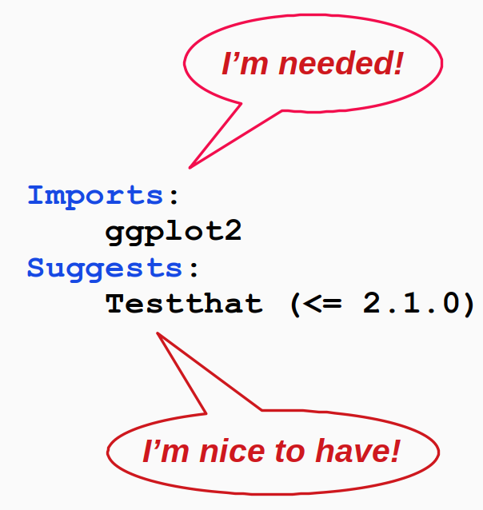

```{r setup, include=FALSE}
knitr::opts_chunk$set(echo = TRUE, 
                      message = FALSE,	
                      warning = FALSE)
options(htmltools.dir.version = FALSE)
```

```{r pkgs, include=FALSE}
library(RefManageR)
library(tidyverse)
library(usethis)

```

```{r, load-refs, include=FALSE, cache=FALSE}
BibOptions(check.entries = FALSE,
           bib.style = "numeric",
           cite.style = "authoryear",
           style = "markdown",
           hyperlink = FALSE,
           dashed = FALSE)
myBib <- ReadBib("bibliography.bib", check = FALSE)
```

background-image: url(pics/forwards.svg)
background-position: 50% 65%
background-size: 250px

class: inverse


# Package development

## Creating impact from code

### Emma Rand & Susannah Cowtan 

### York, January 2020

Updated: `r Sys.Date()`


.footnote[
Made with xaringan `r Cite(myBib, "xaringan")`
]
---
class: inverse center middle

# Package dependencies

---

class: clear

```{r no_lib_req, out.width = "100%", fig.align = "center", echo=FALSE}
knitr::include_graphics("pics/no_library_require.png")
```

---

# Specifying dependencies

.font130[
Required packages should be specified in the DESCRIPTION file
]

```{r imports, out.width = "50%", fig.align = "center", echo=FALSE}

```

---

# 3 Kinds of dependency

.font140[
**Imports:** required.  Installed automatically

**Suggests:** optional.  Used in development only, in a vignette or example, or for testing. Not installed automatically

**Depends:** rare and outside the scope of this class
]
---

# Use :: to access imported functions
.font130[
Import the function in DESCRIPTION:

```{r DESC, eval = FALSE}
Imports:
    ggplot2
```

Access in `density_plot.R`

```{r dens_plot, eval = FALSE}
density_plot <- function(v) {
  ggplot2::ggplot(data.frame(values = v), 
                  ggplot2::aes(x = values)) +
    ggplot2::geom_density()
}
```
]
---

# Using suggested functions
.font110[
Suppose instead:
* `ggplot2` was only used in `density_plot()`, and
* we expect `density_plot()` to be very rarely used

We might put `ggplot2` in `Suggests:` instead of `Imports:`

Then we'd need to check it was installed before we could use the function:
]
.code110[
```{r dens_plot_sugg, eval = FALSE}
density_plot <- function(v) {
  # This won't work without ggplot2
  if(!requireNamespace("ggplot2", quietly = TRUE)) {
    stop("Need ggplot2!  Use install.packages(\"ggplot2\")")
  }
  ggplot2::ggplot(data.frame(values = v), 
                  ggplot2::aes(x = values)) +
    ggplot2::geom_density()
}
```
]
---
background-image: url(pics/usethis_hexie.png)
background-position: 90% 10%
background-size: 150px

# Adding imports to the DESCRIPTION file

.font120[
* You can do this by hand, or

* You can use `usethis::use_package()`

Think about whether you need a recent version of the package!

Specifying a **minimum version** is better than specifying an exact version.

]
.code110[

```{r use_pkg, eval = FALSE}
# To add a package to Imports:
use_package("ggplot2")

# To add a package to Suggests:
use_package("ggplot2", type = "Suggests")

# Need version at least as new as you used:
use_package("ggplot2", min_version = "3.2.1")
```
]

---

class: inverse center middle

# Namespace: imports

---

# Tired of using :: all the time?

.font130[

Or maybe you want to use an infix function like `%>%`?

]

.code110[

```{r infix, eval = FALSE}
`%>%` <- magrittr::`%>%`

density_plot <- function(v) {
  stopifnot(is.numeric(v))
    
  data.frame(values = v) %>%  
    ggplot2::ggplot(ggplot2::aes(x = values)) +
    ggplot2::geom_density()
}
```

]

---

# Importing individual functions

.code110[

```{r importFrom, eval = FALSE}
#' @importFrom ggplot2 ggplot aes geom_density
#' @importFrom magrittr %>%
#' 
density_plot <- function(v) {
  stopifnot(is.numeric(v))
  
  data.frame(values = v) %>%
    ggplot(aes(x = values)) +
    geom_density()
}
```

]

---

# Or, create R/imports.R

.font130[

Imports belong to the **package**, not individual functions.

You may prefer to store them centrally.

]

.code110[

```{r import_file, eval = FALSE}
# Imports for the package mypackage

#' @importFrom ggplot2 ggplot aes geom_density
#' @importFrom magrittr %>%
#'
NULL
```

]
---

# Why not import a whole package?

.font130[

Seems like it would be easier, right?

]

.code110[

```{r import_all, eval = FALSE}
#' @import ggplot2 
#' @import magrittr
#' 
density_plot <- function(v) {
  stopifnot(is.numeric(v))
  
  data.frame(values = v) %>%
    ggplot(aes(x = values)) +
    geom_density()
}
```

]

---

# It's dangerous!

.font130[

Let's say we define a function like this, using `foo::fun1` and `bar::fun2`

]

.code110[

```{r foobar, eval = FALSE}
#' @import foo
#' @import bar

fun <- function(x) {
    fun1(x) + fun2(x)
}
```

]

.font130[

What happens next year, when a new function `fun1` is added to `bar`?

]

---

# Summary of importing

.font160[

DESCRIPTION | Namespace
------------|-----------
Makes **package** available | Makes **function** available
Mandatory | Optional <br>(can use `::` instead)
`use_package()` | `#' @importFrom`

]

---

class: inverse center middle

# Namespace: exports

---

# Two classes of functions

.font160[

```{r export_classes, echo = FALSE}
`%>%` <- magrittr::`%>%`

data.frame(Internal = c("Only for use within <br>package",
                        "Documentation <br>optional",
                        "Easily changed"),
           External = c("For use by others",
                        "Must be documented",
                        "Changing will break <br>other people's code")) %>%
    knitr::kable(format = "html", escape = FALSE) %>%
    kableExtra::column_spec(1, width = "50%")
```

]
---

# Default: exports everything!

.font130[

`roxygen2` creates a default NAMESPACE file which
exports everything:

]
.code110[

```{r default_namespace, eval = FALSE}
# Generated by roxygen2: fake comment so
# roxygen2 overwrites silently
exportPattern("^[^\\.]")
```

]
---

# Better: export explicitly

.code110[ 

```{r exp1, eval = FALSE}
#' @export

fun1 <- function() {}
```

```{r exp2, eval = FALSE}
#' @export

fun2 <- function() {}
```

]

```{r most_important, out.width = "80%", fig.align = "right", echo=FALSE}

```

---

# Export functions people should use!

.font130[

Don't export internal helpers.

]
.code110[

```{r intl_helpers, eval = FALSE}
# Defaults for NULL values
`%||%` <- function(a, b) {if(is.null(a)) b else a}

# Remove NULLs from a list
compact <- function(x) {
  x[!vapply(x, is.null, logical(1))]
}
```

]

---

# References

```{r refs, echo=FALSE, results="asis"}
PrintBibliography(myBib)
```


---
# License

<a rel="license" href="http://creativecommons.org/licenses/by-nc-sa/4.0/"></a><br /><span xmlns:dct="http://purl.org/dc/terms/" property="dct:title">Package Development: Creating impact from code.</span> by <span xmlns:cc="http://creativecommons.org/ns#" property="cc:attributionName">R Forwards</span> is licensed under a <a rel="license" href="http://creativecommons.org/licenses/by-nc-sa/4.0/">Creative Commons Attribution-NonCommercial-ShareAlike 4.0 International License</a>.
