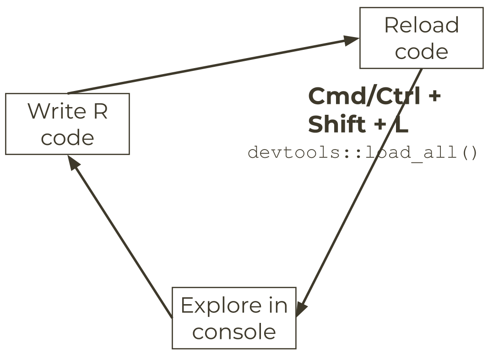
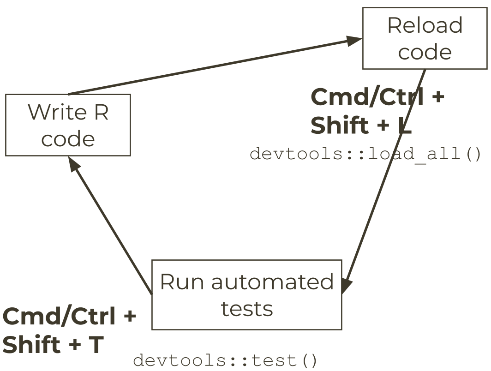

```{r setup, include=FALSE}
knitr::opts_chunk$set(echo = TRUE, 
                      message = FALSE,	
                      warning = FALSE)
options(htmltools.dir.version = FALSE)
```

```{r pkgs, include=FALSE}
library(RefManageR)
library(tidyverse)
library(usethis)

```

```{r, load-refs, include=FALSE, cache=FALSE}
BibOptions(check.entries = FALSE,
           bib.style = "numeric",
           cite.style = "authoryear",
           style = "markdown",
           hyperlink = FALSE,
           dashed = FALSE)
myBib <- ReadBib("bibliography.bib", check = FALSE)
```

background-image: url(pics/forwards.svg)
background-position: 50% 65%
background-size: 250px

class: inverse


# Package development

## Creating impact from code

### Emma Rand & Susannah Cowtan 

### York, January 2020

Updated: `r Sys.Date()`


.footnote[
Made with xaringan `r Cite(myBib, "xaringan")`
]
---
class: inverse center middle

# Unit testing
---

# Unit testing

## Why? Coding is iterative


We build new functions a bit at a time.

What if a new thing we add changes the existing functionality?

How can we check and be sure all the old functionality still works with the new fancy feature?

Unit Testing to the rescue!

---
class: inverse center middle

# Testing workflow
---

# A frivolous function

Create a new package with this very silly function.

```{r go_to_zoo, eval = FALSE}
zoo_sound <- function(animal, sound){
  assertthat::assert_that(
    assertthat::is.string(animal),
    assertthat::is.string(sound))
  paste0("The ", animal, " goes ", sound, "!")
}
```

You will need to add an `Imports:` section to your `DESCRIPTION` file which 
imports `assertthat`.

`assertthat::assert_that()` is a replacement for `stopifnot` which gives more 
informative error messages.

`assertthat::is.string()` returns either `TRUE` or `FALSE`.
---

# Set up a testing infrastructure

```{r use_test, eval = FALSE}
usethis::use_test("zoosounds")
```


✔ Setting active project to [your project location]

✔ Adding `testthat` to `Suggests` field in `DESCRIPTION`

✔ Creating `tests/testthat/`

✔ Writing `tests/testthat.R`

● Call `use_test()` to initialize a basic test file and open it for editing.

✔ Increasing `testthat` version to `>= 2.1.0` in `DESCRIPTION`

✔ Writing `tests/testthat/test-zoosounds.R`

● Modify `tests/testthat/test-zoosounds.R`

---
# Workflow before testing

```{r work_no_test, out.width = "85%", fig.align = "center", echo=FALSE}

```

---
# Now add testing!

```{r work_test, out.width = "85%", fig.align = "center", echo=FALSE}

```
---

---
# References

```{r refs, echo=FALSE, results="asis"}
PrintBibliography(myBib)
```


---
# License

<a rel="license" href="http://creativecommons.org/licenses/by-nc-sa/4.0/"></a><br /><span xmlns:dct="http://purl.org/dc/terms/" property="dct:title">Package Development: Creating impact from code.</span> by <span xmlns:cc="http://creativecommons.org/ns#" property="cc:attributionName">R Forwards</span> is licensed under a <a rel="license" href="http://creativecommons.org/licenses/by-nc-sa/4.0/">Creative Commons Attribution-NonCommercial-ShareAlike 4.0 International License</a>.
