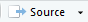
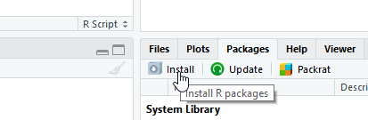
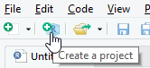
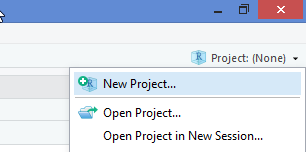

```{r setup, include=FALSE}
options(digits = 4)
options(width = 67)
library(knitr)
library(kableExtra)
opts_chunk$set(echo = TRUE, dev = "png", dpi = 300,
               warning = FALSE,
               comment = "#", eval = FALSE, 
               fig.width = 5, fig.height = 5, 
               knitr.table.format = "markdown")
# trim white space top and right of plot
knit_hooks$set(small.mar = function(before, options, envir) {
    if (before) par(mar = c(4, 5, 2, 1))
})
# trim white space when par won't work
library(magick)
knit_hooks$set(crop = function(before, options, envir) {
    if (before || isTRUE((fig.num <- options$fig.num) == 0L))
        return()
    paths = fig_path(options$fig.ext, options, fig.num)
    for (f in paths) image_write(image_trim(image_read(f)), f)
})
set.seed(1)
```

class: inverse center middle

# Why R?

---

# Reasons to learn R

Free and open source.
  
Software for data science:
 - experiment/survey design
 - data retrieval
 - data wrangling
 - data analysis
 - reporting
 
A programming language, so we can

- use existing functions to code up our data science tasks
- write new functions for customised/novel tasks

---

# Companies that use R

https://github.com/ThinkR-open/companies-using-r

- AirBnB
- Amazon Web Services
- BBC
- Booking.com
- Buzzfeed
- Ebay
- The Economist
- Facebook
- ...

---

# The R Ecosystem

<div style="padding: 0;float: left;width: 32%;text-align:center;border:2px solid;">

Base 

<br>
<table class="GeneratedTable" width="90%" style="margin:20px auto">
     <tr>
       <td>base</td>
     </tr>
     <tr>
       <td>create R objects<br>summaries<br>math functions</td>
     <tr>
  </table>
    <table class="GeneratedTable" width="90%" style="margin:40px auto">
     <tr>
       <td>recommended</td>
     </tr>
     <tr>
       <td>statistics<br>graphics<br>example data</td>
     <tr>
  </table>
  </div>
  
<div style="padding: 0;float: left;width:62%;text-align:center;border:2px solid;margin-left:20px">
  
  Contributed Packages

<div style="center;display:flex; justify-content:center">
  <table class="GeneratedTable" width = "40%" style="margin:20px auto">
     <tr>
       <td>CRAN <br><a href="https://cran.r-project.org">cran.r-project.org</a></td>
     </tr>
     <tr>
       <td>main repos<br>~13000 pkgs</td>
     <tr>
  </table>
    <table class="GeneratedTable" width = "40%" style="margin:20px auto">
     <tr>
       <td><br><a href="https://www.bioconductor.org">bioconductor.org</a></td>
     </tr>
     <tr>
       <td>bioinformatics<br>>1500 pkgs</td>
     <tr>
  </table>
  </div>

  <table class="GeneratedTable" width = "40%" style="margin:20px auto 40px">
     <tr>
       <td>GitHub <br><a href="https://github.com">github.com</a></td>
     </tr>
     <tr>
       <td>devel pkgs<br>GitHub-only pkgs</td>
     <tr>
  </table>

</div>


---

class: inverse center middle

# Using R

---

# R Code-along

We can type commands directly into the R console

```{r, eval = FALSE}
3 + 4
?"+" #look up help for "+"
x <- 3 + 4 ; y <- log(x) 
ls() # list of objects in the current workspace
rm(x)
data() # find out what standard data sets there are
plot(iris) # plot Fisher's iris data
```

???

Participants should type code as I do/after me

---

class: inverse center middle

# Using RStudio

---

# RStudio IDE


---

# R Studio Features

Features provided by RStudio include:

 - organise multiple R scripts, help files, plots 
 - interactively send code chunks from the source editor to R
 - syntax highlighting, code completion, smart indentation
 - search code and help files

---

# Why R Scripts?

Writing an R script for an analysis has several advantages

- it provides a *record* of the exact approach used in an analysis
- it enables the analysis to be easily *reproduced* and modified

---

# R Scripts in RStudio

Text files saved with a `.R` suffix are recognised as R code.
  
Code can be sent directly from the source editor as follows

 - one function call:  <kbd>Ctrl</kbd>/<kbd title = "command">&#8984;</kbd> + <kbd title = "enter">&#8629;</kbd> or 
- several separate function calls: select lines, then run as above
- whole script: <kbd>Ctrl</kbd>/<kbd title = "command">&#8984;</kbd> + <kbd>Shift</kbd> + <kbd title = "enter">&#8629;</kbd> or 

---

# RStudio Shortcuts from the R Console

RStudio provides a few shortcuts to help run code in the R console

 - <kbd title = "up arrow">&#x2191;</kbd>/<kbd title = "down arrow">&#x2193;</kbd> go back/forward through history one command at a time
 - <kbd>Ctrl</kbd>/<kbd title = "command">&#8984;</kbd> + <kbd title = "up arrow">&#x2191;</kbd> review recent history and select command
 - <kbd>Tab</kbd> view possible completions for part-written expression

Code completion (using <kbd>Tab</kbd>) is also provided in the source editor

---

# RStudio Code-along

```{r, eval = FALSE}
View(iris)
# showing syntax highlighting, code completion, running code, indentation
sum(3, 4)
summary(iris, maxsum = 2, 
        digits = 2)
```

???

Show how to change background so not white

---

class: inverse center middle

# Packages

---

# Install Packages

Most day-to-day work will require at least one contributed package.

CRAN packages can be installed from the Packages tab in RStudio



The corresponding code will be shown in the R console, e.g.

```{r}
install.packages(c("dplyr", "ggplot2"))
```

---

# Your Turn

Install the following packages that we will use later in the workshop
          
- readr
- readxl
- dplyr
- ggplot2

---

# Using Packages

To use an installed package in your code, you must first load it from your package library

```{r}
library(dplyr)
x <- c(1, 3, 6)
last(x)
```

Sometimes an RStudio feature will require a contributed package. A pop-up will ask permission to install the package the first time, after that RStudio will load it automatically.

---

class: inverse center middle

# Working with Data in R

---

# Data Structures 

Data structures are the building blocks of code. In
R there are four main types of structure:

- vectors and factors
- matrices and arrays
- lists
- data frames

The first and the last are sufficient to get started.

---

# Vectors

A single number is a special case of a numeric vector. Vectors of length greater than one can be created using the concatenate function, `c`.
```{r, eval=TRUE}
x <- c(1, 3, 6)
```

The elements of the vector must be of the same type: common types are numeric, character and logical
```{r, eval= TRUE}
x <- 1:3
x
y <- c("red", "yellow", "green")
y
z <- c(TRUE, FALSE)
```
Missing values (of any type) are represented by the symbol `NA`.

---

# Data Frames

Data sets are stored in R as *data frames*. These are structured as a list
of objects, typically vectors, of the same length

```{r, eval = TRUE}
str(iris)
```

Here `Species` is a factor, a special data structure for categorial
variables.

---

# Creating a Data Frame and Extracting Values

```{r, eval = TRUE}
x <- 1:3
y <- c("red", "yellow", "green")
mydata <- data.frame(x, y)
mydata
```

```{r}
mydata$x
```

```{r}
mydata[[1]] # or mydata[["x"]]
```

```{r}
mydata[1, 2:3] # or mydata[1, c("x", "y")]
```


---

# Data Input via Import Dataset

Using the Import Dataset button in RStudio 


we  can import files stored locally or online in the following formats:

- `.txt` or `.csv` via `read_delim` or `read_csv` from **readr**.
- `.xlsx` via `read_excel` from **readxl**.
- `.sav/.por` , `.sas7bdat` and `.dta` via `read_spss`, `read_sas` and
`read_dta` respectively from **haven**.

Most of these functions also allow files to be compressed, e.g. as `.zip`.


---

# Your Turn

Use the Import Dataset button, import a data set from the `data sets` 
folder of the workshop materials. 

Try changing some of the import options to see how that changes the preview of 
the data and the import code.

---

# Tibbles

The functions used by *Import Dataset* return data frames of
class `"tbl_df"`, aka **tibbles**. The main differences are

|     |    data.frame  |   tibble   |
|:---:|:--------------:|:----------:|
| Printing <br> (default) | Whole table | 10 rows; columns to fit <br> Prints column type |
| Subsetting | `dat[, 1]`, `dat$X1`, `dat[[1]]` <br> all return vector | `dat[,1]` returns tibble <br>  `dat$X1`, `dat[[1]]` return vector |
| Strings | Converted to factor (default) | Left as character |
| Variable names | Made *syntactically valid* <br> e.g. `Full name` -> `Full.name` | Left as is <br> use e.g. ``dat$`Full name`` ` |

---

class: inverse center middle

# Workflow

---

# R Studio Projects

An Rstudio project is a context for work on a specific project

- automatically sets working directory to project folder
- has separate workspace and command history

.pull-left-66[
Create a project from a new/existing directory via the File Menu or the New Project button

Switch project, or open a different project in a new RStudio instance via the Project menu.
]
.pull-right-33[

<br>

]

---

# Your Turn

The `infant` directory in the workshop materials is an RStudio project. Open 
this folder and double-click on the `infant.Rproj` file to open it. *Hint* the 
file extension may be hidden on Windows, look for the icon that looks like a 
light blue box with a dark blue R on top.

From the Files tab, open the `cleaning.R` R script from the `scripts` folder.

Use the Import Dataset button to import the `infant.xlsx` file from the 
`data` folder.

Copy the code loading the **readxl** package to the "load packages" section of 
`cleaning.R`.

Copy the code importing the `infant.xlsx` file to the "import data" section of 
`cleaning.R`.

---

# Project Structure

An R project structure helps you kickstart the project you undertake as
fast as possible, using a standardized form.

A typical project can be organised into folders such as `data`,
`scripts`, `results` and `reports`.

The scripts should be named to reflect the content/function:
 - cleaning.R = cleaning the raw data
 - analysis.R = analysing the tidy data

A README file can be used to describe the project and the files.

---

# Good Practices for R Scripts

Organising your R script well will help you and others understand and use
it.

- Add comment or two at start to describe purpose of script
- Load required data and packages at the start
- Use an RStudio project to avoid using file paths that are specific to you
- Use `#---` to separate sections (in RStudio Code > Insert Section)
- Give objects and variables meaningful names

---

class: inverse center middle

# Data Wrangling

---

# Data Pre-processing

The imported data are a subset of records from a US Child Health and 
Development Study, corresponding to live births of a single male foetus. 

The data requires a lot of pre-processing
 - converting numeric variables to categorical variables
 - converting coded values to missing values
 - filtering rows and selecting columns
 
The **dplyr** package can be used for these tasks.

---

# dplyr

The **dplyr** package provides the following key functions to operate on
data frames

 - `select()` (and `rename()`)
 - `filter()`
 - `distinct()`
 - `mutate()` (and `transmute()`)
 - `arrange()`
 - `summarise()`
 
We will look at the most commonly used functions today.

---

# `select()` 

`select()` selects variables from the data frame.

Select named columns:

```{r}
library(dplyr)
infant <- select(infant, gestation, sex)
```

Select a sequence of columns, along with an individual column

```{r}
infant <- select(infant, pluralty:gestation, parity)
```

Drop selected columns

```{r}
infant <- select(infant, -(id:outcome), -sex)
```

---

# Your Turn

In the first R chunk of the `Cleaning data` section, use `select()` to remove 
the redundant variables `pluralty`, `outcome` and `sex`, as well as 
characteristics of the father `drace`, ... , `dwt`
(Dad's race, ..., Dad's weight). 

Overwrite the `infant` data frame with the result.

---

# `filter()`

`filter()` selects rows of data by criteria

For example to keep records where the smoking status is not unknown (`smoke` 
is not equal to 9) and age is greater than 18:

```{r}
infant <- filter(infant, smoke != 9 & age > 18)
```
<br>

| Building block     | R code                          |
|:-------------------|---------------------------------|
| Binary comparisons |`>`, `<`, `==`, `<=`, `>=`, `!=` |
| Logical operators  |or <code class="remrk-inline-code">&#124;</code> and `&`, not `!`    |
| Value matching     |e.g. `x %in% 6:9`                |
| Missing indicator  |e.g. `is.na(x)`                  |

---

# Your Turn

The variable `gestation` gives the length of the pregnancy in days. 

In the second R chunk of the `Cleaning data` section, use `filter()` to exclude 
extremely premature babies (gestation less than 28 weeks) AND extremely late 
babies (gestation more than 52 weeks).

*HINT* You can use `28 * 7` to give the number of days that is equal to 28 
weeks.

Run the second filter in this chunk which has been completed for you - this 
exclude observations where the smoking status or race of the mother is unknown.

---

# `mutate()`

`mutate()` computes new columns based on existing columns. Re-using
an existing name replaces the old variable. For example we can convert 
the mother's weight from pounds to kilograms

```{r}
infant <- mutate(infant, 
                 wt = ifelse(wt == 999, NA, wt),
                 wt = wt * 0.4536)
```

The `recode_factor()` function from **dplyr** helps to converted numeric codes 
to a categorical variable (factor), e.g.

```{r}
infant <- mutate(infant, 
                 race = recode_factor(race, 
                                      `6` = "Latino", `7` = "Black", 
                                      `8` = "Asian", `9` = "Mixed", 
                                      .default = "White"))
```

---

# Your Turn

In the second R chunk of the `Cleaning data` section, update the variables 
`ht` and `smoke` as described below.

For `ht`, replace `999` with `NA`.

For `smoke`, recode the numeric codes as follows:
 - 1 = currently
 - 2 = until pregnancy
 - 3 = used to
 - 0 = never

---

# Chaining

We can use `%>%` to pipe the data from one step to the next

```{r}
infant <- infant %>% 
    filter(smoke != 9 & age > 18) %>%
    select(-(id:outcome), -sex) %>%
    mutate(wt = ifelse(wt == 999, NA, wt),
           wt = wt * 0.4536)
```

Any function with data as the first argument can be added to the data
pipeline.

---

# Saving Data

Plain text files can be saved using the **readr** package:
 - `write_csv()` to write a CSV file
 - `write_delim()` to write a tab delimited file
However, only the labels will be saved for factors.

To save the tibble as an object that can be reloaded into R, use `saveRDS()`

```{r}
saveRDS(infant, "data/infant.rds")
```

The file path is relative to your project directory (where the .Rproj file is).

To reload the data, use

```{r}
infant <- readRDS("data/infant.rds")
```

---

# Your Turn

Run the code in the last chunk of the "Cleaning data" section, which sources 
an R script to clean the remaining variables.

Then run the code in the last chunk of `cleaning.R` to save the cleaned data.

In the Environment pane of RStudio, click on the broom to remove all objects 
from your current workspace.

Open the next script, `analysis.R` and run the code in the "Import data" 
section to reload the clean data.

---

class: inverse center middle

# Table Summaries

---

# `summarise()`

`summarise()` function is for computing single number summaries of variables,
so typically comes at the end of a pipeline or in a separate step

```{r, eval = TRUE, message = FALSE, echo = FALSE}
library(dplyr)
infant <- readRDS("data/infant.rds")
```

```{r}
summarise(infant,
          `Mean mother's weight (kg)` = mean(wt, na.rm = TRUE),
          `Sample size` = sum(!is.na(wt)),
          `Total sample size` = n())
```
```
# A tibble: 1 x 3
  `Mean mother's weight (kg)` `Sample size` `Total sample size`
                        <dbl>         <int>               <int>
1                        129.          1163                1198
```

---

# Grouped Operations

`group_by()` sets grouping on a data frame. This is most 
useful  for `summarise()`

```{r, results = "asis"}
infant %>% 
    group_by(`Ethnic group` = race) %>%
    summarise(`Mean weight (kg)` = mean(wt, na.rm = TRUE)) %>%
    ungroup()
```
```
# A tibble: 5 x 2
  `Ethnic group` `Mean weight (kg)`
  <fct>                       <dbl>
1 Latino                       119.
2 Black                        138.
3 Asian                        110.
4 Mixed                        129.
5 White                        127.
```

It is good practice to `ungroup()` at the end to avoid affecting later analyses.
---

# Your Turn

An infant is categorised as low weight if its birth weight is ≤ 2500 grams,
regardless of gestation. The `bwt_cat` factor categories the birth weight into 
the following categories: (1500, 2000], (2000, 2500], (2500, 3000], 
(3000, 3500], and (3500, 5000].

In your `analysis.R` script, load the **dplyr** package in the "Load packages" 
section, so that you can use the functions from **dplyr**.

In the "Count by birth weight category" section, complete the pipeline to 
count the number of infants in each level of `bwt_cat`.

---

class: inverse center middle

# Plotting in R

---

# Plots

In RStudio, graphs are displayed in the Plots window. The plot is sized to fit 
the window and will be rescaled if the size of the window is changed.

Back and forward arrows allow you to navigate through graphs that have been plotted.

Graphs can be saved in various formats using the Export drop down menu, which 
also has an option to copy to the clipboard.

First we consider "no-frills" plots, for quick exploratory plots.

---

class: inverse center middle

# Base R Plots

---

# Histogram/Density

```{r, out.width = "40%", fig.show = "hold", fig.align = "center", fig.cap = "Left: histogram of of birth weight. Right: density curve of birth weight.", eval = TRUE, crop =  TRUE}
hist(infant$bwt)
plot(density(infant$bwt))
```

---

# Boxplots

```{r, out.width = "40%", fig.show = "hold", fig.align = "center", fig.cap = "Left: boxplot of of birth weight. Right: boxplots of birth weight for each ethnic group.", eval = TRUE, small.mar = TRUE}
boxplot(infant$bwt)
boxplot(bwt ~ race, data = infant)
```

---

# Scatterplots

```{r scatter2, out.width = "40%", fig.align="center", fig.show = "hide", eval = TRUE, crop = TRUE}
plot(bwt ~ wt, data = infant)
# plot(infant$wt, infant$bwt); plot(x = infant$wt, y = infant$bwt)
```

.pull-left[

]

---

# Your Turn

In the section "Explore association of bwt with gestation", plot `bwt` on the 
y axis against `gestation` on the x axis.

You should see two outliers, where the gestation is very low (less than 180 
days, i.e. 6 months), but the birth weight is average. 

These two observations look suspect, it is likely they have been recorded 
incorrectly, so we will exclude them from the rest of the analysis. Run the 
code in the "Filter outliers" section to exclude them.

---

class: inverse center middle

# ggplot2 Plots

---

# ggplot2

**ggplot2** is a package that produces plots based on the *grammar of graphics* 
(Leland Wilkinson), the idea that you can build every graph from the same 
components

 - a data set
 - a co-ordinate system
 - and *geoms* visual marks that represent data points

To display values, you map variables in the data to visual properties of 
the geom (*aesthetics*), like size, colour, x-axis and y-axis.

It provides a unified system for graphics, simplifies tasks such as 
adding legends, and is fully customisable.

---

# ggplot2 histogram/density plot

```{r, fig.show = "hold", fig.align = "center", fig.width = 3, fig.height = 3, fig.cap = "Left: ggplot histogram. Right: ggplot density curve", out.width = "30%", eval = TRUE}
library(ggplot2)

ggplot(infant, aes(x = bwt * 28.35)) + 
  geom_histogram(bins = 20)

ggplot(infant, aes(x = bwt * 28.35)) + 
  geom_density()
```

---

# ggplot2 boxplots

```{r, out.width = "40%", fig.width = 5, fig.height = 4, fig.align="center", eval = TRUE}
ggplot(infant, aes(y = bwt * 28.35, x = race)) +
    geom_boxplot()
```

---

# ggplot2 scatterplot

```{r, out.width = "40%", fig.width = 6, fig.height = 4, fig.align="center", eval = TRUE, warning = FALSE}
ggplot(infant, aes(y = bwt * 28.35, x = gestation)) +
    geom_point()
```

---

# Your Turn

Load the **ggplot2** package in the "Load packages" section, so that you can 
use the functions from **ggplot2**.

In the "Explore association of birth weight with mother's age" section, use 
`ggplot()` to create a scatterplot of birth weight in grams on the y-axis 
(`bwt * 28.35`) against mother’s age (`age`) on the x axis.

---

# Multiple geoms

We can add more than one geom to a plot, e.g. we can add a linear smooth 
with confidence interval as follows

```{r, out.width = "40%", fig.width = 6, fig.height = 4, fig.align="center", eval = TRUE, warning = FALSE}
ggplot(infant, aes(y = bwt * 28.35, x = gestation)) +
    geom_point() + 
    geom_smooth(method = "lm")
```

---

# Colour by group

```{r, out.width = "40%", fig.width = 6, fig.height = 4, fig.align="center", eval = TRUE, warning = FALSE}
p <- ggplot(infant, aes(y = bwt * 28.35, x = gestation, color = smoke)) +
    geom_point()
p
```

---

# Customising labels

```{r, out.width = "40%", fig.width = 6, fig.height = 4, fig.align="center", eval = TRUE, warning = FALSE}
ggplot(infant, aes(y = bwt * 28.35, x = gestation, color = smoke)) +
   geom_point() + 
   labs(x = "Gestation", y = "Birth Weight (g)", color = "Smoking status")
```


Or equivalently:
```{r}
p + labs(x = "Gestation", y = "Birth Weight (g)", color = "Smoking status")
```

---

# ggplot2 Facetting

```{r, out.width = "40%", fig.width = 5, fig.height = 4, fig.align="center", eval = TRUE, warning = FALSE}
p + facet_wrap(~ smoke) + guides(color = FALSE)
```

---

# Your Turn

Use `geom_smooth(method = "lm")` to add a linear smooth with confidence 
interval to your plot from the last exercise.

Use `labs` to customise the x and y axis labels to say "Birth Weight (g)" and 
"Mother's Age",

Update the aesthetics (inside the call to `aes()`) to colour the points by 
smoking status (`smoke`). Update the call to `labs()` to make the legend title 
"Smoking status".

Look at the help file for `labs()` to find out how to add a title to the plot, 
then add the title "Birth Weight by Mother's Age".

Try mapping `smoke` to different aesthetics, e.g. `shape`, `size`, `alpha`. 
What happens if you map to more than one aesthetic?

---

# Themes

Themes control the display of all non-data elements of the plot. There are 
some default themes, e.g.

```{r, out.width = "40%", fig.width = 5, fig.height = 4, fig.align="center", eval = TRUE, warning = FALSE}
p + theme_bw()
```

---

# Themes

We can also control individual elements of the theme, e.g.

```{r, out.width = "40%", fig.width = 5, fig.height = 4, fig.align="center", eval = TRUE, warning = FALSE}
p + theme(axis.text.x = element_text(angle = 90, hjust = 1, vjust = 0.5))
```

---

# Saving Plots

Once we have a plot we are happy with we can save it using `ggsave()`

```{r}
ggsave("bwt_vs_gestation.png", width = 4, height = 4, units = "in")
```

We can also save from the plot window, but using `ggsave()` makes it easier to 
save the plot in the same format if we edit the plot later.

---

# Your Turn

(If time allows) Go to https://ggplot2.tidyverse.org/reference/index.html and 
scroll to the Themes section, to see the complete themes that are available. 
Try out different themes.

When you are finished, save your plot with `ggsave()`.

---

# Learning more/getting support

Package vignettes (dplyr)

Package website, e.g. https://ggplot2.tidyverse.org/

RStudio cheatsheets (dplyr, ggplot2) https://www.rstudio.com/resources/cheatsheets/

R for Data Science (data handling, basic programming and modelling, R markdown) http://r4ds.had.co.nz

RStudio Community (friendly forum focused on "tidyverse" packages, including dplyr, ggplot2) https://community.rstudio.com/

---

# Going further

Quick-R (basic "how to"s from data input to advanced statistics) http://www.statmethods.net/

Task views http://cran.r-project.org/web/views/
provide an overview of R’s support for different
topics, e.g. Bayesian inference, survival analysis, ...

http://www.rseek.org/ – search the web, online
manuals, task views, mailing lists and functions.

Many books, e.g. on https://bookdown.org/.

---

# License

<a rel="license" href="http://creativecommons.org/licenses/by-nc-sa/4.0/"></a><br /><span xmlns:dct="http://purl.org/dc/terms/" property="dct:title">Package Development Workshop</span> by <span xmlns:cc="http://creativecommons.org/ns#" property="cc:attributionName">Forwards</span> is licensed under a <a rel="license" href="http://creativecommons.org/licenses/by-nc-sa/4.0/">Creative Commons Attribution-NonCommercial-ShareAlike 4.0 International License</a>.

