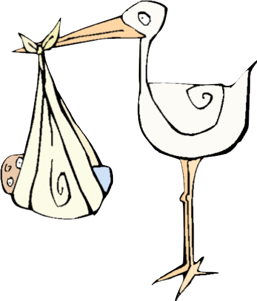
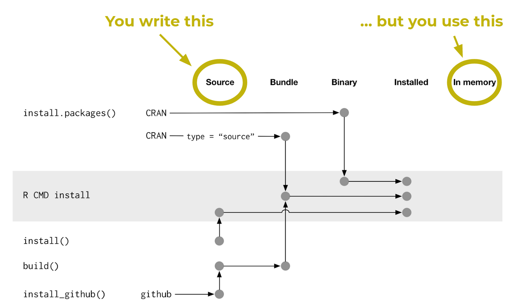
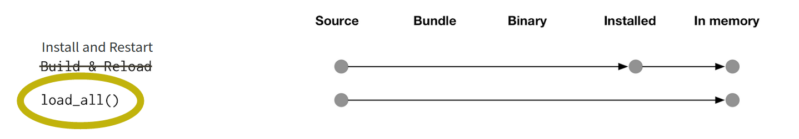
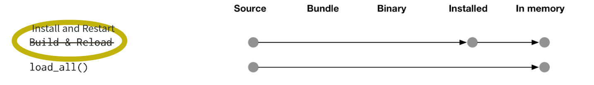

```{r define-style, include = FALSE}
# xaringanthemer ---------------------------------------------------------------
library(xaringanthemer)
style_duo_accent(
  primary_color = "#AD4475", # soft pink
  secondary_color = "#8D377C", # purple
  link_color = "#4485ad", # blue
  code_highlight_color = "#F9E5AF", # light-yellow
  code_inline_color = "#A7A7A7", # gray
  base_font_size = "35px",
  header_h1_font_size = "2.5rem",
  header_h2_font_size = "2rem",
  header_h3_font_size = "1.75rem",
  text_font_google = google_font("Source Sans Pro"),
  text_font_family = xaringanthemer_font_default("text_font_family"),
  text_font_weight = xaringanthemer_font_default("text_font_weight"),
  text_font_url = xaringanthemer_font_default("text_font_url"),
  text_font_family_fallback = xaringanthemer_font_default("text_font_family_fallback"),
  text_font_base = "sans-serif",
  code_font_google = google_font("Source Sans Code"),
  code_font_family = xaringanthemer_font_default("code_font_family"),
  code_font_size = "25px",
  code_font_url = xaringanthemer_font_default("code_font_url"),
  code_font_family_fallback = xaringanthemer_font_default("code_font_family_fallback"),
  outfile = "style-xaringanthemer.css"
)

# R options --------------------------------------------------------------------
options(
  htmltools.dir.version = FALSE,
  dplyr.print_min = 6,
  dplyr.print_max = 6,
  tibble.width = 65,
  width = 65
)

# figure height, width, dpi ----------------------------------------------------

knitr::opts_chunk$set(
  echo = TRUE,
  fig.width = 8,
  fig.asp = 0.618,
  out.width = "60%",
  fig.align = "center",
  dpi = 300,
  message = FALSE
)

# ggplot2 ----------------------------------------------------------------------
ggplot2::theme_set(ggplot2::theme_minimal(base_size = 18))

# countdown --------------------------------------------------------------------
library(countdown)

# xaringanExtra ----------------------------------------------------------------
library(xaringanExtra)
xaringanExtra::use_panelset()

# hook for setting output number of lines --------------------------------------
hook_output <- knitr::knit_hooks$get("output")
knitr::knit_hooks$set(output = function(x, options) {
  lines <- options$output.lines
  if (is.null(lines)) {
    return(hook_output(x, options)) # pass to default hook
  }
  x <- unlist(strsplit(x, "\n"))
  more <- "..."
  if (length(lines) == 1) { # first n lines
    if (length(x) > lines) {
      # truncate the output, but add ....
      x <- c(head(x, lines), more)
    }
  } else {
    x <- c(more, x[lines], more)
  }
  # paste these lines together
  x <- paste(c(x, ""), collapse = "\n")
  hook_output(x, options)
})


# Referencing ------------------------------------------------------------------
library(RefManageR)
BibOptions(
  check.entries = FALSE,
  bib.style = "authoryear",
  cite.style = "authoryear",
  style = "markdown",
  hyperlink = TRUE,
  dashed = FALSE,
  longnamesfirst = FALSE,
  max.names = 2
)
myBib <- ReadBib("bibliography.bib", check = FALSE)
```

layout: true
  
<div class="my-footer">
<span>
<a href="https://3mmarand.github.io/workshops/package-dev-modules/slides/01-packages-in-a-nutshell/packages-in-a-nutshell.html" target="_blank">🔗 Link to slides</a>
</span>
</div> 


---

class: middle, inverse

# Overview

---

## Welcome!

.pull-left[
.center[
```{r echo = FALSE, out.width = "45%"}
knitr::include_graphics("images/emma-rand.png")
```
Emma Rand  
.small[
Senior Lecturer (Prof)  
Department of Biology, University of York, UK 
]
]
]
.pull-right[
.center[
```{r echo = FALSE, out.width = "45%"}
knitr::include_graphics("images/mine.jpg")
```
Dr. Mine Çetinkaya-Rundel 
.small[
Senior lecturer (Prof)  
School of Maths, University of Edinburgh, UK   
RStudio
]
]
]

.center[
[Forwards](https://forwards.github.io/) Teaching Team Leads
]

---

## Summary

This workshop explains what a package is and why you might want to write one. 

-  where packages come from
-  where they live on your computer
-  package states
-  package components


???

This workshop explains what a package is and why you might want to write one. It covers where packages come from, where they live on your computer and the different states a package can be in. We will explore the key components of a package using an example and outline the Forwards approach to package development process.


---

## Module Prerequisites

Before starting this module you should have:

-  [installed R and RStudio](../prerequisite-guides/install-r-rstudio.md)

-  had some experience of coding in R and it will help to have previously installed and loaded packages


???

Add speaker notes

---

## Learning Objectives

At the end of this module the successful learner will be able to:

- explain the rationale for writing packages

- find and explore their own package library/libraries

- describe the key components of a package

- describe the different states a package can be in

- outline the development of a package using devtools


???

Add speaker notes

---

class: middle, inverse

# Why write a package?

---

## Why resuable components

-  You want to **test** it

-  You want to **generalise** it

-  You want to **document** it

-  You want to **share** it

-  You want to create **impact** from your work


???

These aspects allow you to work reproducibly, collaborate with others and disseminate your work more easily.

This helps you gain recognition and create impact from your work.

---

## The bad news

.... it may be frustrating
```{r, echo = FALSE, out.width = "500px"}
knitr::include_graphics("images/allie_brosh_argh.png")
```

.tiny[
COPYRIGHT: Allie Brosh  http://hyperboleandahalf.blogspot.com/2010/09/four-levels-of-social-entrapment.html
]


???

Add speaker notes

---

## The good news!

.... frustration is normal and temporary.
```{r, echo = FALSE, out.width = "500px"}
knitr::include_graphics("images/allie_brosh_happy.png")
```

.tiny[
COPYRIGHT: Allie Brosh  http://hyperboleandahalf.blogspot.com/2010/06/this-is-why-ill-never-be-adult.html
]


???

Add speaker notes

---

class: middle, inverse

# Where do packages live?

---
## R packages live in a library

```{r, out.width = "500px", echo = FALSE}

```

--

Where's the library?

---
## Get to know your R installation.

.your-turn[
What version of R are you using?
]

.scroll-output-height[
```{r}
R.version
```
]

???

Add speaker notes

---
## Get to know your R installation.

.your-turn[
Where is R's home directory?
]

```{r}
R.home()
```

The R home directory is the top-level directory of the R installation being run.

Note: this is **not** the same as your working directory.

???

The name of the home directory will be the version you are using.

The home directory is where R will look for the programs and functions it needs.

You working directory is where R will look for your files.


---

## Get to know your R installation.

.your-turn[
What is in R's home directory?
]
The home directory contains these files and folders:

```{r}
list.files(R.home())
```


???

Add speaker notes

---

## Get to know your R library


.your-turn[
What is the default R library?
]


```{r}
.Library
```

The default library is in the home directory

???

Add speaker notes
---

## Get to know your R library

.your-turn[
What libraries does R know about?
]

```{r}
.libPaths()
```


???

Add speaker notes

---

## Get to know your R library.

For many R users `.Library` and `.libPaths()` are the same.  

--

Other R users maintain, or have access to, multiple libraries.

--
.tip[
You may not have write access to the default library.
]
---

## Where do R packages come from?

```{r, echo = FALSE, out.width = "400px"}

```

???

Add speaker notes

---

## Where do R packages come from?

CRAN and GitHub, mostly

CRAN:
```{r, eval=FALSE}
install.packages("praise")
```

GitHub:
```{r, eval=FALSE}
remotes::install_github("rladies/praise")
```


???

You can often find the latest features for a package in development on GitHub. Some packages never make it to CRAN. Not necessarily 'bad' packages, the author just hasn't done the paperwork required.

To install to a particular library:

install.packages("praise", lib = library)

withr::with_libpaths(library, install_github("gaborcsardi/praise"))

---

## Your installed packages

.your-turn[
How many packages do you have installed?
]
```{r}
dim(installed.packages())
```
--
The output of `installed.packages()` is a matrix; each row is a package

--

I have `r dim(installed.packages())[1]` packages installed

???

Add speaker notes

---

## Your installed packages

.your-turn[
View the matrix of installed packages
]

```r
View(installed.packages())
```
???

Add speaker notes

---


## Your installed packages

The columns give some information about each package:

```{r}
colnames(installed.packages())
```

???

Add speaker notes

---
## Startup files

.pull-left[

`.Rprofile`

Code that runs at startup
 - Load workflow packages
 - Set options
 - Use in moderation!
 ]
 
.pull-right[
`.Renviron`

Settings for R
 - Set library paths
 - Set environment variables
]

???

Help you manage your library paths (amongst other things).
You will edit these in set up

---

class: middle, inverse

# Developing a script vs developing a package

---
## Different

.pull-left-narrow[
.hand[.blue[Script]]

-  one-off data analysis
-  defined by `.R` extension
-  `library()` calls
-  documentation in `#` comments
-  `source()`
]

.pull-right-wide[
.hand[.blue[Package]]
-  defines reusable components
-  defined by presence of `DESCRIPTION` file
-  Required packages specified in `DESCRIPTION`, made available in `NAMESPACE` file
-  documentation in files and `Roxygen` comments
-  Install and restart
]


???

Add speaker notes

---
## Same

Iterate early and often!  

Change it, try it, change it, try it, 


---

class: middle, inverse

# Explore!

---

## Explore

.your-turn[
Look at [Stephanie Kirmer's](https://github.com/skirmer) demo package [here](https://github.com/forwards/workshops/tree/master/Chicago2019/demoPackage)

-  Where’s the R code? What is it mostly comprised of?
-  What do you think is in the DESCRIPTION file? 
-  How about the NAMESPACE file?

]
???
Mainly comments in the form:
#' goToTheZoo

DESCRIPTION has package metadata. The presence of this file is what makes and RStudio Project a package. 
NAMESPACE gives the functions imported and exported

This looks like a lot of files to get right! Fortunately the devtools approach will make most of this automatically!

---

class: middle, inverse

# Package states
---
## Package states

There are five states a package can be in:
-  source

-  bundled

-  binary

-  installed

-  in-memory
---

```{r, out.width = "870px", echo = FALSE}

```

.tiny[
Figure from [R Packages](https://r-pkgs.org/) `r Cite(myBib, "Wickham_Bryan")`
https://github.com/hadley/r-pkgs/blob/master/diagrams/installation.png
]

???
You already know some of the functions that put packages into these states. For example, `install.packages()` and `remotes::install_github()` move a package from source, bundled, or binary states into the installed state. 
The `library()` function loads an installed package into memory, making it available for immediate and direct use.

---

## Package states

.pull-left-narrow[
-  .tip[source]

-  bundled

-  binary

-  installed

-  in-memory
]

.pull-right-wide[
.tip[
What you create and work on.

Specific directory structure with some particular components e.g., `DESCRIPTION`, an `R/` directory.

We examined the source of the demoPackage

]
]

???

Add speaker notes
---

## Package states

.your-turn[
Visit the CRAN landing page for `readxl`:  https://cran.r-project.org/package=readxl 

And the GitHub repository where `readxl` is developed in the open: 
https://github.com/tidyverse/readxl
]
---

## Package states

.pull-left-narrow[
-  source

-  .tip[bundled]

-  binary

-  installed

-  in-memory
]

.pull-right-wide[
.tip[

Also known as "source tarballs".

Package files compressed to single file.

Conventionally `.tar.gz`

You don't normally need to make one.

Unpacked it looks very like the source package
]
]

???

In the rare case that you need to make a bundle from a package you’re developing locally, use devtools::build(). Under the hood, this calls pkgbuild::build() and, ultimately, R CMD build, which is described further in the Building package tarballs section of Writing R Extensions.

---

## Package states

.pull-left-narrow[
-  source

-  bundled

-  .tip[binary]

-  installed

-  in-memory
]

.pull-right-wide[
.tip[

Package distribution for users w/o dev tools

Also a single file

Platform specific: `.tgz` (Mac) `.zip` (Windows)

Package developers submit a bundle to CRAN; CRAN makes and distributes binaries

`install.packages()` 
]
]

???

`install.packages()` is usually downloading the binary

To understand the difference between package bundle and a package binary see https://r-pkgs.org/package-structure-state.html

---

## Package states

.pull-left-narrow[
-  source

-  bundled

-  binary

-  .tip[installed]

-  in-memory
]

.pull-right-wide[
.tip[
A binary package that’s been decompressed into a package library

Command line tool `R CMD INSTALL` powers all package installation
]
]

???

Add speaker notes
---

```{r, out.width = "900px", echo = FALSE}
knitr::include_graphics("images/installation.png")
```

There's more than one route (tool) for installation.

.tiny[
Figure from [R Packages](https://r-pkgs.org/) `r Cite(myBib, "Wickham_Bryan")`
https://github.com/hadley/r-pkgs/blob/master/diagrams/installation.png
]

???
---

## Package states

.pull-left-narrow[
-  source

-  bundled

-  binary

-  installed

-  .tip[in-memory]
]

.pull-right-wide[
.tip[

If a package is installed `library()` makes its function available by loading the package into memory and attaching it to the search path.

We do not use `library()` for packages we are working on

`devtools::load_all()` loads a source package directly into memory.
]
]

???

Add speaker notes

---
class: middle, inverse

# Workflow

---
# Workflow

```{r, out.width = "800px", echo = FALSE}

```


`devtools::load_all()` is to package development  

as  

interactive “stepping through” code is to script development

???

devtools::load_all() simulates package installation, i.e., it puts the package in to memory.
---
# Workflow

```{r, out.width = "800px", echo = FALSE}

```


RStudio’s Install & Restart is to package development  
as  
`source()` or

RStudio’s "Source" or `Rscript foo.R` is to script development

???

Add speaker notes

---
# Workflow

Use `devtools::load_all( )` a lot!  

(And “Install and Restart” sparingly)


???

Add speaker notes

---

class: middle, inverse

# Approach


---

## Approach

We follow the approach used in [R Packages](https://r-pkgs.org/) `r Cite(myBib, "Wickham_Bryan")`:

-  uses `devtools` 
-  in RStudio
-  version controlled using git
-  hosted on GitHub

---
class: middle, inverse

# Summary

---

## Summary

-  packages allow you to generalise, test, document and share your code
-  packages come from CRAN and GitHub (mainly)
-  they live in libraries on your pc
-  you write source, submit bundles, install binaries (mainly), and use in-memory
-  we use `devtools::load_all()` during development a lot

???

Add speaker notes

---

class: middle, inverse

# Where next?

---

## Where next?

<!-- list some follow-up resources -->

R Forwards modules

-  [Setting up your system](https://www.eventbrite.co.uk/e/r-forwards-package-development-module-setting-up-your-system-tickets-132115790887)
-  [Your first package!](https://www.eventbrite.co.uk/e/r-forwards-package-development-module-your-first-package-tickets-132115738731)

Other sources
-  [R Packages](https://r-pkgs.org/) `r Cite(myBib, "Wickham_Bryan")`
-  Hillary Parker's [Writing an R package from scratch](https://hilaryparker.com/2014/04/29/writing-an-r-package-from-scratch/)
-  Karl Broman's [R package primer a minimal tutorial](https://kbroman.org/pkg_primer/)

???
Setting up your system sign up close 1800 GMT Monday
Your first package! sign up close 1800 GMT Tuesday

---

class: middle, inverse

# What questions do you have?

---

class: middle, inverse

# Acknowledgements

---

Slides made with: **`knitr`** `r Cite(myBib, c("knitr1", "knitr2", "knitr3"))`,**`R Markdown`** `r Cite(myBib, c("markdown1", "markdown2"))`, **`xaringan`** `r Cite(myBib, "xaringan")`, **`xaringanthemer`** `r Cite(myBib, "xaringanthemer")`, **`xaringanExtra`** `r Cite(myBib, "xaringanExtra")`, **`countdown`** `r Cite(myBib, "countdown")`. 

Referencing with **`RefManageR`** `r Cite(myBib, "McLean-2017")`.

Designed by: [Mine Çetinkaya-Rundel](https://twitter.com/minebocek) and [Emma Rand](https://twitter.com/er13_r)

---

## References

.small[
```{r refs1, echo = FALSE, results  ="asis"}
PrintBibliography(myBib, start = 1, end = 5)
```
]

---

## References

.small[
```{r refs2, echo = FALSE, results = "asis"}
PrintBibliography(myBib, start = 6, end = 10)
```
]

---

## References

.small[
```{r refs3, echo = FALSE, results = "asis"}
PrintBibliography(myBib, start = 11)
```
]

---

## License

<a rel="license" href="http://creativecommons.org/licenses/by-nc-sa/4.0/"></a><br /><span xmlns:dct="http://purl.org/dc/terms/" property="dct:title">Package Development Module: Packages in a nutshell</span> by <span xmlns:cc="http://creativecommons.org/ns#" property="cc:attributionName">Forwards</span> is licensed under a <a rel="license" href="http://creativecommons.org/licenses/by-nc-sa/4.0/">Creative Commons Attribution-NonCommercial-ShareAlike 4.0 International License</a>.
