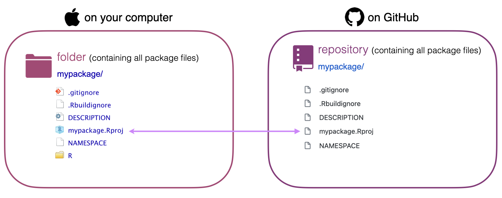

```{r define-style, include = FALSE}
# xaringanthemer ---------------------------------------------------------------
library(xaringanthemer)
style_duo_accent(
  primary_color = "#AD4475", # soft pink
  secondary_color = "#8D377C", # purple
  link_color = "#4485ad", # blue
  code_highlight_color = "#F9E5AF", # light-yellow
  code_inline_color = "#A7A7A7", # gray
  base_font_size = "35px",
  header_h1_font_size = "2.5rem",
  header_h2_font_size = "2rem",
  header_h3_font_size = "1.75rem",
  text_font_google = google_font("Source Sans Pro"),
  text_font_family = xaringanthemer_font_default("text_font_family"),
  text_font_weight = xaringanthemer_font_default("text_font_weight"),
  text_font_url = xaringanthemer_font_default("text_font_url"),
  text_font_family_fallback = xaringanthemer_font_default("text_font_family_fallback"),
  text_font_base = "sans-serif",
  code_font_google = google_font("Source Sans Code"),
  code_font_family = xaringanthemer_font_default("code_font_family"),
  code_font_size = "25px",
  code_font_url = xaringanthemer_font_default("code_font_url"),
  code_font_family_fallback = xaringanthemer_font_default("code_font_family_fallback"),
  outfile = "style-xaringanthemer.css"
)

# R options --------------------------------------------------------------------
options(
  htmltools.dir.version = FALSE,
  dplyr.print_min = 6,
  dplyr.print_max = 6,
  tibble.width = 65,
  width = 65
)

# figure height, width, dpi ----------------------------------------------------

knitr::opts_chunk$set(
  echo = TRUE,
  fig.width = 8,
  fig.asp = 0.618,
  out.width = "60%",
  fig.align = "center",
  dpi = 300,
  message = FALSE
)

# ggplot2 ----------------------------------------------------------------------
ggplot2::theme_set(ggplot2::theme_minimal(base_size = 18))

# countdown --------------------------------------------------------------------
library(countdown)

# xaringanExtra ----------------------------------------------------------------
library(xaringanExtra)
xaringanExtra::use_panelset()

# hook for setting output number of lines --------------------------------------
hook_output <- knitr::knit_hooks$get("output")
knitr::knit_hooks$set(output = function(x, options) {
  lines <- options$output.lines
  if (is.null(lines)) {
    return(hook_output(x, options)) # pass to default hook
  }
  x <- unlist(strsplit(x, "\n"))
  more <- "..."
  if (length(lines) == 1) { # first n lines
    if (length(x) > lines) {
      # truncate the output, but add ....
      x <- c(head(x, lines), more)
    }
  } else {
    x <- c(more, x[lines], more)
  }
  # paste these lines together
  x <- paste(c(x, ""), collapse = "\n")
  hook_output(x, options)
})


# Referencing ------------------------------------------------------------------
library(RefManageR)
BibOptions(check.entries = FALSE,
           bib.style = "authoryear",
           cite.style = "authoryear",
           style = "markdown",
           hyperlink = TRUE,
           dashed = FALSE,
           longnamesfirst = FALSE,
           max.names = 2)
myBib <- ReadBib("../bibliography.bib", check = FALSE)
```

layout: true
  
<div class="my-footer">
<span>
<a href="https://forwards.github.io/" target="_blank">🔗 Link to slides</a>
</span>
</div> 


<!-- Based on https://github.com/forwards/fwdbrand/blob/master/inst/rmarkdown/templates/xaringan/skeleton/skeleton.Rmd with module template added -->

<!-- Instructions creating a new module-->
<!-- Guiding principles for module design are here: 
../README.md -->
<!-- Edit Title, subtitle, Author and link -->
<!-- Complete the sections in the module template and add your teaching material using the Format templates as a guide where needed -->


---

class: middle

# Overview

---

## Welcome!

.pull-left[
.center[
```{r echo = FALSE, out.width = "45%"}
knitr::include_graphics("images/emma-rand.png")
```
Emma Rand  
.small[
Senior Lecturer (Prof)  
Department of Biology, University of York, UK 
]
]
]
.pull-right[
.center[
```{r echo = FALSE, out.width = "45%"}
knitr::include_graphics("images/mine.jpg")
```
Dr. Mine Çetinkaya-Rundel 
.small[
Senior lecturer (Prof)  
School of Maths, University of Edinburgh, UK   
RStudio
]
]
]

.center[
[Forwards](https://forwards.github.io/) Teaching Team Leads
]

---

## Summary

This workshop walks you through setting up your system

- for developing an R package and
- for version control with Git with repositories hosted on GitHub

In this workshop we assume `your system = Mac` -- if you're on a Windows machine, take the parallel workshop *Setting up your system for Windows users*


???

This workshop walks you through setting up your system for developing an R package and for version control with Git with repositories hosted on GitHub. Our goal is to get your system ready for actual package development in the next module.

---

## Lesson plan

-  0 - 5: Introduction  
    -  Prerequisites  
    -  Learning Objectives  
-  5 - 25: Section 1: Live code-along-coding  
-  25 - 30: Additional exercises based on Section 1  
-  30 - 45: Section 2: Live code-along-coding  
-  45 - 50: Additional exercises based on Section 2  
-  50 - 55: Wrap-up, where next, additional exercises  

<!-- Edit appropriately -->

???

Add speaker notes

---

## Module Prerequisites

Before starting this module you should complete the first module in the Forwards package development series: Packages in a nutshell.

We will assume that you have

-  [installed R and RStudio](../prerequisite-guides/install-r-rstudio.md)

-  some experience of coding in R

-  installed and loaded a package

<!-- Here you list the prerequisites for instructors and learners. Most prerequisites should be references to other modules. You can include additional prerequisites but minimise the number and complexity of them. If there are many, consider writing a new module. -->

???

Add speaker notes

---

## Learning Objectives

At the end of this module the successful learner will be able to:

- set up their system to create and develop an R package (that does not use C or C++ code)

- set up their system to use version control with Git 

- set up their RStudio environment to communicate with GitHub

<!-- Here you list specific LO for the module. The LOs describe what someone will be able to to do after undertaking the module. “Bloom's Taxonomy of Educational Objectives (published in 1956 and revised in 2001) provides a useful model for thinking about LO. More here: http://teachtogether.tech/en/#s:process-objectives-->

???

Add speaker notes

---

class: middle, inverse

# Review

---

# Types of R packages

.pull-left-wide[
- Installing released packages from CRAN using `install.packages()` -- **binary**
- Installing development packages using `devtools::install_github()` -- **source**
- Once installed, binary and source packages are identical
]
.pull-right-narrow[
```{r, out.width = "100%", echo = FALSE, fig.alt = "Various stages of R packages (source, bundle, binary, installed, and in memory) on the x-axis and the various installation options (install.packages, R CMD install, install, build, install_github)."}
knitr::include_graphics("images/installation.png")
```
]


.tiny[
Figure from [R Packages](https://r-pkgs.org/) `r Cite(myBib, "Wickham_Bryan")`
https://github.com/hadley/r-pkgs/blob/master/diagrams/installation.png
]

???
You already know some of the functions that put packages into these states. For example, `install.packages()` and `devtools::install_github()` move a package from source, bundled, or binary states into the installed state. 
The `library()` function loads an installed package into memory, making it available for immediate and direct use.

---

## devtools

> "The aim of devtools is to make package development easier by providing R functions that simplify and expedite common tasks."
> [devtools.r-lib.org](https://devtools.r-lib.org/)

```{r eval = FALSE}
install.packages("devtools")
library(devtools)
```

Use devtools to

- install source packages from GitHub and elsewhere
- install and develop packages you write

???

Using the devtools package is not a requirement for developing or installing from source R packages, but it's a convenient, user-friendly, and well-documented approach.

---

class: middle, inverse

# Setting up your system for development

---

## Xcode

Install the Xcode command line tools:

- **Option 1:** 
  - [Register as an Apple developer](https://developer.apple.com/programs/register/)
  - In the Terminal:
  ```
  xcode-select --install
  ```

- **Option 2:** Install the current release of full [Xcode from the Mac App Store](https://itunes.apple.com/ca/app/xcode/id497799835?mt=12)

???

Option 2 is convenient since you can just get it off the App Store, but it includes a great deal that you do not need.

---

## Verify system setup

```{r}
library(devtools)
```

```{r message = TRUE}
has_devel()
```

---

## What's next?

- Creating a package is as easy as...

```{r eval = FALSE}
create_package()
```

- But we're going to do a bit more setup first!
  - Use version control during development with **Git**
  - Host your package on **GitHub**

---

class: middle

# Git

---

## Check Git status

In the **Terminal**

.pull-left[
- Check if Git is installed

```{bash}
which git
```
]
.pull-right[
- Check the version of your Git

```{bash}
git --version
```
]

.tip[
If asked to install the Xcode command line tools, say yes!
]

???

Add speaker notes

---

## Installing Git

If `which git` didn't find Git installed, and if you weren't prompted to install it, you can run the following in the Terminal

```{bash, eval = FALSE}
xcode-select --install
```

---

## Other options for installing Git

We're providing these for reference, but expect that by now you're all set up with Git!

- Recommended if you don't want to use the Terminal:
  - Download and install from https://git-scm.com/downloads
  - If you're developing version controlled packages, you should get to using the Terminal

- Recommended if you do lots of scientific computing and using software that needs to be installed and updated regularly:
  - Use Homebrew: Run the following in the Terminal

  ```{bash, eval = FALSE}
  brew install git
  ```
  
  - You might first need to install Homebrew if this is your first time using it, see [brew.sh](https://brew.sh/) for instructions

---

class: middle

# GitHub

---

## stuff about setting up GitHub account

---

## git sitrep...

---

class: middle

# R & RStudio `r emo::ji("purple_heart")` Git & GitHub

---

## Love potion: RStudio projects

```{r echo=FALSE, out.width="100%"}

```

---

## stuff about RStudio projects

---


class: middle

# Where next?

---

## Where next?

<!-- which module in the curriculum could follow -->
<!-- list some follow-up resources -->

???

Add speaker notes

---

Slides made with:  **`knitr`** `r Cite(myBib, c("knitr1", "knitr2", "knitr3"))`,**`R Markdown`** `r Cite(myBib, c("markdown1", "markdown2"))`, **`xaringan`** `r Cite(myBib, "xaringan")`, **`xaringanthemer`** `r Cite(myBib, "xaringanthemer")`, **`xaringanExtra`** `r Cite(myBib, "xaringanExtra")`, **`countdown`** `r Cite(myBib, "countdown")`. 

Referencing with **`RefManageR`** `r Cite(myBib, "McLean-2017")`.

Designed by: [Mine Çetinkaya-Rundel](https://twitter.com/minebocek) and [Emma Rand](https://twitter.com/er13_r)

---
## References

.small[
```{r refs1, echo=FALSE, results="asis"}
PrintBibliography(myBib, start = 1, end = 5)
```
]

---

## References

.small[
```{r refs2, echo=FALSE, results="asis"}
PrintBibliography(myBib, start = 6, end = 10)
```
]


---
## License

<a rel="license" href="http://creativecommons.org/licenses/by-nc-sa/4.0/"></a><br /><span xmlns:dct="http://purl.org/dc/terms/" property="dct:title">Package Development Module: fill in the module name</span> by <span xmlns:cc="http://creativecommons.org/ns#" property="cc:attributionName">Forwards</span> is licensed under a <a rel="license" href="http://creativecommons.org/licenses/by-nc-sa/4.0/">Creative Commons Attribution-NonCommercial-ShareAlike 4.0 International License</a>.


