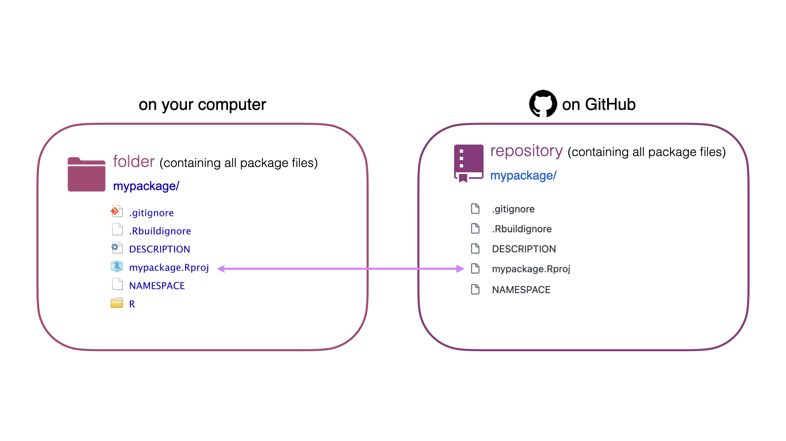

```{r define-style, include = FALSE}
# xaringanthemer ---------------------------------------------------------------
library(xaringanthemer)
style_duo_accent(
  primary_color = "#AD4475", # soft pink
  secondary_color = "#8D377C", # purple
  link_color = "#4485ad", # blue
  code_highlight_color = "#F9E5AF", # light-yellow
  code_inline_color = "#A7A7A7", # gray
  base_font_size = "35px",
  header_h1_font_size = "2.5rem",
  header_h2_font_size = "2rem",
  header_h3_font_size = "1.75rem",
  text_font_google = google_font("Source Sans Pro"),
  text_font_family = xaringanthemer_font_default("text_font_family"),
  text_font_weight = xaringanthemer_font_default("text_font_weight"),
  text_font_url = xaringanthemer_font_default("text_font_url"),
  text_font_family_fallback = xaringanthemer_font_default("text_font_family_fallback"),
  text_font_base = "sans-serif",
  code_font_google = google_font("Source Sans Code"),
  code_font_family = xaringanthemer_font_default("code_font_family"),
  code_font_size = "25px",
  code_font_url = xaringanthemer_font_default("code_font_url"),
  code_font_family_fallback = xaringanthemer_font_default("code_font_family_fallback"),
  outfile = "style-xaringanthemer.css"
)

# R options --------------------------------------------------------------------
options(
  htmltools.dir.version = FALSE,
  dplyr.print_min = 6,
  dplyr.print_max = 6,
  tibble.width = 65,
  width = 65
)

# figure height, width, dpi ----------------------------------------------------

knitr::opts_chunk$set(
  echo = TRUE,
  fig.width = 8,
  fig.asp = 0.618,
  out.width = "60%",
  fig.align = "center",
  dpi = 300,
  message = FALSE
)

# ggplot2 ----------------------------------------------------------------------
ggplot2::theme_set(ggplot2::theme_minimal(base_size = 18))

# countdown --------------------------------------------------------------------
library(countdown)

# xaringanExtra ----------------------------------------------------------------
library(xaringanExtra)
xaringanExtra::use_panelset()

# hook for setting output number of lines --------------------------------------
hook_output <- knitr::knit_hooks$get("output")
knitr::knit_hooks$set(output = function(x, options) {
  lines <- options$output.lines
  if (is.null(lines)) {
    return(hook_output(x, options)) # pass to default hook
  }
  x <- unlist(strsplit(x, "\n"))
  more <- "..."
  if (length(lines) == 1) { # first n lines
    if (length(x) > lines) {
      # truncate the output, but add ....
      x <- c(head(x, lines), more)
    }
  } else {
    x <- c(more, x[lines], more)
  }
  # paste these lines together
  x <- paste(c(x, ""), collapse = "\n")
  hook_output(x, options)
})


# Referencing ------------------------------------------------------------------
library(RefManageR)
BibOptions(check.entries = FALSE,
           bib.style = "authoryear",
           cite.style = "authoryear",
           style = "markdown",
           hyperlink = TRUE,
           dashed = FALSE,
           longnamesfirst = FALSE,
           max.names = 2)
myBib <- ReadBib("../bibliography.bib", check = FALSE)
```

layout: true
  
<div class="my-footer">
<span>
<a href="http://bit.ly/pkg-dev-2" target="_blank">🔗 bit.ly/pkg-dev-2</a>
</span>
</div> 


<!-- Based on https://github.com/forwards/fwdbrand/blob/master/inst/rmarkdown/templates/xaringan/skeleton/skeleton.Rmd with module template added -->

<!-- Instructions creating a new module-->
<!-- Guiding principles for module design are here: 
../README.md -->
<!-- Edit Title, subtitle, Author and link -->
<!-- Complete the sections in the module template and add your teaching material using the Format templates as a guide where needed -->


---

class: middle

# Overview

---

## Welcome!

.pull-left[
.center[
```{r echo = FALSE, out.width = "45%", fig.alt = "Emma Rand headshot"}

```
Emma Rand  
.small[
Senior Lecturer (Prof)  
Department of Biology, University of York, UK 
]
]
]
.pull-right[
.center[
```{r echo = FALSE, out.width = "45%", fig.alt = "Mine Çetinkaya-Rundel headshot"}

```
Dr. Mine Çetinkaya-Rundel 
.small[
Senior lecturer (Prof)  
Duke University, Durham, NC, USA   
RStudio
]
]
]

.center[
[Forwards](https://forwards.github.io/) Teaching Team Leads
]

<!-- Speaker notes -->

???

Hello and welcome! The package development workshop modules by R Forwards have been designed and developed by Emma Rand and Mine Çetinkaya-Rundel. I'm Mine, and Emma is running the parallel workshop on setting up your system on a Windows machine. I'm a Senior Lecturer at the University of Edinburgh and I am also part of the Education team at RStudio.  

---

## Summary

This workshop walks you through setting up your system

- for developing an R package and
- for version control with Git with repositories hosted on GitHub

<!-- Speaker notes -->

???

This workshop walks you through setting up your system for developing an R package and for version control with Git with repositories hosted on GitHub. Our goal is to get your system ready for actual package development in the next module. And, once again, we're assuming that you're working on a Mac, not a Windows machine. 

---

## Module Prerequisites

Before starting this module you should complete the first module in the Forwards package development series: [**Packages in a nutshell**](http://bit.ly/pkg-dev-1)

We will assume that you have

-  [installed R and RStudio](../prerequisite-guides/install-r-rstudio.md)

-  some experience of coding in R

-  installed and loaded a package

<!-- Here you list the prerequisites for instructors and learners. Most prerequisites should be references to other modules. You can include additional prerequisites but minimise the number and complexity of them. If there are many, consider writing a new module. -->

???

Add speaker notes

---

## Be excellent to each other!

`r emo::ji("yellow_heart")` Please use the chat!

`r emo::ji("purple_heart")` Be kind

`r emo::ji("green_heart")` Be respectful

???

Our intention is make time for asking questions. Please use the chat.
We hope you will feel comfortable posting your questions 'To everyone' because that will help create a supportive learning space for all of us but if you feel more comfortable messaging me or Emma, that's fine.

---

## Learning Objectives

At the end of this module the successful learner will be able to:

- set up their system to create and develop an R package (that does not use C or C++ code)

- set up their system to use version control with Git 

- set up their RStudio environment to communicate with GitHub

<!-- Here you list specific LO for the module. The LOs describe what someone will be able to to do after undertaking the module. “Bloom's Taxonomy of Educational Objectives (published in 1956 and revised in 2001) provides a useful model for thinking about LO. More here: http://teachtogether.tech/en/#s:process-objectives-->

???

Add speaker notes

---

class: middle, inverse

# Review

---

# Types of R packages

.pull-left-wide[
- Installing released packages from CRAN using `install.packages()` -- **binary**
- Installing development packages using `devtools::install_github()` -- **source**
- Once installed, binary and source packages are identical
]
.pull-right-narrow[
```{r, out.width = "100%", echo = FALSE, fig.alt = "Various stages of R packages (source, bundle, binary, installed, and in memory) on the x-axis and the various installation options (install.packages, R CMD install, install, build, install_github)."}
knitr::include_graphics("images/installation.png")
```
]


.footnote[
.tiny[
Figure from [R Packages](https://r-pkgs.org/) by Wickham and Bryan, original [here](https://github.com/hadley/r-pkgs/blob/master/diagrams/installation.png).
]
]

???

You already know some of the functions that put packages into these states. For example, `install.packages()` and `devtools::install_github()` move a package from source, bundled, or binary states into the installed state. 
The `library()` function loads an installed package into memory, making it available for immediate and direct use.

---

## devtools

> "The aim of devtools is to make package development easier by providing R functions that simplify and expedite common tasks."
> [devtools.r-lib.org](https://devtools.r-lib.org/)

```{r eval = FALSE}
install.packages("devtools")
library(devtools)
```

Use devtools to

- install source packages from GitHub and elsewhere
- install and develop packages you write

???

Using the devtools package is not a requirement for developing or installing from source R packages, but it's a convenient, user-friendly, and well-documented approach.

---

class: middle, inverse

# .hand[on Mac]

---

class: middle

```{r eval = FALSE}
if (your_system == "Mac") {
  print("You're in the right place!")
} else {
  print("Join the parallel workshop!")
}
```

<!-- Speaker notes -->

???

Before we get started -- if you're on a Mac, you're in the right place. If you're on a Windows machine, you should join the other breakout room instead. While there is no difference between how you develop packages on Windows and Mac, there are differences between how you set up your computer with the tools that you will need for package development and version control, therefore it's important that you join the workshop that matches your system setup in order to get the most out of today. I should also admit that I'm not very proficient in setting up a Windows machine, so I wouldn't be able to answer Windows specific questions efficiently.

---

class: middle, inverse

# Setting up your system for development

---

## Xcode

.your-turn[
Install Xcode command line tools.
]

.pull-left[
**Option 1:** 

- [Register as an Apple developer](https://developer.apple.com/programs/register/)
- In the *Terminal*:

```{bash eval = FALSE}
xcode-select --install
```
]
.pull-right[
**Option 2:** 

Install the current release of full [Xcode from the Mac App Store](https://itunes.apple.com/ca/app/xcode/id497799835?mt=12)
]

???

Option 2 is convenient since you can just get it off the App Store, but it includes a great deal that you do not need.

---

## Developer tools

.your-turn[
Verify system setup. Run the following in the *Console*.
]

```{r eval = FALSE}
install.packages("devtools")
```

```{r}
library(devtools)
```

```{r message = TRUE}
has_devel()
```

---

## What's next?

- Creating a package is as easy as...

```{r eval = FALSE}
create_package()
```

- But we're going to do a bit more setup first!
  - Use version control during development with **Git**
  - Host your package on **GitHub**

---

class: middle

# Git

---

## Check Git

.your-turn[
Check if Git is already installed. Run the following in the *Terminal*.
]

.pull-left[
- Check if Git is installed

```{bash, eval = FALSE}
which git
```
]
.pull-right[
- Check the version of your Git

```{bash, eval = FALSE}
git --version
```
]

.tip[
If asked to install the Xcode command line tools, say yes!
]

???

Add speaker notes

---

## Install Git

.your-turn[
If `which git` didn't find Git installed, and if you weren't prompted to install it, run the following in the *Terminal*.
]

```{bash, eval = FALSE}
xcode-select --install
```

---

## Other options for installing Git

.midi[
- Recommended if you don't want to use the Terminal:
  - Download and install from https://git-scm.com/downloads
  - If you're developing version controlled packages, you should get to using the Terminal

- Recommended if you do lots of scientific computing and using software that needs to be installed and updated regularly:
  - You might first need to install Homebrew if this is your first time using it, see [brew.sh](https://brew.sh/) for instructions
  - Use Homebrew: Run the following in the Terminal

  ```{bash, eval = FALSE}
  brew install git
  ```
  
]


???

We're providing these for reference, but expect that by now you're all set up with Git!

---

class: middle

# GitHub

---

## GitHub

.to-do[
Register a GitHub account at [github.com](https://github.com/).
]

.small[
- Incorporate your actual name!
- Reuse your username from other contexts.
- Pick a username you will be comfortable revealing to your future boss.
- Shorter is better than longer.
- Be as unique as possible in as few characters as possible.
- Make it timeless. 
- Avoid words laden with special meaning in programming.
- Use all lower case letters.
]

.footnote[
.small[
Advice from [Happy Git with R](https://happygitwithr.com/github-acct.html).
]
]

---

class: middle

# Git and GitHub

---

## Configure Git

.your-turn[
Configure `user.name` and `user.email`.
]

```{r eval = FALSE}
library(usethis)
use_git_config(
  user.name = "Jane Doe",          # actual first and last name
  user.email = "jane@example.com"  # email associated with GitHub account
  )
```

---

## Check Git configuration

.your-turn[
Ask for a **sit**uation **rep**ort.
]

```{r eval = FALSE}
git_sitrep()
```

---

## Personal access token

- Communicating with GitHub will require authentication

- Instead of typing in your username and password each time, use a **PAT** (personal access token)

- The [Managing Git(Hub) Credentials](https://usethis.r-lib.org/articles/articles/git-credentials.html) vignette in the **usethis** package has all the details on PATs!

---

## Create a PAT

.your-turn[
- Create a PAT
- Give the token a descriptive name
- Copy and also store this token somewhere (you won't be able to see it again!)
]

```{r eval = FALSE}
usethis::create_github_token()
```

---

## Store your PAT

.your-turn[
Put your PAT into the Git credential store
]

```{r eval = FALSE}
gitcreds::gitcreds_set()
```

.tip[
You may need to install **gitcreds** with `install.packages("gitcreds")`.
]

---

class: middle, inverse

# .hand[on Windows]


---

class: middle

```{r eval = FALSE}
if (your_system == "Windows") {
  print("You're in the right place!")
} else {
  print("Join the parallel workshop!")
}
```

<!-- Speaker notes -->

???

Before we get started -- if you're on a Windows machine, you're in the right place. If you're on a Mac machine, you should join the other breakout room instead. While there is no difference between how you develop packages on Windows and Mac, there are differences between how you set up your computer with the tools that you will need for package development and version control, therefore it's important that you join the workshop that matches your system setup in order to get the most out of today. I should also admit that I'm not very proficient in setting up a Mac, so I wouldn't be able to answer Windows specific questions efficiently.

---

class: middle, inverse

# Setting up your system for development

---

## RTools

Download the latest (recommended) Rtools installer, rtools40. from https://cran.r-project.org/bin/windows/Rtools/


- **For Windows with no admin rights:** 
  - Run the installer keeping the default settings.
 
- **For Windows with admin rights:** 
  - Run the installer making the following selections: keep the default settings for the installation location and components to install; check the box to add rtools to the system PATH.

???
R for Windows installs the precompiled “binary packages” from CRAN, for which you do not need rtools.
However, if you want to build packages with C/C++/Fortran code from source or build your own packages you need RTools

IMPORTANT: rtools40 is the current version used for R 4.0.0 and newer. For information about previous versions of Rtools that can be used with R 3.6.3 or older, please visit https://cran.r-project.org/bin/windows/Rtools/history.html.
---

## Developer tools

.your-turn[
Verify system setup. Run the following in the *Console*.
]

```{r eval = FALSE}
install.packages("devtools")
```

```{r}
library(devtools)
```

```{r message = TRUE}
has_devel()
```

---

## What's next?

- Creating a package is as easy as...

```{r eval = FALSE}
create_package()
```

- But we're going to do a bit more setup first!
  - Use version control during development with **Git**
  - Host your package on **GitHub**

---

class: middle

# Git

---

## Check Git

.your-turn[
Check if Git is already installed. Run the following in the *Terminal*.
]

.pull-left[
- Check if Git is installed

```{bash, eval = FALSE}
where git
```
]
.pull-right[
- Check the version of your Git

```{bash, eval = FALSE}
git --version
```
]


???

Add speaker notes


---

## Installing Git

Download the installer from https://git-scm.com/downloads 

Run keeping all the default settings. 

If the installer hangs with the progress bar at 100%, close the installer with Task Manager (press Ctrl + Alt + Delete; select Task Manager; find Git for Windows installer and close).

---

## Installing Git

Open RStudio. In the menus go to Tools > Global Options > Git/SVN. 

Check RStudio has found git under "Git executable:" 

You may need to click Browse and find the git executable.

It may be under C:\Users\username\AppData\Local\Programs\Git\ - remember if file extensions are hidden it will show as git rather than git.exe. Restart RStudio before trying to use git.


???

We're providing these for reference, but expect that by now you're all set up with Git!

---

class: middle

# GitHub

---

## GitHub

.to-do[
Register a GitHub account at [github.com](https://github.com/).
]

.small[
- Incorporate your actual name!
- Reuse your username from other contexts.
- Pick a username you will be comfortable revealing to your future boss.
- Shorter is better than longer.
- Be as unique as possible in as few characters as possible.
- Make it timeless. 
- Avoid words laden with special meaning in programming.
- Use all lower case letters.
]

.footnote[
.small[
Advice from [Happy Git with R](https://happygitwithr.com/github-acct.html).
]
]

---

class: middle

# Git and GitHub

---

## Configure Git

.your-turn[
Configure `user.name` and `user.email`.
]

```{r eval = FALSE}
library(usethis)
use_git_config(
  user.name = "Jane Doe",          # actual first and last name
  user.email = "jane@example.com"  # email associated with GitHub account
  )
```

---

## Check Git configuration

.your-turn[
Ask for a **sit**uation **rep**ort.
]

```{r eval = FALSE}
git_sitrep()
```

---

## Personal access token

- Communicating with GitHub will require authentication

- Instead of typing in your username and password each time, use a **PAT** (personal access token)

- The [Managing Git(Hub) Credentials](https://usethis.r-lib.org/articles/articles/git-credentials.html) vignette in the **usethis** package has all the details on PATs!

---

## Create a PAT

.your-turn[
- Create a PAT
- Give the token a descriptive name
- Copy and also store this token somewhere (you won't be able to see it again!)
]

```{r eval = FALSE}
usethis::create_github_token()
```

---

## Store your PAT

.your-turn[
Put your PAT into the Git credential store
]

```{r eval = FALSE}
gitcreds::gitcreds_set()
```

.tip[
You may need to install **gitcreds** with `install.packages("gitcreds")`.
]

---

class: middle, inverse

# .hand[back together!]

---

class: middle

# R & RStudio `r emo::ji("purple_heart")` Git & GitHub

---

## Love potion: RStudio projects

```{r echo = FALSE, out.width = "100%", fig.alt = "Side-by-side comparison of project folders on your computer and repositories on GitHub."}

```

???

A the project folder on your computer, that contains the files needed to make an R package, is a repository on GitHub. You should only house one package per repository.

---

## RStudio Git pane

```{r echo = FALSE, out.width = "80%", fig.alt = "RStudio Git pane screenshot"}
knitr::include_graphics("images/rstudio-git-pane.png")
```

???

When working in an RStudio project that is Git tracked, you can use the Git pane in RStudio to commit, pull, push, etc., i.e. to communicate with GitHub.

---

class: middle

# Where next?

---

## Where next?

- Next module: Your first package!
- Following module: Package documentation
- Everything you might want to know about using R, RStudio, Git, and GitHub: [Happy Git with R](https://happygitwithr.com/)
- Setting up for Git tracked package development:
  - [usethis setup
](https://usethis.r-lib.org/articles/articles/usethis-setup.html)
  - [Managing Git(Hub) Credentials](https://usethis.r-lib.org/articles/articles/git-credentials.html)

<!-- which module in the curriculum could follow -->
<!-- list some follow-up resources -->

???

Add speaker notes

---

Slides made with:  **`knitr`** `r Cite(myBib, c("knitr1", "knitr2", "knitr3"))`,**`R Markdown`** `r Cite(myBib, c("markdown1", "markdown2"))`, **`xaringan`** `r Cite(myBib, "xaringan")`, **`xaringanthemer`** `r Cite(myBib, "xaringanthemer")`, **`xaringanExtra`** `r Cite(myBib, "xaringanExtra")`, **`countdown`** `r Cite(myBib, "countdown")`. 

Referencing with **`RefManageR`** `r Cite(myBib, "McLean-2017")`.

Designed by: [Mine Çetinkaya-Rundel](https://twitter.com/minebocek) and [Emma Rand](https://twitter.com/er13_r)

---

## License

<a rel="license" href="http://creativecommons.org/licenses/by-nc-sa/4.0/"></a><br /><span xmlns:dct="http://purl.org/dc/terms/" property="dct:title">Package Development Module: fill in the module name</span> by <span xmlns:cc="http://creativecommons.org/ns#" property="cc:attributionName">Forwards</span> is licensed under a <a rel="license" href="http://creativecommons.org/licenses/by-nc-sa/4.0/">Creative Commons Attribution-NonCommercial-ShareAlike 4.0 International License</a>.
