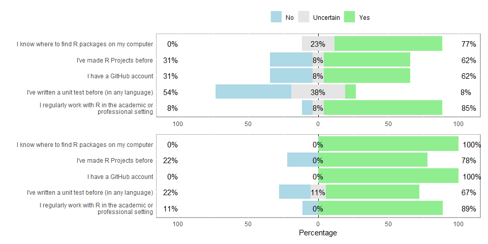
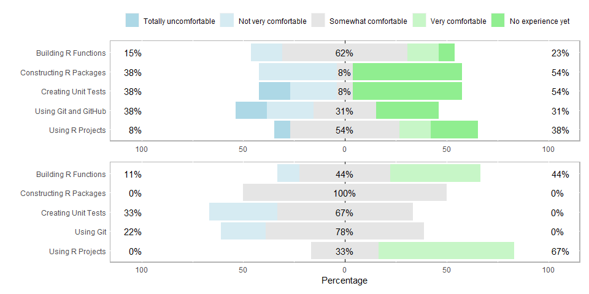

Report on Package Development Workshop, Johannesburg, South Africa
================
Heather Turner
2020-03-30

# Practical detials

  - Date: 07.03.2020
  - Time: 09:00 - 1700
  - Location: PwC, Midrand, South Africa
  - People: Heather Turner and Bianca Peterson

# Description

Curious about package development but not sure where to start? This
workshop is for you\! The goal is to empower you to contribute back to
the R ecosystem through writing your own packages or contributing to
others. We’ll be using materials developed by Hadley Wickham, Jenny
Bryan, and others on the [Forwards teaching
team](https://forwards.github.io/about/).

By the end of this workshop, you should know how to:

  - turn your code into an R package,
  - use GitHub as an effective collaboration tool,
  - add a vignette or an article,
  - build a web page for your package, and
  - submit a package to CRAN.

Prerequisites: Participants should know how to write functions in R.
Knowledge of [R markdown](https://rmarkdown.rstudio.com/index.html) will
be beneficial.

Computing requirements: Attendees are encouraged to set up the required
tools on their laptops as described
[here](https://github.com/forwards/workshops/blob/master/Computing_requirements.md).
Alternatively, an RStudio cloud with the required tools will be
accessible for the duration of the workshop.

Participants may bring their own code that they want to make into a
package, or work with the example provided.

# Advertising

  - Forwards website and Twitter
  - satRday Johannesburg website and Twitter

# Participants

There were 15 participants. Participation in the workshop was
unrestricted.

# Scholarships

Scholarships were open to women from countries with visa-free access to
South Africa. The visa-free condition was added due to the short
time-frame (application deadline 5 weeks before the conference,
notification 1 week later). There were 30 full applications and another
21 partial applications. It is not clear if the partial applications
were a mistake or if the applicants chose not to complete the rest of
form (most completed the first page with basic personal information).
Reminders were sent out to allow people a chance to complete the form
before the deadline, so only complete applications were considered.

Scholarships were awarded to one woman from South Africa, two women from
Namibia and one woman from Kenya. Kenya does not have visa-free access
to South Africa, however the candidate was stronger than others that
applied and in her application she explained that she had funding for
the visa and from experience expected to be able to obtain the required
visa in a matter of days.

The scholarships were intended to cover travel to Johannesburg, the
workshop fee and two nights’ accommodation, with a free ticket to the
satRday the next day. However due to the availability of flights it was
clear that three nights’ accommodation would be necessary to attend the
satRday, so the awarded amounts were set to allow for this, with a small
amount towards daily expenses. The amounts were based on the candidates’
estimates and our own evaluation, with a fixed amount per country:

| Country      | Travel | Accommodation (2 nights) | Allowance | Total Grant (USD) |
| ------------ | ------ | ------------------------ | --------- | ----------------- |
| Kenya        | 600    | 150                      | 100       | 850               |
| Namibia      | 300    | 150                      | 100       | 550               |
| South Africa | 150    | 150                      | 100       | 400               |

The workshop fee was 1000 ZAR per person.

# Surveys

Number of people completing pre-workshop survey: 13

  - Number of students: 3
  - Number of Early career professional: 6
  - Number of Established career professional: 5

Number of people completing post-workshop survey: 9

## Experience: pre and post

Note: Participants were asked to download Git and create a GitHub
account before attending.

<!-- -->

## Perceived difficulty: pre and post

Note: due to constraints on the network at the workshop venue, it was
not possible for participants to work through the GitHub exercises.

<!-- -->
