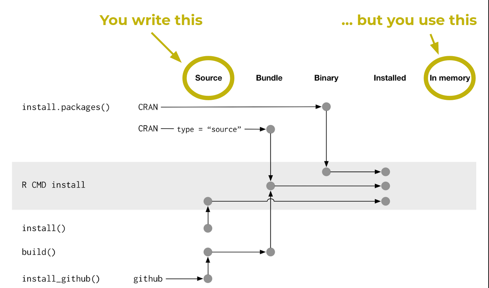
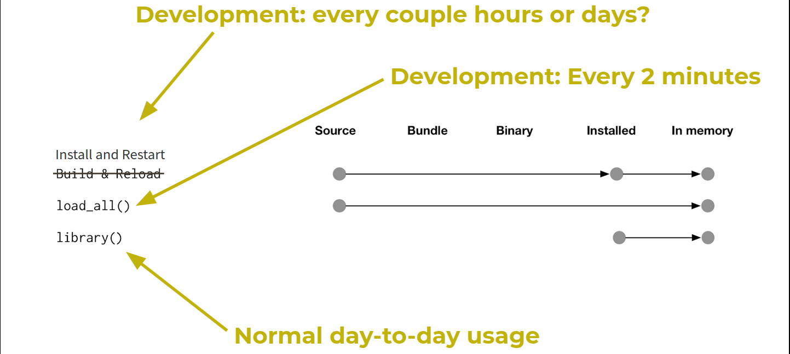
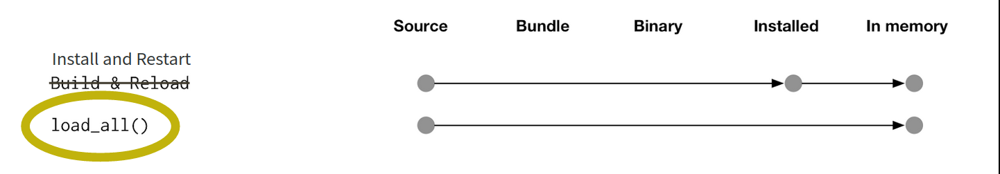
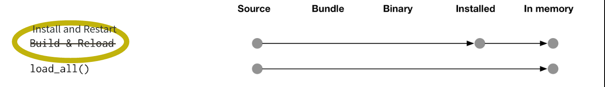

```{r setup, include=FALSE}
knitr::opts_chunk$set(echo = TRUE, 
                      message = FALSE,	
                      warning = FALSE)
options(htmltools.dir.version = FALSE)
```

# Get to know your R installation

Where is R installed on your computer?

```{r}
R.home()
```

---
# Get to know your R installation

What files are in your R installation?

```{r}
list.files(R.home())
```

---
# Get to know your R installation

Which version of R are you using?

```{r}
R.version
```

---
background-image: url(../../pics/stork.png)
background-position: 95% 25%
background-size: 300px
# Get to know your R installation

## Where do R packages come from?

--

CRAN and GitHub, mostly
.pull-left[
CRAN:
```{r, eval=FALSE}
install.packages("foo")
```

GitHub:
```{r, eval=FALSE}
library(devtools)
install_github("jane/foo")
```
]
---
# Get to know your R installation

## Where do R packages live on your computer?

```{r, out.width = "300px", echo=FALSE}
knitr::include_graphics("../../pics/library.png")
```

--

R packages live in a library.

---
# Get to know your R installation

## Get to know your R library

The default library:
```{r}
.Library
```
---
# Get to know your R installation

## Get to know your R library

All the libraries R knows about:
```{r}
.libPaths()
```


---
# Get to know your R installation

## Get to know your R library

* For many R users `.Library` and `.libPaths()` are the same.  

--

* Other R users maintain, or have access to, multiple libraries.

--

* You may not have write access to the default library.

--

* For example, you can put add-on packages in a user-level library:
`/Users/jenny/resources/R/library`

---
# Get to know your R installation


```{r}
View(installed.packages())
```

How many packages do you have installed?

How do the packages break down by Priority (and what does that mean, anyway)?

---
# Get to know your R installation

## Startup files

```
.Rprofile
```
Code that runs at startup
 - Load workflow packages
 - Set options
 - Use in moderation!
 
```
.Renviron
```
Settings for R
 - Set library paths
 - Set environment variables

---
# Get to know your R installation

## Before we start:

Make sure you have recent versions of:

.pull-left[
`devtools`  
`pkgdown`  
`roxygen2`  
]

.pull-right[
`testthat`   
`tidyverse`  
`usethis`  
]

Tip: use `View(old.packages())`

---
# Packages vs scripts

.center[
How is developing a  
**package**
same/different  
from developing a **script**?
]

---
# Packages vs scripts

**How same?**  

Iterate early and often!  

Change it, try it, change it, try it, **ad nauseum**

---
# Packages vs scripts

**How different?**

Write functions not "top-level" code.  

Dependendencies are different: no `library()` calls

Install & restart (or simulate that): don't `source()`

---
# Packages vs scripts: Your turn

Look at our demo package on github here:
1. Where’s the R code? What is it mostly comprised of?
2. What do you think is in the DESCRIPTION file? How
about the NAMESPACE file?
3. MAN-what?

```{r, out.width = "500px", echo=FALSE}
knitr::include_graphics("../../pics/demo_package.png")
```

---

```{r, out.width = "500px", echo=FALSE}

```
<small>Figure from Hadley Wickham’s book, R packages
http://r-pkgs.had.co.nz
https://github.com/hadley/r-pkgs/blob/master/diagrams/installation.png</small>

---

```{r, out.width = "500px", echo=FALSE}

```
<small>Figure from Hadley Wickham’s book, R packages
http://r-pkgs.had.co.nz
https://github.com/hadley/r-pkgs/blob/master/diagrams/loading.png</small>

---

```{r, out.width = "500px", echo=FALSE}

```

.center[
`devtools::load_all()` is to package development  
as  
interactive “stepping through” code is to script development
]

---

```{r, out.width = "500px", echo=FALSE}

```

.center[
RStudio’s Install & Restart is to package development  
as  
`source()` or
RStudio’s “Source” or `Rscript foo.R` is to script development
]

---

.center[
Use `devtools::load_all( )` a lot!  

(And “Install and Restart” sparingly)
]

---

.center[
Let's do this!
]

# License

<a rel="license" href="http://creativecommons.org/licenses/by-nc-sa/4.0/"></a><br /><span xmlns:dct="http://purl.org/dc/terms/" property="dct:title">Package Development: Creating impact from code.</span> by <span xmlns:cc="http://creativecommons.org/ns#" property="cc:attributionName">R Forwards</span> is licensed under a <a rel="license" href="http://creativecommons.org/licenses/by-nc-sa/4.0/">Creative Commons Attribution-NonCommercial-ShareAlike 4.0 International License</a>.
