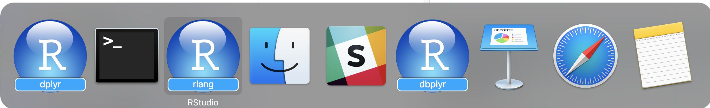
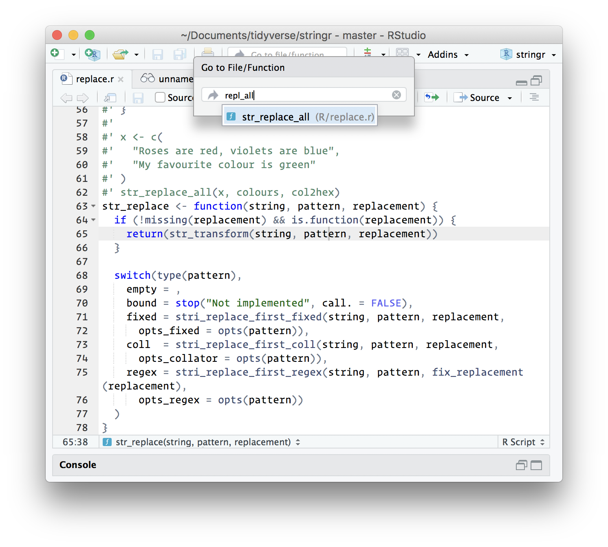
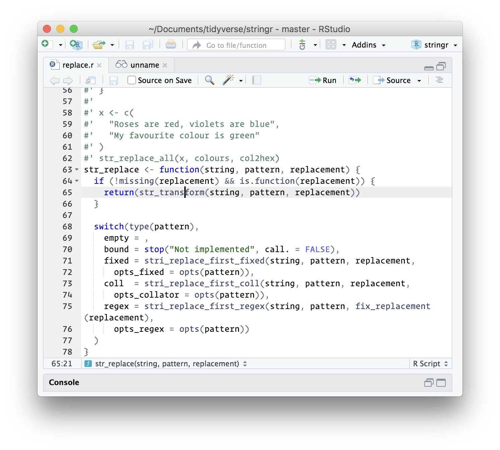
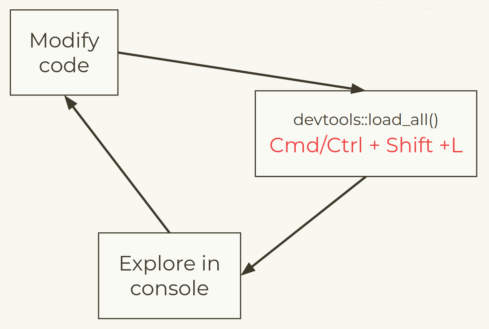

```{r setup, include=FALSE}
knitr::opts_chunk$set(echo = TRUE, 
                      message = FALSE,	
                      warning = FALSE)
options(htmltools.dir.version = FALSE)
```

```{r pkgs, include=FALSE}
library(RefManageR)
library(tidyverse)

```

```{r, load-refs, include=FALSE, cache=FALSE}
BibOptions(check.entries = FALSE,
           bib.style = "numeric",
           cite.style = "authoryear",
           style = "markdown",
           hyperlink = FALSE,
           dashed = FALSE)
myBib <- ReadBib("../../bibliography.bib", check = FALSE)
```

class: inverse center middle

# Motivation

---

class: clear center middle font200

<!-- -->

Workflow: you should have one

&mdash; <cite>Jenny Bryan</cite>

---

class: clear center middle font200

<!-- -->

A package is a set of  
conventions that  
*(with the right tools)*  
makes your life easier

---

class: clear center middle font200

<!-- -->

Seriously, it doesn’t have to be  
about sharing your code  
(although that is an added  
benefit!). It is about saving  
yourself time.

&mdash; <cite>Hilary Parker</cite>

---

class: clear middle font200

<!-- -->

.pull-left[
.center[
**Script**  
One off data analysis  
Primarily side-effects
]
]

.pull-right[
.center[
**Package**  
Defines reusable components  
No side-effects
]
]

---

class: inverse center middle

# RStudio Projects

---

class: clear center middle font200

Why use RStudio projects?

**3** reasons

---

class: clear font200

```{r, out.width = "900px", echo=FALSE}

```

Work on multiple projects simultaneously and independently

---

class: clear center middle font200

# Manage working directories

If the first line of your #rstats script is 

`setwd("C:\Users\jenny\path\that\only\I\have")`  

I will come into your lab and SET YOUR COMPUTER ON FIRE `r emo::ji("fire")` .

&mdash; <cite>Mash-up of rage tweets by @jennybc and @tpoi</cite>

---

class: clear center font200

# Enhanced Navigation

.pull-left[
```{r, out.width = "500px", echo=FALSE}

```

Ctrl + . = find functions/files
]

.pull-right[
```{r, out.width = "500px", echo=FALSE}

```

F2 = jump to definition
]

---

class: inverse center middle

# My first package

---

class: font180

# Your turn

Verify that you can create a package with:
```r
usethis::create_package("~/Desktop/mypackage")
```

What other files and directories are created?

---

class: clear font180

## What happens when we run `create_package()`?


* `mypackage.Rproj` is the file that makes this directory an RStudio Project.

* The `R/` directory is where we will put `.R` files with function definitions.

* `DESCRIPTION` provides metadata about your package. We will need to edit this.

* `NAMESPACE` declares the functions your package exports for external use and the external functions your package imports from other packages.

---

class: clear font180

## Now that you have your package, what do you put in it?

There's a usethis helper for adding `.R` files!

```r
usethis::use_r("file-name")
```

Organize files so that related code lives together. If you can give a file
a concise and informative name, it's probably about right.

---

class: font180

# Your turn

- Create a new R file in your package called `animalSounds.R`

- Paste the following code into your script:

```{r}
animalSounds <- function(animal, sound){
  assertthat::assert_that(
    assertthat::is.string(animal),
    assertthat::is.string(sound))
  
  paste0("The ", animal, " goes ", sound, "!")
}
```

---

class: clear center font180

# Development workflow?

```{r, out.width = "800px", echo=FALSE}

```

--

You don't even need to save your code!

---

class: font180

# Your turn

1. Load all with devtools::load_all() and test the `animalSounds()` function.

2. Change some tiny thing about your function - maybe the animal “says” instead 
of “goes”?

3. Load all with devtools::load_all() and test the update function.

---

class: clear font180

## Naming a Package

Can only contain the characters [A-Z, a-z, 0-9, .]

Tips:
- Unique name you can easily Google
- Avoid mixing upper and lower case
- Use abbreviations
- Add an r to make unique, e.g stringr
- Use wordplay, e.g. lubridate
- Avoid tradmarked names
- Use the **available** package to check name not taken

---

class: clear font180

## Other metadata in DESCRIPTION

- *Title*: One line, title case, with no period. Less than 65 characters.
- *Version*
    - for release: x.y.z where x= major version, y = minor version, z = patch version.
    - for development version building on version x.y.z, use: x.y.z.9000
- *Authors@R*: author(s) defined using `person()`
- *Description*: One paragraph describing what the package does. Keep the width 
of the paragraph to 80 characters; indent subsequent lines with 4 spaces.
- *License*: Will discuss later
- *Encoding*: How to encode text, use UTF-8 encoding.
- *LazyData*: Use `true` to lazy-load data sets in the package.

---

class: font180

# Your turn

1. Update the package name, title and description.
2. Add yourself as an author and maintainer.

---

class: inverse center middle font200

Woohoo, you did it!

`r emo::ji("package")`

---

class: clear font200

## License

<a rel="license" href="http://creativecommons.org/licenses/by-nc-sa/4.0/"></a><br /><span xmlns:dct="http://purl.org/dc/terms/" property="dct:title">Package Development Workshop</span> by <span xmlns:cc="http://creativecommons.org/ns#" property="cc:attributionName">Forwards</span> is licensed under a <a rel="license" href="http://creativecommons.org/licenses/by-nc-sa/4.0/">Creative Commons Attribution-NonCommercial-ShareAlike 4.0 International License</a>.
