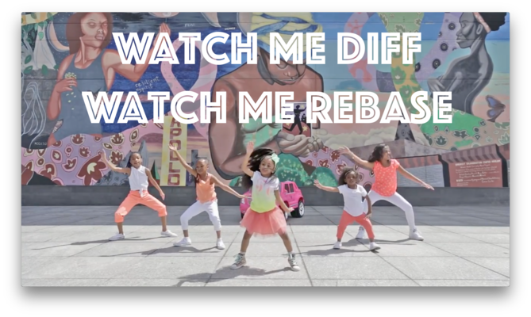
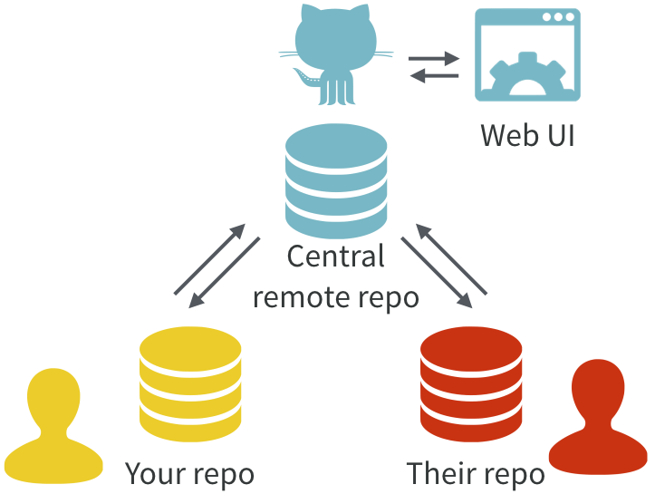
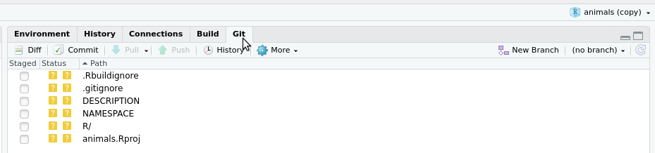
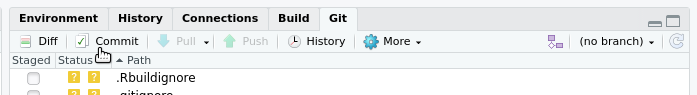
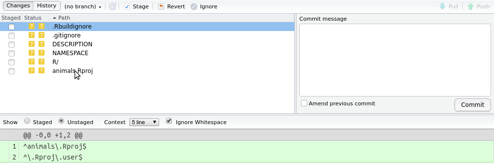
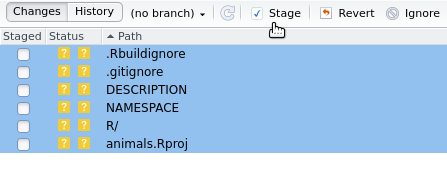

```{r setup, include=FALSE}
knitr::opts_chunk$set(echo = TRUE, 
                      message = FALSE,	
                      warning = FALSE)
options(htmltools.dir.version = FALSE)
```

```{r pkgs, include=FALSE}
library(RefManageR)
```

```{r, load-refs, include=FALSE, cache=FALSE}
BibOptions(check.entries = FALSE,
           bib.style = "numeric",
           cite.style = "authoryear",
           style = "markdown",
           hyperlink = FALSE,
           dashed = FALSE)
myBib <- ReadBib("../../bibliography.bib", check = FALSE)
```

class: inverse center middle

# Git & GitHub

---

class: clear center middle font200

<!-- -->

Use both!

The `r emo::ji("rage")` `r  emo::ji("shit")` `r emo::ji("scream")` will pay off

---

class: clear middle center font200

```{r, out.width = "800px", echo=FALSE}

```

[happygitwithr.com](happygitwithr.com)

---

class: clear middle center font200

Excuse me, do you have a moment to talk about
version control?
https://doi.org/10.7287/peerj.preprints.3159v2

```{r, out.width = "500px", echo=FALSE}

```

---

# Your turn

For this exercise use the command line interface provided in the Terminal tab 
in RStudio

1. Do I already have Git?

    ```
    which git
    ```

2. What version of Git do I have?

    ```
    git --version
    ```

Eek! I don’t have Git!  
Fear not- time to install!  
https://git-scm.com/downloads

---

class: inverse center middle

# Use git on a project/package

---

---

# Basic Git Workflow

1. Modify Code
2. Stage changes
3. Commit changes

---

class: clear font150

```{r eval = FALSE}
usethis::use_git()
```
```
✔ Initialising Git repo
✔ Adding '.Rhistory', '.RData' to '.gitignore'
There are 6 uncommitted files:
* '.gitignore'
* '.Rbuildignore'
* 'animals.Rproj'
* 'DESCRIPTION'
* 'NAMESPACE'
* 'R/'
Is it ok to commit them?

1: Not now
2: Absolutely not
3: For sure
```

Choose not to commit the files, then choose to restart when asked.

???

● A restart of RStudio is required to activate the Git pane
Restart now?

1: Yes
2: Not now
3: Nope

Selection: 

---

class: center

The project now has a git tab

```{r, out.width = "800px", echo=FALSE}

```

The uncommitted files have icons with `?` next to them: git isn't tracking 
changes in these files.

---

class: clear font200

# Identifying yourself

name: config

Before you can make a commit, git must know who you are

```{r, eval = FALSE}
usethis::use_git_config(
    scope = "project",
    user.name = "Your Name",
    user.email = "you@domain.com"
)
```

You can use `scope = "user"` to use the same identity for all projects.

---

class: clear font200

Now click the commit button

```{r, out.width = "800px", echo=FALSE}

```

which will bring up the review changes window

---

class: clear font200

Added/changed code lines are highlighted in green 

```{r, out.width = "800px", echo=FALSE}

```

If we had deleted code lines, they would be highlighted in red.

---

class: clear font200

.pull-left[
We can stage all the files at once: 
 - Click on the first file
 - Shift+Click on the last file
 - Click `Stage` button
]

.pull-right[
```{r, out.width = "800px", echo=FALSE}

```
]

---

class: clear font200

All the staged files now have an `A` icon next to them: `A` for *added*

```{r, out.width = "800px", echo=FALSE}
knitr::include_graphics("../../pics/commit.png")
```

We can write a meaningful commit message and click commit.

---

class: font150

# Your Turn

Set up git on your package:

1. In your package project run `usethis::use_git()`
 - Choose not to commit the files, then choose to restart when asked.
2. When the project has restarted, define your identity with 
`usethis::use_git_config()`
 - see [Identifying Yourself](#config)
3. Use the commit button to open the review changes window.
 - stage and commit the changes.
4. Back in the git tab, click the history button to view your first commit!
5. Make a change to your `animalSounds()` function and save it. What happens in 
the git tab? Open the review changes window again and take a look there.
6. Right-click the changed file and choose `Revert` to revert the change.

---

class: inverse center middle

# Use GitHub on a git project/package

---

We can set up a remote GitHub repo to synchronize with our local git repo with
`usethis::use_github()`.

This function uses the GitHub API to set up the repo on GitHub, which requires 
a personal access token (PAT).

---

Create a PAT via

```{r eval=FALSE}
browse_github_token()
```

This opens a browser window for you to log in to GitHub. 
 - click generate token
 - copy it

---

Back in RStudio run

```{r eval=FALSE}
usethis::edit_r_environ()
```

`.Renviron` will open. Add a line like:

```
GITHUB_PAT=xxxyyyzzz

```

Where xxxyyyzzz is pasted from the clipboard.

--

Make sure `.Renviron` ends with a newline!

Save and close `.Renviron`, then restart R.


---

Now we can run

```{r eval=FALSE}
usethis::use_github() 
```

First question: how to authenticate your *pushes* and *pulls* to/from the 
remote?

```
Which git protocol to use? (enter 0 to exit) 

1: ssh   <-- presumes that you have set up ssh keys
2: https <-- choose this if you don't have ssh keys (or don't know if you do)

```

Choose 2 for now, unless you already use ssh keys.

???

add ref here

---

Next question:

 ```
● Check title and description
  Name:        animals
  Description: Demo package about animals
Are title and description ok?

1: Not now
2: Absolutely not
3: Yup
```

Say yes if they are okay (you can still change them later!).

OR say no, then modify, stage and commit changes to the DESCRIPTION
file before running `usethis::use_github()` again.

---

Once the title and description are okay:

```
✔ Creating GitHub repository
✔ Setting remote 'origin' to 'https://github.com/username/animals.git'
✔ Adding GitHub links to DESCRIPTION
✔ Setting URL field in DESCRIPTION to 'https://github.com/username/animals'
✔ Setting BugReports field in DESCRIPTION to 'https://github.com/username/animals/issues'
✔ Pushing 'master' branch to GitHub and setting remote tracking branch
✔ Opening URL 'https://github.com/username/animals'
```

Now you can look at your GitHub page! `r emo::ji("party")` 

---

# Basic Git and GitHub Workflow

1. Modify Code
2. Stage changes
3. Commit changes
4. Repeat 1-3 several times a day, with each commit representing an incremental 
change
5. Push changes to GitHub once a day/at bigger milestones

---

# Your Turn

1. Create a GitHub PAT using `browse_github_token()`.
2. Add it to your `.Renviron` using `usethis::edit_r_environ()`.
3. Run `usethis::use_github()` to setup GitHub on your package project.
4. Make a small change to `animalSounds()`, stage and commit.
5. Click on the push button in the Git tab to push your changes - you will be 
prompted for your GitHub password.
6. Look at your repo on GitHub and view the commit history.

---
# References

```{r refs, echo=FALSE, results="asis"}
PrintBibliography(myBib)
```


---
# License

<a rel="license" href="http://creativecommons.org/licenses/by-nc-sa/4.0/"></a><br /><span xmlns:dct="http://purl.org/dc/terms/" property="dct:title">Package Development: Creating impact from code.</span> by <span xmlns:cc="http://creativecommons.org/ns#" property="cc:attributionName">R Forwards</span> is licensed under a <a rel="license" href="http://creativecommons.org/licenses/by-nc-sa/4.0/">Creative Commons Attribution-NonCommercial-ShareAlike 4.0 International License</a>.
