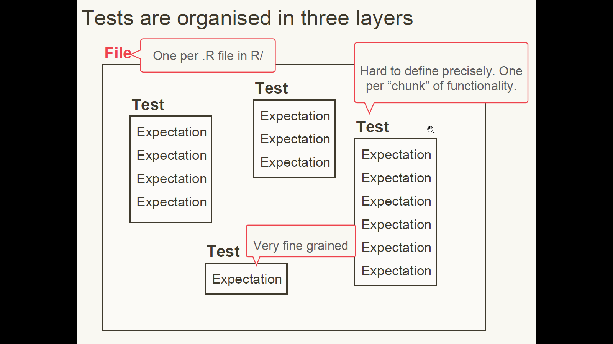
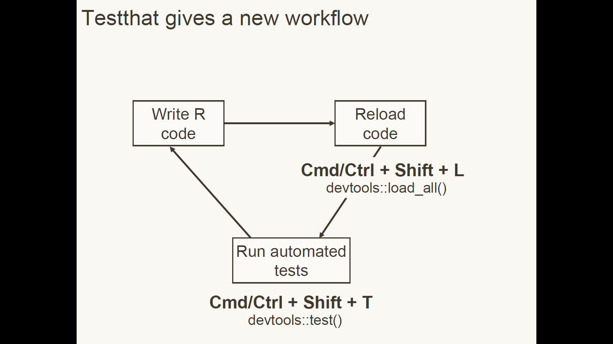

```{r setup, include=FALSE}
knitr::opts_chunk$set(echo = TRUE, 
                      message = FALSE,	
                      warning = FALSE)
options(htmltools.dir.version = FALSE)
```

class: inverse center middle

# Why test?

---

class: clear center middle font200

Improve readability or performance without changing behaviour.


---

class: clear font200

## Coding is Iterative


We build new functions one bit at a time.

What if a new thing we add changes the existing functionality?

How can we check and be sure all the old functionality still works with New Fancy Feature?

Unit Tests!

---

class: inverse center middle

# Unit Testing

---

class: clear font200

# Set up test infrastructure


```r
usethis::use_testthat()
```
```
✔ Adding 'testthat' to Suggests field
✔ Creating 'tests/testthat/'
✔ Writing 'tests/testthat.R'
✔ Writing 'tests/testthat/test-zooSounds.R'
● Modify 'tests/testthat/test-zooSounds.R'
```

```r
devtools::test()
```
Or Command + Shift + T 

---

class: clear

## Tests are organized in three layers

```{r, out.width = "800px", echo=FALSE}

```


---

class: clear font200

## Organizing Tests

Test every individual task the function completes separately.

Check both for successful situations and for expected failure situations

---

class: clear font200

Four expectations cover 90% of cases

```r
expect_equal(object, expected)

expect_error(object, regex)

expect_warning(object, regex)

expect_known_output(code)
```

---

class: clear font200

Our Example Function

```r
animalSounds <- function(animal, sound){
  assertthat::assert_that(
    assertthat::is.string(animal),
    assertthat::is.string(sound))
  
  paste0("The ", animal, " goes ", sound, "!")
}
```

---

class: clear font200

## A sample test

In `tests/testthat/test-animalSounds.R`

```r
library(testthat)


test_that("animalSounds produces expected strings", {
  giraffe_moo <- animalSounds("giraffe", "moo")
  expect_equal(giraffe_moo, 
               "The giraffe goes moo!")
})
```

---

class: font200

# Your turn

Write a new unit test for `animalSounds()` using `expect_error()`. 

Run the tests with `Cmd + Shift + T`


---

class: inverse center middle

# Test Driven Development

---

class: clear

## So far we've done this:

```{r, out.width = "800px", echo=FALSE}
knitr::include_graphics("../../pics/dev_cycle_before_testing.png")
```

---

class: clear

## Test driven development is a new workflow

```{r, out.width = "800px", echo=FALSE}

```

---

class: font200

# Your Turn

Make this test pass

```r
giraffe <- animalSounds("giraffe")
expect_equal(giraffe, 
             "The giraffe makes no sound.")
```

Hint: set the default value for the sound argument to `NULL`.

---

class: center middle font200

When you stop work, leave a test failing.

---

class: clear font200

## License

<a rel="license" href="http://creativecommons.org/licenses/by-nc-sa/4.0/"></a><br /><span xmlns:dct="http://purl.org/dc/terms/" property="dct:title">Package Development Workshop</span> by <span xmlns:cc="http://creativecommons.org/ns#" property="cc:attributionName">Forwards</span> is licensed under a <a rel="license" href="http://creativecommons.org/licenses/by-nc-sa/4.0/">Creative Commons Attribution-NonCommercial-ShareAlike 4.0 International License</a>.
