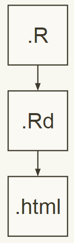
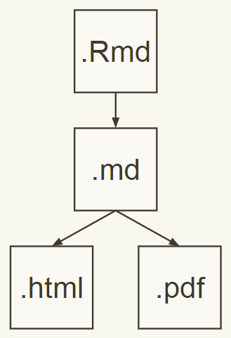
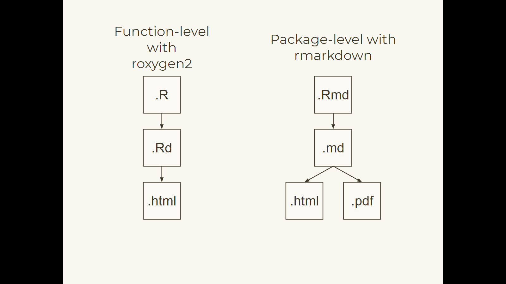
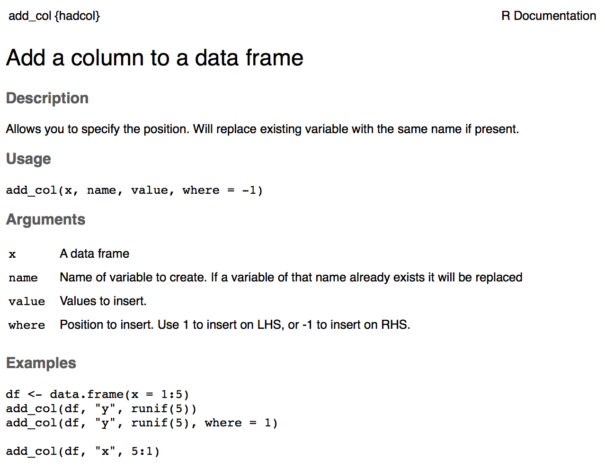
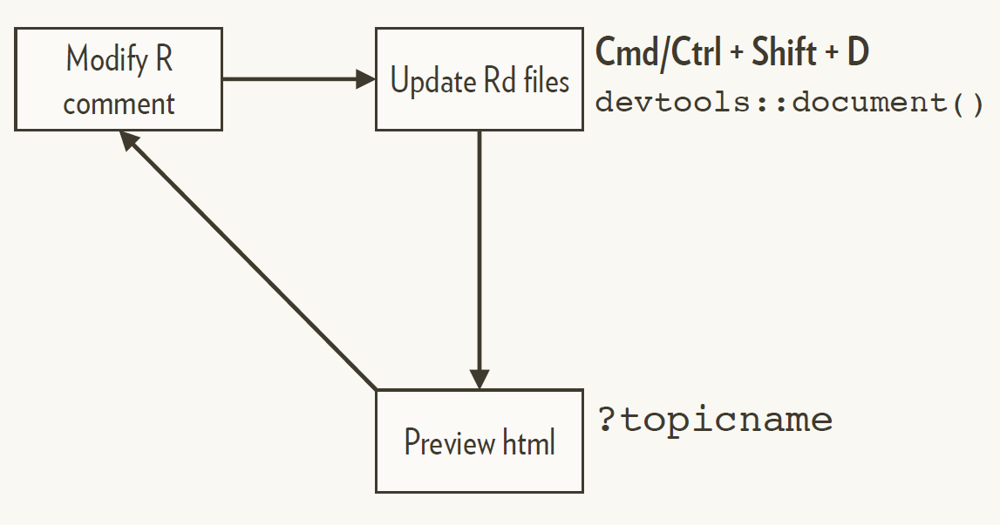
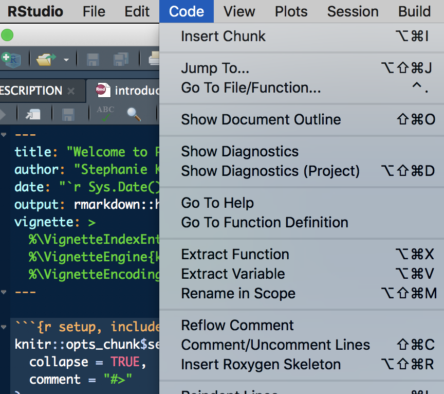
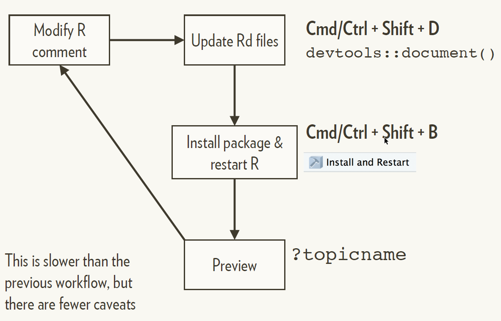
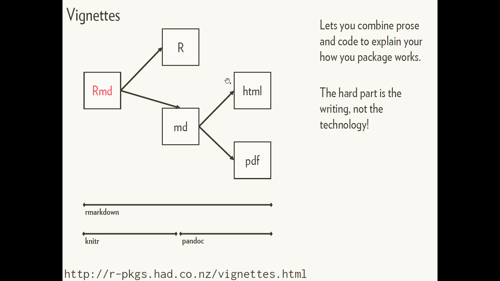
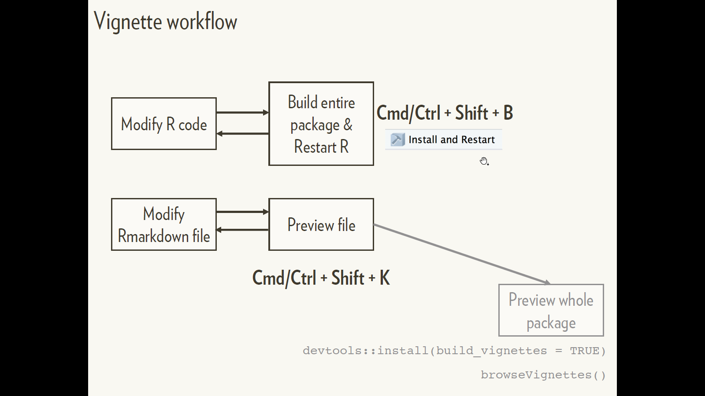

```{r setup, include=FALSE}
knitr::opts_chunk$set(echo = TRUE, 
                      message = FALSE,	
                      warning = FALSE)
options(htmltools.dir.version = FALSE)
```

---

class: clear

.pull-left[
Function-level with roxygen2
```{r, out.width = "500px", echo=FALSE}

```
]

.pull-right[
Package-level with rmarkdown
```{r, out.width = "500px", echo=FALSE}

```
]

---

class: inverse center middle

# Markdown

Quick overview

---

class: clear

# Basic markdown formatting

```
# This is a top level heading

This is some text. Make text _italic_ with single underscores
(or stars). Make it **bold** with double stars (or underscores).
Here is a [link to a markdown guide](http://bit.ly/19fAexE).

* This is a list

* This is another item

```R
# Some R code
f <- function() x + 1
```

## This is a secondary heading

You can also do `inline code`, numbered lists and quotes and
more.
```
---

class: clear center

```{r, out.width = "500px", echo=FALSE}
knitr::include_graphics("../../pics/markdown_quick_reference.png")
```

---

class: inverse center middle

# Markdown

Function documentation
with **roxygen2**

---

class: clear center

# Roxygen2

```{r, out.width = "500px", echo=FALSE}

```

http://r-pkgs.had.co.nz/man.html

---

# You write specially formatted comments in .R

```
#' @param numberVec Vector of numbers
```

`#'` denotes a Roxygen comment

`@param` is a Roxygen tag. 

The `@param` tag takes an argument: the name of the parameter

The remaining text (until the next tag in the file ) is the documentation 
relevant to the tag.

---

# The full manual page can be created this way

```
#' Add a Column to a Data Frame
#'
#' Allows you to specify the position. Will replace existing variable
#' with the same name if present.
#'
#' @param x A data frame
#' @param name Name of variable to create. If a variable of that name
#'    already exists it will be replaced
#' @param value Values to insert.
#' @param where Position to insert. Use 1 to insert on LHS, or -1 to
#'    insert on RHS.
#' @examples
#' df <- data.frame(x = 1:5)
#' add_col(df, "y", runif(5))
#' add_col(df, "y", runif(5), where = 1)
#'
#' add_col(df, "x", 5:1)
```
---

# Roxygen translates to **.Rd** - but you can ignore this file!

```
% Generated by roxygen2: do not edit by hand
% Please edit documentation in R/add_col.R
\name{add_col}
\alias{add_col}
\title{Add a Column to a Data Frame}
\usage{
add_col(x, name, value, where = -1)
}
\arguments{
\item{x}{A data frame}
In almo
st a l l c a
ses you
c a n ign
ore the
se f il e s
\item{name}{Name of variable to create. If a variable of that name
already exists it will be replaced}
\item{value}{Values to insert.}
\item{where}{Position to insert. Use 1 to insert on LHS, or -1 to insert on
RHS.}
}
\description{
Allows you to specify the position. Will replace existing variable
with the same name if present.
}
```
---

class: clear center

# Roxygen2

```{r, out.width = "500px", echo=FALSE}

```

---

class: clear

# Documentation workflow

.pull-left[
```{r, out.width = "500px", echo=FALSE}

```
]
.pull-right[
- Update documentation
Cmd/Ctrl + Shift + D or `devtools::document()`

- Preview `?topicname`
]

---

class: clear

# Two caveats

1. You must have loaded the package with
`load_all()` at least once.
    - Check for message "Using development documentation..."
    
2. This technique only builds individual files so links do not work.

---

# Your turn

[need to do]

---

class: clear center

# Roxygen2

```{r, out.width = "500px", echo=FALSE}
knitr::include_graphics("../../pics/annotation_man_page.png")
```

---

class: clear

# The description block

- First sentence is the **title**
- Next paragraph is the **description**
- Everything else is the **details**

```
#' Sum of vector elements
#'
#' \code{sum} returns the sum of all the values present in its arguments.
#'
#' This is a generic function: methods can be defined for it directly or via the
#' \code{\link{Summary}} group generic. For this to work properly, the arguments
#' \code{...} should be unnamed, and dispatch is on the first argument.
```

---

class: clear

There are five *tags* you’ll use for most functions

Tag        | Purpose
---------- | -------------
@param arg | Describe inputs
@examples  | Show how the function works
@seealso   | Pointers to related functions
@return    | Describe outputs (value)
@export    | Is this a user-visible function?


Usual RStudio shortcuts work in the @examples section

---

class: clear

# RStudio helps you remember

.pull-left[
Function-level with roxygen2
```{r, out.width = "500px", echo=FALSE}

```
]

.pull-right[
```{r}
#' Title
#'
#' @param x
#' @param y
#' @param z
#'
#' @return
#' @export
#'
#' @examples
fun <- function(x, y, z) {
}
```
]

---

# Your turn

---

class: clear

# Use markdown for formatting

Activate by running `use_roxygen_md()`

Text formatting:

```
**bold**, _italic_, `code`
```

Create links

* To a function in the same package: `[func()]`
* To a function in a different package: `[pkg::func()]`

With different link text:

* `[link text][func()]`
* `[link text][pkg::func()]`

---

class: clear center

# Documentation workflow 2

.pull-left[
```{r, out.width = "500px", echo=FALSE}

```
]
.pull-right[
- Update documentation
Cmd/Ctrl + Shift + D or `devtools::document()`

- Update documentation
Cmd/Ctrl + Shift + B or "Install and Restart"

- Preview `?topicname`
]

This is slower than the previous workflow, but there are fewer caveats

---

# Your turn

---

class: clear

# roxygen2 comes with other tools to reduce duplication

Document multiple functions in the same file
```
#' @rdname add_col
```

Inherit the parameter descriptions from another function
```
#' @inheritParams add_col
```

Inherit everything from another topic
```
#' @inherit add_col
```

Inherit selectively

```
#' @inherit add_col parameters return references
#'   title description details
#'   sections seealso
```

---

class: clear

# Read online about how to document other objects

* Data: http://r-pkgs.had.co.nz/data.html#documenting-data

* Classes & methods: http://r-pkgs.had.co.nz/man.html#man-classes

* Package as a whole: http://r-pkgs.had.co.nz/man.html#man-packages

---

class: inverse center middle

# Markdown

Package documentation with `rmarkdown`

---

class: clear

# Vignettes

.pull-left[
```{r, out.width = "500px", echo=FALSE}

```
]
.pull-right[
Lets you combine prose
and code to explain your
how you package works.

The hard part is the
writing, not the
technology!
]

http://r-pkgs.had.co.nz/vignettes.html

---

class: clear

# Easiest way to get started is with `use_vignette()`

```r
usethis::use_vignette("name")
```

Adds to DESCRIPTION

```
Suggests: knitr
VignetteBuilder: knitr
```

Creates `vignettes/`

Drafts `vignettes/name.Rmd`

---

class: clear

# Vignette = Rmarkdown + special metadata

```
---
title: "Vignette Title"
author: "Vignette author"
date: "`r Sys.Date()`"
output: rmarkdown::html_vignette
vignette: >
%\VignetteIndexEntry{Vignette Title}
%\VignetteEngine{knitr::rmarkdown}
%\VignetteEncoding{UTF-8}
---
```

* `html_vignette` output uses a custom style sheet to keep the file size of the 
HTML as small as possible.

* The `vignette:` field contains special metadata needed when the package is 
built. **Don't forget to change the title here too!**

---

class: clear center

# Vignette workflow

```{r, out.width = "500px", echo=FALSE}

```

---

# Your turn

---

class: inverse center middle

# README

---

class: clear

# If sharing with others, include a README

** usethis** has functions to set up a README with/without R code

```
usethis::use_readme_rmd()
usethis::use_readme_md()
```

For public projects this should include 
 - a brief overview
 - instructions on how to install the package
 - a few examples
 
For private projects, this is a great place to jot down notes.

---

class: inverse center middle

# NEWS

---

# Also good idea to track changes


```r
usethis::use_news_md()
```

Add news for the latest version at the top.

Use a top-level heading for each version

```r
# mypackage 1.0.0
```

Add each change in a bulleted list
    - If you have many changes, split into subsections (e.g.
    `## Major changes`, `## Minor improvements`, `## Bug fixes`).
    - Wait until release to decide if subsections are necessary
 
Note connections to GitHub
 - If related to a GitHub issue, add the issue number, e.g. (`#10`). 
 - If related to a pull request, add the pull request number and the author, e.g. (`#101, @hadley`). 
 
---

class: inverse center middle

# Package website with `pkgdown`

---

# Build a website

`pkgdown::build_site()` creates a package website based on the 
standard documentation files.

**Home page**: based on README

**Reference**: one page for help file
    - generates an index page, with functions listed alphabetically by default
    
**Articles**: one page for each vignette

**News**

**Get Started**: if you have a vignette with the same name as the package

A link to your GitHub repo (if listed in the DESCRIPTION url field).

---

# Your turn

---
# License

<a rel="license" href="http://creativecommons.org/licenses/by-nc-sa/4.0/"></a><br /><span xmlns:dct="http://purl.org/dc/terms/" property="dct:title">Package Development: Creating impact from code.</span> by <span xmlns:cc="http://creativecommons.org/ns#" property="cc:attributionName">R Forwards</span> is licensed under a <a rel="license" href="http://creativecommons.org/licenses/by-nc-sa/4.0/">Creative Commons Attribution-NonCommercial-ShareAlike 4.0 International License</a>.
