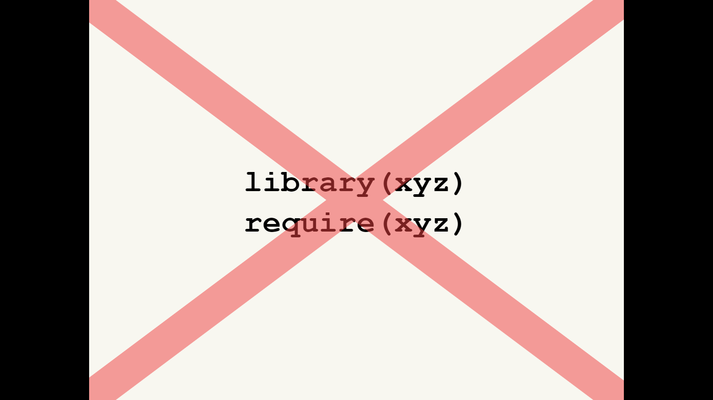

```{r setup, include=FALSE}
knitr::opts_chunk$set(echo = TRUE, 
                      message = FALSE,	
                      warning = FALSE)
options(htmltools.dir.version = FALSE)
```

---

class: clear

1. License
2. Dependencies
3. Namespace: imports
4. Namespace: exports
5. R CMD check
6. CRAN

---

class: inverse center middle

# License

---

class: clear

# There are three main open source licenses

1. CC0: “public domain”, best for data packages

2. MIT: Free for anyone to do anything with

3. GPL: Changes and bundles must also be GPL

---

class: clear

# Use helper to set up


```
usethis::use_cc0_license()
usethis::use_mit_license()
usethis::use_gpl_license()
```

---

class: clear

You can also make clear that your package isn’t open source

DESCRIPTION:
License: file LICENSE

LICENSE:
Proprietary: do not distribute outside of Widgets Incorporated.

---

class: inverse center middle

# Dependencies

---

class: clear center

```{r, out.width = "500px", echo=FALSE}

```

---

class: clear

```
Depends: 
  R (>= 3.0.2) # optional version spec
Imports:
  stringr (>= 1.0.0),
  lubridate
Suggests:
```

**Depends**: I need you!
**Suggests**: I like having you around!

---

class: clear

There are three types of dependency

**Imports**: required, installed automatically.
**Suggests**: optional, e.g. only needed for development; only used in
vignette or example. *Not* installed automatically.
**Depends**: basically deprecated for packages.
(Correct uses exist, but beyond the scope of this class)

---

class: clear

Use `::` to access functions in imported packages

In DESCRIPTION
```
Imports: pkgname
```

In `new_function.R`
```r
new_function <- function(x, y, z) {
  pkgname::imported_function(x, y) + z
}
```

---

class: clear

Should check if suggested package available

In DESCRIPTION
```
Suggests: pkgname
```

In `new_function.R`
```r
new_function <- function(x, y, z) {
  if (!requireNamespace("pkgname", quietly = TRUE)){
    warning("pkgname must be installed to perform this function", 
            "returning NULL")
    return(NULL)
  } else {
    pkgname::imported_function(x, y) + z
  }
}
```

Exit gracefully (without an error) if possible. The main functionality of 
your package should not require suggested packages.

---

class: clear middle

# Reasons to use depends instead of imports

.center[This page has been intentionally left blank]

---

class: clear

# `use_package()`

`use_package()` will modify the DESCRIPTION and remind you how to use the
function.

```r
usethis::use_package("assertthat")
usethis::use_package("glue", "suggests")
```

---

class: inverse center middle

# Namespace: imports

---

class: clear

# You might get tired of using :: all the time

Or you might want to use an infix function
```r
`%>%` <- magittr::`%>%`

col_summary <- function(df, fun) {
  stopifnot(is.data.frame(df))
  
  df %>% 
    purrr::keep(is.numeric) %>% 
    purrr::modify(fun)
}

```

---

class: clear

# You can **import** functions into the package

```r
#' @importFrom purrr keep modify
#' @importFrom magrittr %>%
col_summary <- function(df, fun) {
  stopifnot(is.data.frame(df))
  
  df %>% 
    keep(is.numeric) %>% 
    modify(fun)
}
```

---

class: clear

# Alternatively, create R/imports.R

Imports belong to the package, not to individual functions, so you might want 
to recognise this by storing in a central location

```r
#' @importFrom purrr keep map
#' @importFrom magrittr %>%
NULL
```

---

class: clear

# Importing everything from a package seems easy

```r
#' @import purrr
col_summary <- function(df, fun) {
  stopifnot(is.data.frame(df))
  
  df %>% 
    keep(is.numeric) %>% 
    map_dfc(fun)
}

```

---

class: clear

# But is dangerous...

```r
#' @import pkg1
#' @import pkg2
fun <- function(x) {
  fun1(x) + fun2(x)
}

```

Works today...

... But next year, **pkg2** adds a `fun1` function


---

class: clear


Description                 | NAMESPACE
--------------------------- | -------------
Makes **package** available | Makes function available
Mandatory                   | Optional (can use :: instead)
`use_package()`             | `#' @importFrom`

---

class: inverse center middle

# Namespace: exports

---

class: clear

# A namespace splits functions into two classes


Internal                    | External
--------------------------- | -------------
Only for use within package | For use by others
Documentation optional      | Must be documented
Easily changed              | Changing will break other people’s code

---

class: clear

# The default NAMESPACE exports everything

```
# Generated by roxygen2: fake comment so 
# roxygen2 overwrites silently.
exportPattern("^[^\\.]")
```

---

class: clear

# Better to export functions explicitly

```r
#' @export
fun1 <- function(...) {}

#' @export
fun2 <- function(...) {}
```

Most important if you’re planning on sharing with others

---

class: clear

# Export functions that people should use

Don't export internal helpers

```r
# Defaults for NULL values
`%||%` <- function(a, b) if (is.null(a)) b else a

# Remove NULLs from a list
compact <- function(x) {
  x[!vapply(x, is.null, logical(1))]
}
```

---

class: inverse center middle

# R CMD check

---

class: clear

# Automated checking


Runs automated checks for common problems in R packages.

Useful for local packages, even with some false positives.

If you want to submit to CRAN, you must pass R CMD check cleanly.

http://r-pkgs.had.co.nz/check.html

---

class: clear center

```{r, out.width = "500px", echo=FALSE}

```

---

class: clear

# Types of problem

**ERROR** Must fix!

**WARNING** Fix if submitting to CRAN

**NOTE** Fix if submitting to CRAN

It is possible to submit with a NOTE, but it’s best avoided

---

class: clear

# Run the checks

```
# Cmd/Ctrl + Shift + E
devtools::check()
```


If you don't understand an error, google it!

---

class: inverse center middle

# CRAN

---

class: clear

# First submission to CRAN

First check locally
```r
devtools::check()
```

Then on R-hub
```r
devtools::check_rhub()
```

Then with CRAN's win-builder
```r
devtools::check_win()
```

Write submission notes
```r
usethis::use_cran_comments()
```

Then submit to CRAN
```r
devtools::release()
```

This asks you questions which you should carefully read and answer

---

class: clear

# cran-comments.md

```
## Test environments
* local OS X install (R-release)
* win-builder (R-release, R-devel)

## R CMD check results

0 errors | 0 warnings | 1 note

* This is a new release.
```

There’s always one note for a new submission

---

class: clear

# If your submission fails

Do not despair! It happens to everyone, even R-core members.

If it’s from the CRAN robot, just fix the problem & resubmit.

If it’s from a human, do not respond to the email and do not
argue. Instead update cran-comments.md & resubmit.

---

class: clear

# For resubmission

```
This is a resubmission. Compared to the last submission, I
have:

* First change.
* Second change.
* Third change.

---
## Test environments
* local OS X install, R 3.2.2
* win-builder (devel and release)

## R CMD check results
...
```

---

class: clear
 
# Subsequent submissions to CRAN

Proceed as before. If you have reverse dependencies you need to also run 
R CMD check on them, and  notify CRAN if you have deliberately broken them.

Fortunately the revdepcheck package makes this fairly easy

```
install_github("r-lib/revdepcheck")
use_revdep_check()
library(revdepcheck)
revdep_check()
revdep_report_cran()
```

---

class: inverse center middle font140

# Learning more

.pull-left[

```{r rstudio_community, out.width = "100%", fig.align = "center", echo=FALSE}
knitr::include_graphics("pics/RStudio-community.png")
```

<a href = "https://community.rstudio.com/">https://community.rstudio.com</a>
]

.pull-right[

R-package-devel mailing list

```{r r_dev, out.width = "100%", fig.align = "center", echo=FALSE}
knitr::include_graphics("pics/R-devel.png")
```

]

---

class: clear, split-three font130

# More details on many topics in books

.column[
```{r r_adv_r, out.width = "100%", fig.align = "center", echo=FALSE}
knitr::include_graphics("pics/wickham_adv_R.jpg")
```
<a href="https://adv-r.hadley.nz/">https://adv-r.hadley.nz/</a>
]
.column[
```{r r_pkgs, out.width = "100%", fig.align = "center", echo=FALSE}
knitr::include_graphics("pics/wickham_R_pkgs.png")
```
<a href="http://r-pkgs.had.co.nz/">http://r-pkgs.had.co.nz/</a>
]
.column[
```{r r_r4ds, out.width = "100%", fig.align = "center", echo=FALSE}
knitr::include_graphics("pics/wickham_grolemund_r4ds.png")
```
<a href="https://r4ds.had.co.nz/">https://r4ds.had.co.nz/</a>
]


---
# License

<a rel="license" href="http://creativecommons.org/licenses/by-nc-sa/4.0/"></a><br /><span xmlns:dct="http://purl.org/dc/terms/" property="dct:title">Package Development: Creating impact from code.</span> by <span xmlns:cc="http://creativecommons.org/ns#" property="cc:attributionName">R Forwards</span> is licensed under a <a rel="license" href="http://creativecommons.org/licenses/by-nc-sa/4.0/">Creative Commons Attribution-NonCommercial-ShareAlike 4.0 International License</a>.
