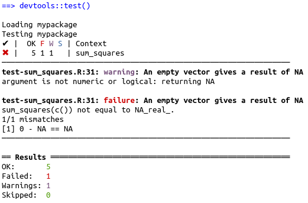
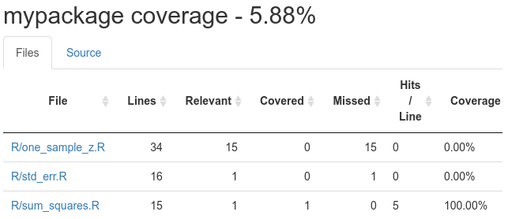

```{r setup, include=FALSE}
knitr::opts_chunk$set(echo = TRUE, 
                      message = FALSE,	
                      warning = FALSE)
options(htmltools.dir.version = FALSE)
```

```{r pkgs, include=FALSE}
library(RefManageR)
library(tidyverse)
library(usethis)

```

```{r, load-refs, include=FALSE, cache=FALSE}
BibOptions(check.entries = FALSE,
           bib.style = "numeric",
           cite.style = "authoryear",
           style = "markdown",
           hyperlink = FALSE,
           dashed = FALSE)
myBib <- ReadBib("../../bibliography.bib", check = FALSE)
```

background-image: url(pics/forwards.svg)
background-position: 50% 65%
background-size: 250px

class: inverse


# Package development

## Creating impact from code

### Emma Rand & Susannah Cowtan 

### York, January 2020

Updated: `r Sys.Date()`


.footnote[
Made with xaringan `r Cite(myBib, "xaringan")`
]
---
class: inverse center middle

# Unit testing
---

# Unit testing

## Why? Coding is iterative

.font120[
We build new functions a bit at a time.

What if a new thing we add changes the existing functionality?

How can we check and be sure all the old functionality still works with the new fancy feature?

Unit Testing to the rescue!
]

---
class: inverse center middle

# Testing workflow

---

background-image: url(pics/usethis_hexie.png)
background-position: 90% 20%
background-size: 150px

# Set up your testing infrastructure

.font120[
We will be using the `testthat` package to test our package.
This requires:
* A directory structure
* Test files for each `function.R` file
* A `testthat.R` file to run all the tests
* Adding `testthat` to the package requirements

This is a pain to set up! So use `usethis::use_test()`:

```{r use_testthat, out.width = "100%", fig.align = "center", echo=FALSE}
knitr::include_graphics("../../pics/use_testthat.png")
```
]
---
# Existing workflow

```{r work_no_test, out.width = "95%", fig.align = "center", echo=FALSE}
knitr::include_graphics("../../pics/workflow_pre_testing.png")
```

---
# Now add unit testing

```{r work_test, out.width = "95%", fig.align = "center", echo=FALSE}
knitr::include_graphics("../../pics/workflow_testing.png")
```
---
# Testing a function

Test by comparing **expectations** with **results**.

What expectations do we have of the `sum_squares()` function?

**Standard case:** if we give it numeric input we expect:
--

* Decimal output (type `double`)
* Not negative

--

**Special case:** what happens if we give it a vector of identical numbers?

--
* Output is zero

--

**Expected failures:**

What if there are missing values?

--
* Output is `NA`

--

What if the input was non-numeric?

--
* Should throw an error, or at least a warning

---

background-image: url(pics/testthat_hexie.png)
background-position: 90% 3.5%
background-size: 150px

# Building tests with testthat

.font110[
Let's build tests for `sum_squares()` for the standard cases: 
* numeric output
* non-negative output

Edit your `tests/testthat/test-sum_squares.R` file to read:
]

.code110[
```{r test_sumsq1, eval = FALSE}
test_vec <- rnorm(20, mean = 5, sd = 1.2)

### Standard case
# Expect a floating point result from a numeric input
test_that("Output is type \"double\" for numeric input", {
  expect_type(sum_squares(test_vec), "double")
})
# Expect that the result is not negative
test_that("Output is non-negative", {
  expect_gte(sum_squares(test_vec), 0)
})
```
]

---

# Four expectations cover 90% of cases

.code110[
```{r expectations, eval = FALSE}
expect_equal(object, expression)

expect_error(code, regexp)

expect_warning(code, regexp)
expect_warning(code, NA)

expect_known_output(code)
```
]
--
.font120[
Try using `expect_equal` to build tests for
* The special case of a vector of identical numbers
* The case when the input includes missing values

Remember to specify `NA_real_` not `NA` - the type of missing data is important!
]
---

# Testing for special cases and bad input

```{r test_sumsq2, eval = FALSE}
### Special cases
# Identical values should result in zero
test_that("Identical values give a sum of squares of zero", {
  expect_equal(sum_squares(rep(1, 10)), 0)
})

### Expected failures
# Missing values should result in a missing value
test_that("Missing values give a result of NA", {
  expect_equal(sum_squares(c(test_vec, NA)), NA_real_)
})
# Character input throws both an error(from sd) and a warning(from mean)
# so use expect_condition() not expect_error() or expect_warning()
test_that("Non-numeric input gives errors and/or warnings", {
  expect_condition(sum_squares(c("cat", "dog")))
})
```

.font110[
I've also added a test to see what happens when a character vector is supplied.

Think about what we could do to our function so that `expect_error` could be used.
]
---

# Running the tests

.font120[
`devtools::test()` will run all the tests associated with a package.
]
--

```{r run_test, out.width = "95%", fig.align = "center", echo=FALSE}
knitr::include_graphics("../../pics/devtools_test.png")
```

--

.font120[
Ideally, if an empty vector `c()` is supplied to the function, it would return
`NA`.  Try adding a test for this and run `devtools::test()` again to see what
happens when a test fails.
]
---
# When a test fails

```{r fail_test, out.width = "95%", fig.align = "center", echo=FALSE}

```

---
# Organising tests

.font130[

* Think about the overall functionality, or “end to end” tests

* Test every individual task the function completes, separately

* Check both for successful situations and for expected failure situations

* If appropriate, check for special cases
]
---
class:clear

```{r bored_tests, fig.align = "center", echo=FALSE}
knitr::include_graphics("../../pics/bored_tests.png")
```

---

class: inverse center middle

# Test coverage

---

# Which lines of code have been tested?

.font110[
When all your tests are passing, check test coverage with `devtools::test_coverage()`.
We have a failing test, so comment it out for now.
]
--

```{r test_coverage, fig.align = "center", echo=FALSE}

```

--
.font110[
Remember! It only tells you whether a line has been tested at all, 
not whether it's been tested thoroughly enough. That's up to you!
]
---


class: inverse center middle

# R CMD check

---

# Automatic checking

.font160[

* Runs automated checks for common problems in R packages

* Useful for local packages, even with some false positives

* If you want to submit to CRAN you **must** pass <br>.remark-inline-mono[R CMD check] cleanly

<http://r-pkgs.had.co.nz/check.html>

]

---

class: clear

```{r frustration, out.width = "100%", fig.align = "center", echo=FALSE}
knitr::include_graphics("../../pics/frustration.png")
```

---
# Types of problem

.font160[

.pull-left[

.remark-inline-red[**ERROR**]<br>
Must fix!

**WARNING**<br>
Fix if submitting to CRAN

**NOTE**<br>
Fix if submitting to CRAN<br>
.font80[It's possible to submit with a NOTE, but it's best avoided]

]

.pull-right[

 | Local | CRAN
-|-------|------
.remark-inline-red[**ERROR**] | &#10004; | &#10004;
**WARNING** | | &#10004;
**NOTE** | | &#10004;

]]

---

background-image: url(pics/devtools_hexie.jpeg)
background-position: 90% 12.5%
background-size: 150px

# Running R CMD check

.font160[

.remark-inline-mono[Cmd/Ctrl + shift + E] or

`devtools::check()`

Or look in the **Build** menu

]

.font140[
If you don't understand an error, google it!
]

---

class: inverse center middle

# Share it!

---

# Building and installing

.font140[

Build the source package to share it!

`devtools::build()`

Now it can be installed using:

```{r install, eval = FALSE}
install.packages("mypackage_0.0.0.10.tar.gz", 
                 repos = NULL, type = "source")
library(mypackage)
```

Notice that .remark-inline-mono[0.0.0.10] is the version number 
you put in the DESCRIPTION file

]

---

class: inverse center middle

# Learning more

---

# Further topics

.font160[

* Including data
* Licenses
* CRAN submission
* Good practice
    * Collaborating with git and GitHub
    * Continuous integration (code checking)
* Advanced programming
    * Interfacing with C++ / Python / ...
    * Object-oriented programming
* ...

]

---

# Further resources

.font140[
.pull-left[

```{r rstudio_community, out.width = "100%", fig.align = "center", echo=FALSE}
knitr::include_graphics("../../pics/RStudio-community.png")
```

<a href = "https://community.rstudio.com/">https://community.rstudio.com</a>
]

.pull-right[

R-package-devel mailing list

```{r r_dev, out.width = "100%", fig.align = "center", echo=FALSE}
knitr::include_graphics("../../pics/R-devel.png")
```

]]

---
class: clear, split-three

.column[
```{r r_adv_r, out.width = "100%", fig.align = "center", echo=FALSE}
knitr::include_graphics("../../pics/wickham_adv_R.jpg")
```
.font130[<a href="https://adv-r.hadley.nz/">https://adv-r.hadley.nz/</a>
]]
.column[
```{r r_pkgs, out.width = "100%", fig.align = "center", echo=FALSE}
knitr::include_graphics("../../pics/wickham_R_pkgs.png")
```
.font130[<a href="http://r-pkgs.had.co.nz/">http://r-pkgs.had.co.nz/</a>
]]
.column[
```{r r_r4ds, out.width = "100%", fig.align = "center", echo=FALSE}
knitr::include_graphics("../../pics/wickham_grolemund_r4ds.png")
```
.font130[<a href="https://r4ds.had.co.nz/">https://r4ds.had.co.nz/</a>
]]]

---

```{r web_resources, out.width = "100%", fig.align = "center", echo=FALSE}
knitr::include_graphics("../../pics/web_resources.png")
```


# References

```{r refs, echo=FALSE, results="asis"}
PrintBibliography(myBib)
```


---
# License

<a rel="license" href="http://creativecommons.org/licenses/by-nc-sa/4.0/"></a><br /><span xmlns:dct="http://purl.org/dc/terms/" property="dct:title">Package Development: Creating impact from code.</span> by <span xmlns:cc="http://creativecommons.org/ns#" property="cc:attributionName">R Forwards</span> is licensed under a <a rel="license" href="http://creativecommons.org/licenses/by-nc-sa/4.0/">Creative Commons Attribution-NonCommercial-ShareAlike 4.0 International License</a>.
