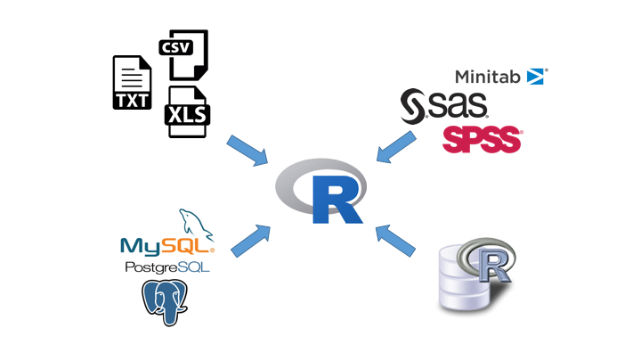
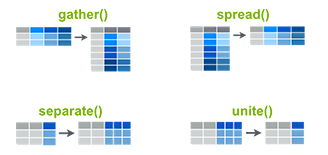
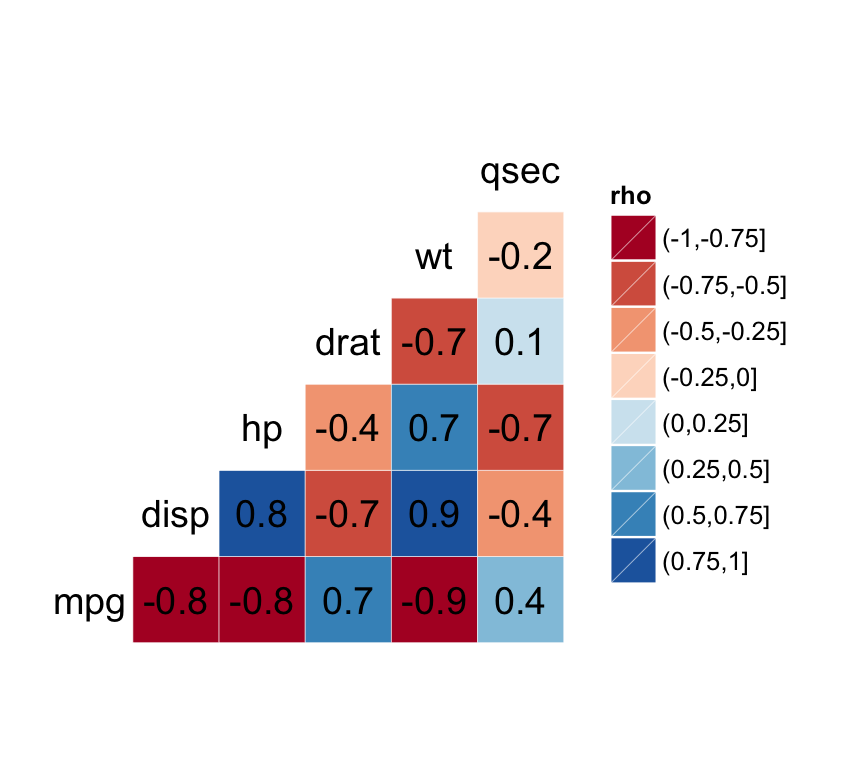
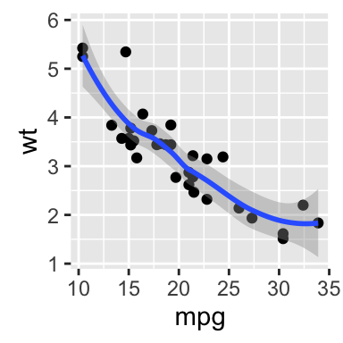
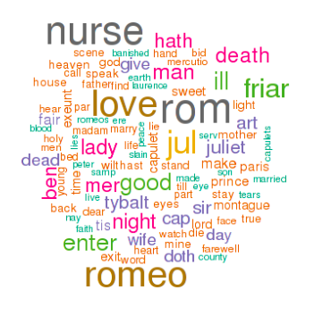
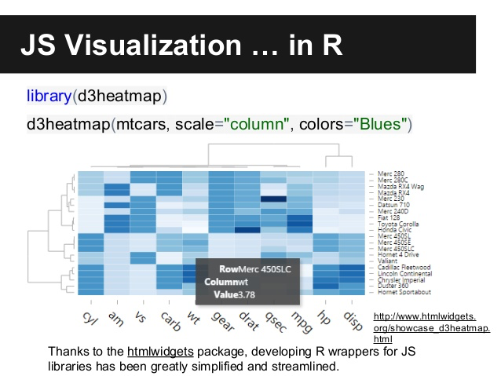
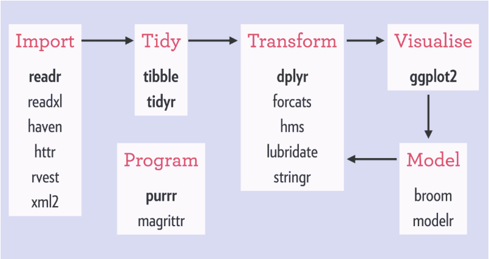
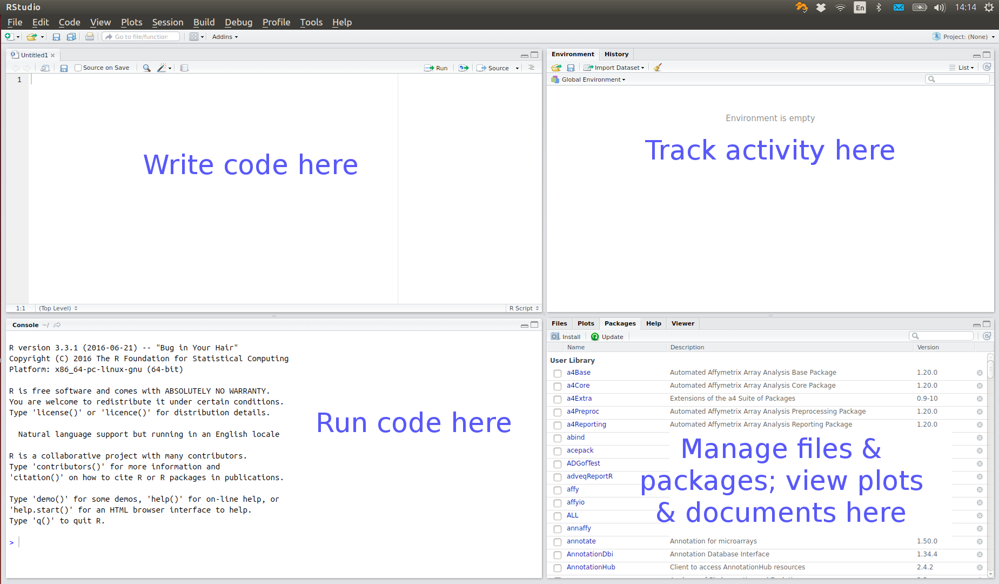
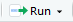
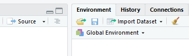

```{r setup, include=FALSE}
options(digits = 4)
options(width = 67)
library(knitr)
library(kableExtra)
opts_chunk$set(echo = TRUE, dev = "png", dpi = 300,
               warning = FALSE,
               comment = "#", eval = FALSE, 
               fig.width = 5, fig.height = 5, 
               knitr.table.format = "markdown")
# trim white space top and right of plot
knit_hooks$set(small.mar = function(before, options, envir) {
    if (before) par(mar = c(4, 5, 2, 1))
})
# trim white space when par won't work
library(magick)
knit_hooks$set(crop = function(before, options, envir) {
    if (before || isTRUE((fig.num <- options$fig.num) == 0L))
        return()
    paths = fig_path(options$fig.ext, options, fig.num)
    for (f in paths) image_write(image_trim(image_read(f)), f)
})
set.seed(1)
```

# What can R do?

<div style="padding: 0;float: left;width: 45%;text-align:center; border:2px solid;">

Data Management  

<br>
<table class="GeneratedTable" width="90%" style="margin:10px auto">
       <td>Data Import</td>
       <td><br></td>
  </table>
    <table class="GeneratedTable" width="90%" style="margin:10px auto">
       <td>Reshaping</td>
      <td><br></td>
  </table>
  </div>
  
<div style="padding: 0;float: left;width:50%;text-align:center;border:2px solid;margin-left:20px">

Data Analysis  

<br>
<table class="GeneratedTable" width="90%" style="margin:10px auto">
       <td>Explaratory Data Analysis</td>
       <td><br></td>
  </table>
    <table class="GeneratedTable" width="90%" style="margin:10px auto">
       <td>Statistical Modelling</td>
      <td><br></td>
     <tr>
  </table>
    <table class="GeneratedTable" width="90%" style="margin:10px auto">
       <td>Advanced Statistics</td>
      <td><br></td>
  </table>
  </div>
  
---

# What can R do? 

<div style="padding: 0;float: left;width: 50%;text-align:center; border:2px solid;">

Reporting

<br>
<table class="GeneratedTable" width="90%" style="margin:10px auto">
       <td>Dashboard</td>
       <td><br></td>
         </table>
       <table class="GeneratedTable" width="90%" style="margin:10px auto">
       <td>Markdown</td>
      <td><br></td>
     <tr>
  </table>
  </div>
  
<div style="padding: 0;float: left;width:45%;text-align:center;border:2px solid;margin-left:20px">

Programming
<br>
<table class="GeneratedTable" width="90%" style="margin:10px auto">
       <td>Connect to other languages</td>
       <td><br></td>
  </table>
    <table class="Packages" width="90%" style="margin:10px auto">
       <td>Packages</td>
      <td><br></td>
     <tr>
  </table>
  </div>
---

# The R Ecosystem

<div style="padding: 0;float: left;width: 32%;text-align:center;border:2px solid;">

Base 

<br>
<table class="GeneratedTable" width="90%" style="margin:20px auto">
     <tr>
       <td>base</td>
     </tr>
     <tr>
       <td>create R objects<br>summaries<br>math functions</td>
     <tr>
  </table>
    <table class="GeneratedTable" width="90%" style="margin:40px auto">
     <tr>
       <td>recommended</td>
     </tr>
     <tr>
       <td>statistics<br>graphics<br>example data</td>
     <tr>
  </table>
  </div>
  
<div style="padding: 0;float: left;width:62%;text-align:center;border:2px solid;margin-left:20px">
  
  Contributed Packages

<div style="center;display:flex; justify-content:center">
  <table class="GeneratedTable" width = "40%" style="margin:20px auto">
     <tr>
       <td>CRAN <br><a href="https://cran.r-project.org">cran.r-project.org</a></td>
     </tr>
     <tr>
       <td>main repos<br>~13000 pkgs</td>
     <tr>
  </table>
    <table class="GeneratedTable" width = "40%" style="margin:20px auto">
     <tr>
       <td><br><a href="https://www.bioconductor.org">bioconductor.org</a></td>
     </tr>
     <tr>
       <td>bioinformatics<br>>1500 pkgs</td>
     <tr>
  </table>
  </div>

  <table class="GeneratedTable" width = "40%" style="margin:20px auto 40px">
     <tr>
       <td>GitHub <br><a href="https://github.com">github.com</a></td>
     </tr>
     <tr>
       <td>devel pkgs<br>GitHub-only pkgs</td>
     <tr>
  </table>

</div>

---

# R Demo

We can type commands directly into the R console

```{r, eval = FALSE}
3 + 4
?"+" #look up help for "+"
x <- 3 + 4 ; y <- log(x) 
ls() # list of objects in the current workspace
rm(x)
data() # find out what standard data sets there are
plot(iris) # plot Fisher's iris data
```

---

# RStudio IDE



---

# R Studio Features

Features provided by RStudio include:

 - syntax highlighting, code completion, smart indentation
 - interactively send code chunks from editor to R
 - organise multiple scripts, help files, plots 
 - search code and help files

---

# RStudio Shortcuts from the R Console

RStudio provides a few shortcuts to help write code in the R console

 - <kbd title = "up arrow">&#x2191;</kbd>/<kbd title = "down arrow">&#x2193;</kbd> go back/forward through history one command at a time
 - <kbd>Ctrl</kbd>/<kbd title = "command">&#8984;</kbd> + <kbd title = "up arrow">&#x2191;</kbd> review recent history and select command
 - <kbd>Tab</kbd> view possible completions for part-written expression

Code completion (using <kbd>Tab</kbd>) is also provided in the source editor

---

# R Scripts

Text files saved with a `.R` suffix are recognised as R code.
  
Code can be sent directly from the source editor as follows

 - <kbd>Ctrl</kbd>/<kbd title = "command">&#8984;</kbd> + <kbd title = "enter">&#8629;</kbd> or  run current line
   - run multiple lines by selecting first
 - <kbd>Ctrl</kbd>/<kbd title = "command">&#8984;</kbd> + <kbd>Shift</kbd> + <kbd title = "enter">&#8629;</kbd> or . Run the script from start to finish.
 
---

# R Studio Demo

```{r, eval = FALSE}
View(iris)
# showing code completion, running code, indentation
sum(3, 4)
summary(iris, maxsum = 2, 
        digits = 2)
pbirthday(40, classes = 365, coincident = 3)
```

---

# Why R Scipts

Writing an R script for an analysis has several
advantages over a graphical user interface (GUI)

- it provides a *record* of the exact approach used
in an analysis
- it enables the analysis to be easily *reproduced*
and modified
- it allows greater control

---

# Good Practices for R Scripts

Organising your R script well will help you and others understand and use 
it. 

- Add comment or two at start to describe purpose of script
- Load required data and packages at the start
- Avoid hard-coding: define variables such as file paths early on
- Give functions and variable meaningful names
- use `###` or `#---` to separate sections (in RStudio Code > Insert Section)

---

# Your Turn!

In RStudio, open a new R Script.

Try typing some of the code from the R/R Studio demo and using some of the 
shortcuts to complete your commands and run them.

---

# Data Structures 

Data structures are the building blocks of code. In
R there are four main types of structure:

- vectors and factors
- matrices and arrays
- lists
- data frames

The first and the last are sufficient to get started.

---

# Vectors

A single number is a special case of a numeric vector. Vectors of length greater than one can be created using the concatenate function, `c`.
```{r, eval=TRUE}
x <- c(1, 3, 6)
```

The elements of the vector must be of the same type: common types are numeric, character and logical
```{r, eval= TRUE}
x <- 1:3
x
x <- rep(1,3)
x
y <- c("red", "yellow", "green")
y
z <- c(TRUE, FALSE)
```
Missing values (of any type) are represented by the symbol `NA`.

---

# Data Frames

Data sets are stored in R as *data frames*. These are structured as a list
of objects, typically vectors, of the same length

```{r, eval = TRUE}
str(iris)
x <- 1:3
y <- c("red", "yellow", "green")
mydata <- data.frame(x, y)
mydata
ls()
```

Here `Species` is a factor, a special data structure for categorial
variables.

---

# Install Packages

Most day-to-day work will require at least one contributed package.

CRAN packages can be installed from the Packages tab


To use an installed package in your code, you must first load it from your package library

```{r}
install.packages("survival", dependencies = TRUE)
library(survival)
```

Sometimes an RStudio feature will require a contributed package. A pop-up will ask permission to install the package the first time, after that RStudio will load it automatically.

---

# Data Input via Import Dataset

Using the Import Dataset dialog in RStudio 



we  can import files stored locally or online in the following formats:

- `.txt`/`.csv` via `read_delim`/`read_csv` from **readr**.
- `.xlsx` via `read_excel` from **readxl**.
- `.sav/.por` , `.sas7bdat` and `.dta` via `read_spss`, `read_sas` and
`read_stata` respectively from **haven**.

Most of these functions also allow files to be compressed, e.g. as `.zip`.

---

# Your Turn

Use the Import Dataset button, import a data set from the `Data Sets` 
folder on the Piazza page. RStudio will ask to install packages as 
required.

Try changing some of the import options to see how that changes the preview of 
the data and the import code.

Install the **skimr** package and use the `skim` function to summarise the 
data set.

---

# Tibbles

The functions used by *Import Dataset* return data frames of
class `"tbl_df"`, aka **tibbles**. The main differences are

|     |    data.frame  |   tibble   |
|:---:|:--------------:|:----------:|
| Printing <br> (default) | Whole table | 10 rows; columns to fit <br> Prints column type |
| Subsetting | `dat[, 1]`, `dat$X1`, `dat[[1]]` <br> all return vector | `dat[,1]` returns tibble <br>  `dat$X1`, `dat[[1]]` return vector |
| Strings | Converted to factor (default) | Left as character |
| Variable names | Made *syntactically valid* <br> e.g. `Full name` -> `Full.name` | Left as is <br> use e.g. ``dat$`Full name`` ` |

---

# Data Input via Code

The **rio** package provides a common interface to the functions used by 
*Import Dataset* as well as many others.

The data format is automatically recognised from the file extension. To
read the data in as a tibble, we use the setclass argument.

```{r}
library(rio)
compsci <- import("compsci.csv", setclass = "tibble")
cyclist <- import("cyclist.xlsx", setclass = "tibble")
```

See `?rio` for the underlying functions used for each format and the
corresponding optional arguments, e.g. the skip argument to
`read_excel` to skip a certain number of rows.

---

# R Studio Projects

An Rstudio project is a context for work on a specific project

- automatically sets working directory to project root
- has separate workspace and command history
- works well with version control via git or svn

.pull-left-66[
Create a project from a new/existing directory via the File Menu or the New Project button

Switch project, or open a different project in a new RStudio instance via the Project menu.
]
.pull-right-33[

<br>

]

---

# Project Structure

An R project structure helps you kickstart the project you undertake as 
fast as possible, using a standardized form.

A typical project can be organised into folders such as `data`, 
`scripts`, `results` and `reports`.

The scripts should be named to reflect the content/function:
- requirements.R = includes required packages
- functions.R = includes custom functions
- custom_theme.R = includes a custom theme to create graphs
- analysis.R = main analysis script

A README file can be used to describe the project and the files.

---

# R Markdown Documents

R markdown documents (`.Rmd`) intersperse code chunks (R, Python, Julia, C++, SQL) with markdown text 

```{r, echo = FALSE, eval = TRUE}
# function to put ``` when compiling Rmd
ticks <- function() "```"
```

.box[
.column-left[
YAML header
]
.column-right[
```{yaml}
---
title: "Report"
output: html_document
---
```

]
.column-left[
Markdown text
]
.column-right[
```{markdown}
## First section 

This report summarises the `cars` dataset.
```
]
.column-left[
R code chunk
]
.column-right[
````r
`r ticks()`{r summary-cars}
summary(cars)
`r ticks()`
````
]
]

---

# Rendering

The `.Rmd` file can be rendered to produce a document (HTML, PDF, docx) integrating the code output.

<center>
<iframe src="example.html" width="50%" height="400px">
</center>

Options can be controlled on a document or chunk level 
whether to show code and/or output.

???

Demo with standard .Rmd template  (File > New R markdown)

---

# Your Turn

Copy the `infant` directory from Piazza to your laptop. Open
`infant.Rproj`, which is an RStudio project file.

From the Files tab, open the `infant.Rmd` R markdown file. In the 
chunk labelled `import-data`, write some code that will import the 
`infant.xlsx` file and create a tibble named `infant`. 
Load any required packages in the `setup` chunk.

Run the code in the `import-data` chunk (the `setup` chunk is run 
automatically). Use `View()` in the console to inspect the result.

```{r, echo = FALSE, eval = TRUE}
library(rio)
infant <- import("../infant/infant.xlsx", setclass = "tibble")
```

---

# Data Pre-processing

The imported data are a subset of records from a US Child Health and 
Development Study, corresponding to live births of a single male foetus. 

The data requires a lot of pre-processing
 - converting numeric variables to factors
 - converting coded values to missing values
 - filtering rows and selecting columns
 
The **dplyr** package can be used to help with many of these steps

---

# dplyr

The **dplyr** package provides the following key functions to operate on
data frames

 - `filter()`
 - `arrange()`
 - `select()` (and `rename()`)
 - `distinct()`
 - `mutate()` (and `transmute()`)
 - `summarise()`

---

# `filter()`

`filter()` selects rows of data by criteria

```{r, eval = TRUE, results = "hide", message = FALSE}
library(dplyr)
infant <- filter(infant, smoke != 9 & age > 18)
```
<br>

| Building block     | R code                          |
|:-------------------|---------------------------------|
| Binary comparisons |`>`, `<`, `==`, `<=`, `>=`, `!=` |
| Logical operators  |or <code class="remrk-inline-code">&#124;</code> and `&`, not `!`    |
| Value matching     |e.g. `x %in% 6:9`                |
| Missing indicator  |e.g. `is.na(x)`                  |


---

# `select()` 

`select()` selects variables from the data frame.

Select named columns:

```{r}
select(infant, gestation, sex)
```

Select a sequence of columns, along with an individual column

```{r}
select(infant, pluralty:gestation, parity)
```

Select all columns *except* specified columns

```{r}
select(infant, -(id:outcome), -sex)
```

---

# `mutate()`

`mutate()` computes new columns based on existing columns. Re-using
an existing name replaces the old variable. For example we can convert 
the mother's weight from pounds to kilograms

```{r}
mutate(infant, 
       wt = ifelse(wt == 999, NA, wt),
       wt = wt * 0.4536)
```

To only keep the computed columns, use `transmute()` in place of 
`mutate()`.

---

# Your Turn

In the `select-variables` chunk, use `select()` to remove the redundant 
variables `pluralty`, `outcome` and `sex`, as well a characteristics of 
the father `drace`, ... , `dwt`. Over-write the `infant` data frame.

The variable `gestation` gives the length of the pregnancy in days. In 
the `filter-variables` chunk, filter  the data to exclude extremely 
premature babies (gestation less than 28 weeks) and extremely late babies 
(gestation more than 52 weeks).

The value `999` has been used to code an unknown value in the `ht` 
variable. In the `mutate-variables` chunk, use `mutate` to update `ht`, 
replacing `999` with `NA`.

---

# Chaining

We can use `%>%` to pipe the data from one step to the next

```{r, eval = TRUE}
infant <- infant %>% 
    filter(smoke != 9 & age > 18) %>%
    select(-(id:outcome), -sex) %>%
    mutate(wt = ifelse(wt == 999, NA, wt),
           wt = wt * 0.4536)
```

Any function with data as the first argument can be added to the data
pipeline.

---

# `summarise()`

`summarise()` function is for computing single number summaries of variables,
so typically comes at the end of a pipeline or in a separate step

```{r, eval = TRUE}
stats <- summarise(infant,
                   `Mean mother's weight (kg)` = mean(wt, na.rm = TRUE),
                   `Sample size` = sum(!is.na(wt)),
                   `Total sample size` = n())
stats
```

In an R markdown document we can convert the result to a markdown table using
`kable` from the **knitr** package

```{r}
kable(stats, align = "ccc")
```


---

# Grouped Operations

Grouping can be set on a data frame using `group_by`. This is most 
useful  for `summarise()`

```{r, eval = TRUE}
infant <- infant %>% filter(!race %in% c(10, 99)) %>%
    mutate(race = recode(race, `6` = "Latino", `7` = "Black", `8` = "Asian",
                         `9` = "Mixed", .default = "White"))
res <- infant %>% group_by(`Ethnic group` = race) %>%
    summarise(`Mean weight (kg)` = mean(wt, na.rm = TRUE))
kable(res, align = "lc")
```

---

# Your Turn

`cut()` (in the **base** package) can be used to create a factor 
from a continuous variable, e.g.

```{r, eval = TRUE}
cut(c(0.12, 1.37, 0.4, 2.3), breaks = c(0, 1, 2, 3))
```

where `(0, 1]` is the set of numbers > 0 and &le; 1, etc.

The infant birth weight `bwt` is given in ounces. In the `table-bwt` chunk use  `mutate()` to create a new factor called `Birth weight (g)`, by converting `bwt` 
to grams through multiplication by 28.35 and then converting 
the result to a factor with the following categories: (1500, 2000], (2000, 2500], (2500, 3000], (3000, 3500], and (3500, 5000].

An infant is categorised as low weight if its birth weight is ≤ 2500 grams, 
regardless of gestation. Use `group_by()` to group the data by the new 
weight factor, then pipe to `summarise()` to count the number of infants in 
each weight category.

---

# Plots

In RStudio, graphs are displayed in the Plots window. The plot is sized to fit 
the window and will be rescaled if the size of the window is changed.

Back and forward arrows allow you to navigate through graphs that have been plotted.

Graphs can be saved in various formats using the Export drop down menu, which 
also has an option to copy to the clipboard.

First we consider "no-frills" plots, for quick exploratory plots.

---

# Boxplots

```{r, out.width = "40%", fig.show = "hold", fig.align = "center", fig.cap = "Left: boxplot of of birth weight. Right: boxplots of birth weight for each ethnic group.", eval = TRUE, small.mar = TRUE}
boxplot(infant$bwt)
with(infant, boxplot(bwt ~ race))
```


---

# Histogram/Density

```{r, out.width = "40%", fig.show = "hold", fig.align = "center", fig.cap = "Left: histogram of of birth weight. Right: density curve of birth weight.", eval = TRUE, crop =  TRUE}
hist(infant$bwt)
plot(density(infant$bwt))
```

---

# Scatterplots

```{r scatter, out.width = "40%", fig.align="center", fig.show = "hide", eval = TRUE, crop = TRUE}
infant <- infant %>%
    mutate(gestation = ifelse(gestation == 999, NA, gestation))
plot(bwt ~ gestation, data = infant)
# plot(infant$gestation, infant$bwt); plot(x = infant$gestation, y = infant$bwt)
```

.pull-left[
```{r, echo = FALSE}
include_graphics("Introduction_To_R_files/figure-html/scatter-1.png")
```

]

.pull-left[
The two observations with very low gestation look suspect, so we will 
exclude them from the rest of the analysis
```{r, eval = TRUE}
infant <- infant %>%
    filter(gestation > 200)
```

]

---

# ggplot2

**ggplot2** is a package that produces plots based on the *grammar of graphics* 
(Leland Wilkinson), the idea that you can build every graph from the same 
components

 - a data set
 - a co-ordinate system
 - and *geoms* visual marks that represent data points

To display values, you map variables in the data to visual properties of 
the geom (*aesthetics*), like size, colour, x-axis and y-axis.

It provides a unified system for graphics, simplifies tasks such as 
adding legends, and is fully customisable.

---

# ggplot2 boxplots

```{r, out.width = "40%", fig.width = 5, fig.height = 4, fig.align="center", eval = TRUE}
library(ggplot2)
ggplot(infant, aes(y = bwt * 28.35, x = race)) +
    geom_boxplot() + 
    ylab("Birth Weight (g)")
```

---

# ggplot2 with Colour

```{r, out.width = "40%", fig.width = 6, fig.height = 4, fig.align="center", eval = TRUE, warning = FALSE}
infant <- mutate(infant, smoke = recode_factor(smoke, 
                                               `1` = "currently", `2`= "until pregnancy", 
                                               `3` = "used to", `0` = "never"))
p <- ggplot(infant, aes(y = bwt * 28.35, x = gestation, color = smoke)) +
    geom_point() + labs(x = "Gestation", y = "Birth Weight (g)", color = "Smoking status")
p
```

---

# ggplot2 Facetting

```{r, out.width = "40%", fig.width = 5, fig.height = 4, fig.align="center", eval = TRUE, warning = FALSE}
p + facet_wrap(~ smoke) + guides(color = FALSE)
```

---

# Plots in R Markdown

The chunk options enable you to arrange plots (caption used as alt text in HTML slides)

````r
`r ticks()`{r, fig.show = "hold", fig.align = "center", fig.width = 4, fig.height = 4,
 ¬ fig.cap = "Left: ggplot histogram. Right: ggplot density curve", out.width = "30%"}
ggplot(infant, aes(x = bwt * 28.35)) + geom_histogram(bins = 20)
ggplot(infant, aes(x = bwt * 28.35)) + geom_density()
`r ticks()`
````
```{r, fig.show = "hold", fig.align = "center", fig.width = 4, fig.height = 4, fig.cap = "Left: ggplot histogram. Right: ggplot density curve", out.width = "25%", echo = FALSE, eval = TRUE}
ggplot(infant, aes(x = bwt * 28.35)) + geom_histogram(bins = 20)
ggplot(infant, aes(x = bwt * 28.35)) + geom_density()
```

---

# Your Turn

Inspect the association between birth weight (`bwt`) and mother’s age 
(`age`) with a ggplot. Use `geom_smooth(method = "lm")` to add a linear 
smooth with confidence interval.

Does the association depend on smoking status? (Hint: assign one or more
aesthetics to `smoke`).

---

# Simple Linear Modelling

The `lm()` function can be used to fit linear models, e.g. a simple 
linear model of `bwt` vs `gestation`

```{r, eval = TRUE, out.width = "60%"}
model1 <- lm(bwt ~ gestation, data = infant)
model1
```

Diagnostic plots can be created by plotting the model object

```{r, eval = FALSE}
plot(model1)
```

(result on next slide).
---
    
```{r, , fig.show = "hold", fig.align = "center", fig.width = 4.5, fig.height = 3.8, fig.cap = "Top left: residuals vs fitted scatterplot. Top right: Square root of standardized residuals vs fitted values. Bottom left: Q-Q plot. Bottom right: standardised residuals vs leverage.", out.width = "34%", echo = FALSE, eval = TRUE}
par(mar = c(5, 4, 1.5, 0.5))
plot(model1)
```

---

# Standard summary
    
```{r, eval = TRUE}
summary(model1)
```

---
    
# broom package

`tidy()` and `glance()` from **broom** extract coefficient and model statistics

```{r, eval = TRUE}
library(broom)
tidy(model1)
glance(model1)
```

`augment()` can be used to augment the original data with fitted values etc.

---

# Multiple Regression

Additional terms can be added to the model via `+`

```{r}
y ~ a + b + c
```

We can use `update` to update a fitted model, changing any aspect of the 
model call. We can update the formula by adding or subtracting terms.

```{r}
update(fit, . ~ . + d - c)
```

All linear models have an intercept by default, it can be removed with `-1`.

`anova()` can applied to a single model to assess the significance of 
each term or nested models to assess the significance of additional terms.

---
    
# Your Turn

Use `lm()` to model birth weight against both gestation and the key 
maternal characteristics weight (`wt`), height (`ht`), parity and race. 
Use `anova()` to inspect the results.

Now add the smoking variables: smoking status (`smoke`), time since 
quitting (`time`) and number of cigarettes smoked per day (`number`). 
Inspect the results - are all the smoking variables significant? 

Use `anova(fit1, fit2)` to produce compare the two models.

---

# Learning more/getting support

RStudio cheatsheets (rmarkdown, dplyr, ggplot2) https://www.rstudio.com/resources/cheatsheets/)

R for Data Science (data handling, basic programming and modelling, R markdown) http://r4ds.had.co.nz

RStudio Community (friendly forum focused on "tidyverse" packages, including dplyr, ggplot2) https://community.rstudio.com/

---

# Going further

Quick-R (basic "how to"s from data input to advanced statistics) http://www.statmethods.net/

Task views http://cran.r-project.org/web/views/
provide an overview of R’s support for different
topics, e.g. Bayesian inference, survival analysis, ...

http://www.rseek.org/ – search the web, online
manuals, task views, mailing lists and functions.

Package vignettes, many books, e.g. on https://bookdown.org/.

---

# License

<a rel="license" href="http://creativecommons.org/licenses/by-nc-sa/4.0/"></a><br /><span xmlns:dct="http://purl.org/dc/terms/" property="dct:title">Package Development Workshop</span> by <span xmlns:cc="http://creativecommons.org/ns#" property="cc:attributionName">Forwards</span> is licensed under a <a rel="license" href="http://creativecommons.org/licenses/by-nc-sa/4.0/">Creative Commons Attribution-NonCommercial-ShareAlike 4.0 International License</a>.

